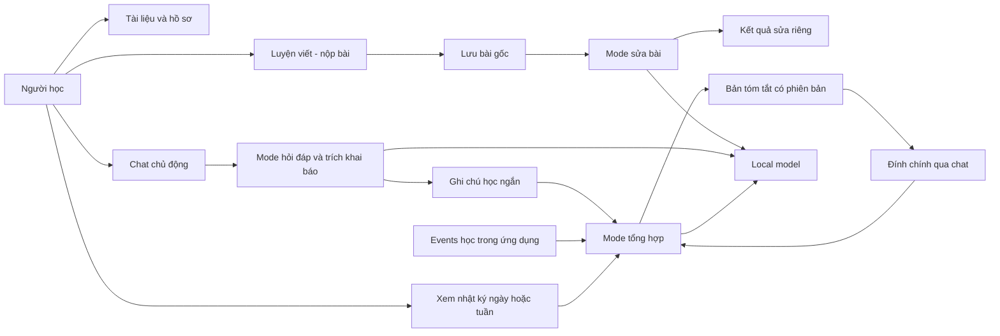

# SPEC.md — StudyCraft

## 1. Overview

StudyCraft giúp người học lưu thông tin học tập, tài liệu và bài làm trong không gian Tiếng Anh. MVP dùng model local để sửa bài đã hoàn thành, có chat hỏi đáp riêng và tạo nhật ký tóm tắt từ khai báo cùng hoạt động học.

Core loop: chọn tài liệu/đề → làm và nộp bài → lưu bài gốc → nhận bản sửa riêng → tự sửa hoặc quay lại sau; chat và nhật ký là các luồng hỗ trợ độc lập.

Đây là thiết kế để triển khai, chưa phải phần mềm đã chạy. Mọi path tính từ root repo. Nguồn nghiệp vụ là `docs/STUDYCRAFT_PRODUCT_DEFINITION.md` đã cập nhật theo quyết định ngày 2026-10-06; quyết định bổ sung ngày 2026-10-08 tại mục 3 thay thế các quy tắc cũ về chat/retention/giới hạn từ; phần chưa chốt được ghi là giả định.

## 2. Goals / Non-goals

Goals:

- F01: giữ hồ sơ/mục tiêu, tài liệu riêng, việc học ngày/tuần và chat chủ động của người học.
- F02: sửa lỗi bài viết hoàn thành; hiển thị lỗi, thay thế tối thiểu và giải thích ở khu vực kết quả riêng; giữ nguyên bài gốc.
- F05 trong MVP: xem lịch sử bài/kết quả và nhật ký tóm tắt ngày/tuần; có thể đính chính nhật ký bằng lời nói trong chat.
- Model local; lưu bài và dùng các thao tác thủ công được khi model không sẵn sàng.
- Lưu lịch sử chat để mở lại ngay trong MVP; nhật ký là bản tóm tắt riêng, lưu vĩnh viễn cùng các phiên bản, không có form tạo nhật ký.
- Kiểm chứng khả năng tìm lại bài/ngữ cảnh và mức phiền do khai báo bằng pilot cá nhân.

Non-goals:

- Agent hướng dẫn nhiều lượt trong lúc sửa, tự hỏi tiếp hoặc tự chuyển kết quả sang chat.
- Gợi ý ý tưởng hay hơn, bài tiếp theo, viết lại theo sở thích hoặc mở rộng bài sau khi sửa.
- Chấm điểm/đánh giá trình độ, bắt tạo nhận xét đủ bốn nhóm khi không có lỗi, kết luận thành thạo.
- Nộp bài hoặc tài liệu chính thức qua chat; chat chỉ để hỏi và khai báo việc học.
- Upload file/PDF/ảnh/audio; thư viện trong MVP chỉ có tên, mô tả, văn bản dán và danh mục.
- Claude/cloud API, tính tiền theo token, bảng giá, budget theo tiền, benchmark chất lượng định lượng.
- Form nhật ký thủ công, scheduler tổng kết tự động theo đồng hồ; tìm kiếm/đổi tên/xóa/phân nhánh hội thoại để sau.
- AI đổi mục tiêu/kế hoạch, nhiều agent, nhiều môn/phương pháp, thông báo nhắc học, SaaS, Notion/Calendar/Gmail, web search hoặc vector search.

Future work, một dòng mỗi mục, không tạo stub ngoài adapter local/fake đang cần:

- Gợi ý mở rộng nội dung, ý tưởng và bài luyện tiếp sau khi sửa bài dùng được.
- Claude hoặc nhà cung cấp khác, cùng chi phí/budget khi thực sự sử dụng.
- Benchmark model và các KPI chất lượng gồm tỷ lệ lỗi bị bỏ sót.
- Upload tài liệu và quản lý file khi chốt định dạng, dung lượng và xử lý nội dung.
- Điều phối buổi học, nhắc ôn, phân tích kỹ năng, nhiều môn và tích hợp ngoài.

## 3. Assumptions & Open Questions

Thông tin hiện có đủ để cập nhật thiết kế và bắt đầu các increment không phụ thuộc chất lượng model. Không tự gán trình độ người học hoặc tuyên bố model local đáp ứng chất lượng/tốc độ trước khi chạy thử.

Quyết định người dùng đã chốt ngày 2026-10-06:

| ID | Quyết định | Hệ quả so với v1 |
| --- | --- | --- |
| D01 | Agent sửa bài hoàn thành; gợi ý/ý tưởng thêm để sau. | Bỏ next_step, proposal và hội thoại bắt buộc khỏi kết quả sửa. |
| D02 | Tài liệu có khu vực riêng; theo đề xuất đưa upload ra sau MVP. | Không nhận tài liệu/bài nộp chính thức qua chat; thư viện văn bản, chưa là ổ lưu trữ file. |
| D03 | Chat hỏi đáp riêng với kết quả sửa. | Hỏi thêm là hành động chủ động; không tự gọi chat sau review. |
| D04 | Trước mắt local model; Claude và tính chi phí để sau. | Bỏ API Claude, budget/cost fields, billing metrics và paid-eval gate. |
| D05 | Nhật ký từ khai báo trong chat và hoạt động ngày/tuần; chỉ tóm tắt, không lưu tất cả, không cần form. | Bỏ journal.add/form; thêm summarize/correct. Phần không lưu transcript được thay thế bởi D08. |
| D06 | Theo đề xuất bổ sung hồ sơ/chuẩn sửa, đính chính, giả thuyết giá trị, phạm vi F05 và thuật ngữ. | Các mục tương ứng bên dưới có tiêu chí kiểm chứng; không tự bịa giá trị baseline. |
| D07 | Đánh giá định lượng chất lượng sẽ tính sau. | Bỏ ngưỡng 90%/80%, yêu cầu 20 bài/40 findings; vẫn kiểm tra đúng luồng, quote và tính nguyên vẹn dữ liệu. |

Quyết định bổ sung ngày 2026-10-08:

- **D08:** Lưu lịch sử chat ngay trong MVP, mở lại sau reload/restart; không tự hết hạn.
- **D09:** Nhật ký lưu vĩnh viễn cùng các phiên bản. “Tóm tắt” mô tả nội dung nhật ký, không phải thời hạn lưu chat.
- **D10:** Giới hạn từ phụ thuộc loại bài; không có mức 300 từ chung.
- **D11:** Ưu tiên chat chạy và kiểm thử được trên máy cá nhân; tối ưu/scale sau. Tham số vận hành do developer thử và điều chỉnh.

Giả định triển khai có thể điều chỉnh:

| ID | Giả định | Phạm vi xác nhận |
| --- | --- | --- |
| A01 | Python 3.12, FastAPI, PostgreSQL; một người dùng local, server bind 127.0.0.1, một process/worker. | Giữ stack cũ; không phải SaaS/public deployment. |
| A02 | Jinja2 + HTML/CSS/JS thuần; một trang có tab Tài liệu, Luyện viết/Kết quả, Chat, Nhật ký. | Không cần Node build hoặc multi-agent. |
| A03 | Giới hạn từ theo loại bài; exercise lưu snapshot policy gồm loại bài, phiên bản và min/max. | Ngưỡng từng loại: TODO(project owner). Không dùng 300 từ/6.000 ký tự làm quy tắc chung. Giới hạn đề/material hiện có là cấu hình kỹ thuật đề xuất. |
| A04 | Hồ sơ có mục đích viết tùy chọn, trình độ tự khai báo mặc định unknown, loại bài mặc định general_paragraph. | Chưa có trình độ cụ thể; không bắt làm placement test. |
| A05 | Ngày Asia/Ho_Chi_Minh; tuần thứ Hai–Chủ nhật. | Ngày/tuần đang diễn ra ghi rõ dữ liệu đến thời điểm tổng hợp. |
| A06 | Mở/chọn nhật ký ngày hoặc tuần sẽ tổng hợp nếu nguồn thay đổi; cùng nguồn trả bản có sẵn. | Không có cron; người dùng không phải điền form hoặc bấm lưu từng nhật ký. |
| A07 | Nhật ký tự lưu có nhãn “AI tổng hợp”; không có duyệt mọi khai báo. Đính chính là yêu cầu trực tiếp tại chat gắn với bản đang xem. | Không cho phép summary thay mục tiêu, activity status hay bài gốc. |
| A08 | Lịch sử hội thoại lưu PostgreSQL; backend lấy một cửa sổ tin gần nhất cho model. | Đề xuất khởi đầu tối đa 8 tin cũ thuộc lượt thành công; TODO(developer) đo và điều chỉnh theo model. Tin bị bỏ khỏi context vẫn còn trong lịch sử. |
| A09 | Local HTTP adapter dùng endpoint OpenAI-compatible; runtime tham chiếu LM Studio tại 127.0.0.1:1234/v1. | Đây là lựa chọn triển khai đề xuất, không khẳng định đã cài runtime/model. Không tự tải model. |
| A10 | Giữ lâu dài tài liệu/bài/bản sửa, ghi chú học tập ngắn và các phiên bản tóm tắt; log kỹ thuật 30 ngày, không chứa text. | Chat chỉ lưu nội dung tại chat_messages; không sao chép transcript vào history_index, request response, log hoặc prompt snapshots. |
| A11 | Đề lấy từ mẫu developer hoặc người học nhập; không sinh đề bằng AI trong MVP. | Giữ khả năng nhận đề, phù hợp ưu tiên agent chỉ sửa bài. |

**P01 — cập nhật quyết định, 2026-10-08:** SPEC này thay thế thiết kế chat tạm và trần từ chung. OpenAPI/DDL/ADR cũ chưa đồng bộ các thay đổi mới; phải hoàn thành bước contract trong I-03/I-05 trước khi coding các luồng tương ứng. Không coi ADR Proposed là Accepted.

- **Q01 — Còn cần chốt:** ngưỡng min/max của từng loại bài: `TODO(project owner)`. Có thể triển khai validator với policy fixture phục vụ test; không đưa số fixture thành chính sách sản phẩm.
- **Q02 — Đã chốt lưu trữ:** nhật ký lưu vĩnh viễn. Câu hỏi trước trộn retention (lưu bao lâu) với trigger (khi nào tổng hợp); A05–A07 vẫn là giả định triển khai: mở kỳ có nguồn đổi mới tổng hợp, không form.
- **Q03 — Đã chốt:** lịch sử chat có trong MVP. Context window là số tin model được đọc mỗi lần, không phải số tin được lưu; developer chọn nhỏ để chạy thử.
- **Q04 — Để developer xử lý:** timeout, attempts, context/output budget là cấu hình bảo vệ, không phải quyết định nghiệp vụ cần người dùng chốt ngay. Các số 120 giây/2 attempts/40.000 bytes/3.000 tokens và giới hạn nguồn dưới đây chỉ là mặc định đề xuất; `TODO(developer)` kiểm chứng khi tích hợp model. Phải có giới hạn hữu hạn và lỗi rõ; không đợi vô hạn hoặc tự retry timeout.

Open questions không chặn đặc tả:

- Tên model local, RAM/VRAM và context size thật: cần xác nhận trước kiểm chứng tích hợp local; chưa cam kết tốc độ.
- Mục đích/trình độ/loại bài thực tế: người học có thể khai báo trong hồ sơ; unknown phải là trạng thái hợp lệ.
- Người rà soát Tiếng Anh chưa được chỉ định; developer kiểm tra luồng không thay cho kiểm chứng ngôn ngữ.
- Baseline và độ dài pilot chưa có dữ liệu: ghi trước pilot, không dùng số tự đặt như kết quả đã đo.

Giả thuyết giá trị: tập trung tài liệu/bài/bản sửa giúp tìm lại việc đang học và giảm khai báo lặp. Pilot ghi thủ công tình huống, thời gian tìm lại bài, thông tin phải nhập lại và khó chịu khi dùng; không xây dashboard hoặc KPI chi phí.

Trade-offs:

- Dùng một local model với các mode độc lập; thay vì nhiều agent; tái sử dụng runtime nhưng không trộn prompt/quyền của sửa bài, chat và nhật ký.
- Lưu chat bền vững, context model có giới hạn; thay vì chỉ giữ RAM; mở lại được hội thoại nhưng tăng dữ liệu cần backup.
- Tổng hợp khi xem; thay vì cron; đủ nhật ký ngày/tuần mà không thêm scheduler.
- Ghép bản sửa bằng các text edits đã kiểm tra; thay vì để model viết lại toàn bài; giữ ý và kiểm soát phần thực sự thay đổi.

## 4. User Stories

| ID | Story | Acceptance criteria |
| --- | --- | --- |
| US-01 | As a learner, I want my goal and learning profile saved so that I can resume in context. | Given chưa có trình độ, When lưu hồ sơ, Then unknown hợp lệ; reload giữ mục tiêu và thông tin đã khai báo. |
| US-02 | As a learner, I want a separate material library so that my learning content is organized independently of chat. | Given tên/mô tả/text hoặc catalog item, When lưu tại Tài liệu, Then có material riêng. Given tên-only, When sửa bài/hỏi nội dung sách, Then không nhận là có source text. |
| US-03 | As a learner, I want to manage activities so that I know what I planned and personally marked complete. | Given activity planned, When người học chọn completed, Then ghi status và event; chat, summary, nộp bài hoặc feedback không tự đổi status. |
| US-04 | As a learner, I want to select or enter a prompt and submit my finished writing so that I can receive corrections. | Given đề mẫu/đề riêng, When nộp bài hợp lệ tại Luyện viết, Then lưu submission trước model. Bản sửa tiếp theo có revision_of; không ghi đè bản gốc. Không cần chat. |
| US-05 | As a learner, I want a separate correction result so that I can see my errors and minimal fixes. | Given bài đã nộp, When sửa bài thành công, Then kết quả có lỗi, giải thích và corrected_text riêng; không next_step, ý tưởng mở rộng hoặc câu hỏi buộc trả lời. Bài không có lỗi rõ được trả corrections rỗng. |
| US-06 | As a learner, I want to ask questions in a separate chat so that I control when to discuss my work. | Given đang xem feedback, When chủ động mở Chat và chọn kết quả liên quan, Then câu hỏi có context đó; khi chỉ xem feedback thì không gọi chat. Given đã gửi và nhận trả lời, When đóng/mở ứng dụng, Then mở lại đúng hội thoại và thứ tự tin; xem lịch sử không gọi model. |
| US-07 | As a learner, I want my reported learning and app activity summarized by day or week so that I do not fill a diary form. | Given khai báo trong chat và bài nộp trong kỳ, When mở nhật ký, Then có tóm tắt tự khai báo và counts ứng dụng riêng; nhật ký không sao chép nguyên hội thoại; không đổi kế hoạch. Báo cáo cả tuần không bị chia tùy tiện cho từng ngày. |
| US-08 | As a learner, I want to correct a journal through chat so that inaccurate summaries do not become permanent facts. | Given journal revision n, When chọn Đính chính và gửi yêu cầu rõ, Then tạo revision n+1, giữ n và bản đính chính ngắn; regenerate phải tôn trọng đính chính đó. Given n đã cũ, Then trả conflict và không ghi đè. |
| US-09 | As a learner, I want learning history and failure recovery so that saved work remains accessible. | Given restart hoặc local model unavailable, When mở bài/lịch sử, Then đề, submission, feedback và journal revisions còn; lịch sử chat cũng còn, lượt đang chạy bị đánh dấu interrupted. Retry cùng ID không tạo bản ghi/gọi model trùng. |

Traceability:

| Story | Source scope | Tools | Increments |
| --- | --- | --- | --- |
| US-01 | F01 | workspace.read, workspace.update | I-02 |
| US-02 | F01 | workspace.read, material.save | I-02 |
| US-03 | F01 | activity.save, workspace.read | I-02 |
| US-04 | F02 | exercise.create, submission.add | I-03 |
| US-05 | F02 | feedback.generate, run.read | I-04 |
| US-06 | F01 | chat.create, chat.list, chat.read, chat.send | I-05 |
| US-07 | F01/F05 | chat.send, journal.summarize | I-05, I-06 |
| US-08 | F05 | journal.correct, journal.summarize | I-06 |
| US-09 | F01/F02/F05 | history.list, chat.read, run.read, workspace.read | I-03, I-04, I-05, I-06, I-07 |

## 5. System Architecture

| Component | Responsibility |
| --- | --- |
| Browser | Khu vực riêng Tài liệu, Luyện viết/Kết quả, Chat, Nhật ký; tải lịch sử chat phân trang từ DB; không tự gửi câu hỏi sau sửa bài. |
| FastAPI/application tools | Input validation, local session, transactions, version/idempotency, dữ liệu học và API allowlist. |
| Bounded runner | Chạy đúng một mode theo action; đọc snapshot → model → validate → persist; không plan tự do/tool calling. |
| LocalModelClient | HTTP local model; fake adapter cho tests. Không có Claude adapter hoặc cloud fallback trong MVP. |
| Context builder | Sửa bài dùng đề/bài/material snapshot/profile; chat chỉ lấy context đã chọn; nhật ký lấy ghi chú học + events + đính chính. |
| PostgreSQL | Artifacts học tập, ghi chú ngắn, summaries/revisions, event metadata, run metadata và lịch sử chat trong bảng riêng. |



- Web cùng origin, `/` và `/static/*`; HTTP theo [OpenAPI](api/openapi.json): GET `/api/v1/workspaces/{workspace_id}`, GET `/api/v1/workspaces/{workspace_id}/history`, GET `/api/v1/workspaces/{workspace_id}/runs/{run_id}`; mười tool ghi dùng POST `/api/v1/tools/{name}`. `/api/tools/{name}` là đề xuất cũ, không phải alias được hỗ trợ. GET `/health` kiểm DB, không gọi model. Bổ sung GET `/api/v1/workspaces/{workspace_id}/chats` và GET `/api/v1/workspaces/{workspace_id}/chats/{thread_id}/messages`; POST mới là `/api/v1/tools/chat.create`. Cả hai GET mới dùng before_id/limit như history; không cần model.
- Một workspace english/short_writing được seed idempotent. UI bootstrap cung cấp workspace ID và CSRF token.
- Một local model run đang active/workspace; không giữ DB transaction mở qua network. Run ID bằng request_id cho thao tác model.
- Input bài đã lưu là durable trước feedback. Tin người học lưu trước inference; reply và learning_reports đã validate lưu cùng transaction sau inference. Không sao chép raw prompt vào DB để “khôi phục”.
- Nội dung kết quả sửa không phải message chat. History chứa exercise/submission/feedback/journal; không chứa chat replies.

## 6. Tools

**HTTP design — Proposed, có thay đổi chưa đồng bộ:** [OpenAPI 3.1](api/openapi.json) là hợp đồng HTTP; JSON manifest bên dưới là hợp đồng tool/provider nội bộ. Manifest v3 bên dưới đã đổi chat/policy; OpenAPI hiện còn v2 ở các phần đó, không được dùng nguyên trạng để code I-03/I-05. Giữ nguyên các quy tắc transport đã đồng bộ P01; cập nhật schemas, endpoints, ví dụ và DDL trước triển khai. Chưa có adapter chạy. Quy tắc ánh xạ khi triển khai:

- HTTP POST không nhận request_id trong body; header Idempotency-Key UUID v4 được chuẩn hóa lowercase và truyền thành request_id nội bộ. Chuẩn hóa UUID trong body và điền planned_period=day nếu thiếu trước khi hash/gọi tool; JSON Schema default không tự điền giá trị.
- HTTP ActivityInputData cho phép thiếu planned_period; ActivityData nội bộ và output bắt buộc có trường này sau chuẩn hóa. Chọn tuần phải gửi week rõ ràng; planned_for là thứ Hai hoặc null nếu chưa lên lịch.
- Error nội bộ được chuyển sang application/problem+json theo OpenAPI; không trả envelope Error trực tiếp qua HTTP. 400 MALFORMED_REQUEST/405 METHOD_NOT_ALLOWED/413 PAYLOAD_TOO_LARGE/415 UNSUPPORTED_MEDIA_TYPE là lỗi transport trước claim, không thêm vào enum nội bộ hoặc persist receipt/run.
- history.list nội bộ nhận before_id=null và limit=20 khi HTTP GET bỏ query tương ứng. Các GET lấy workspace_id/run_id/thread_id từ path và không cần Idempotency-Key.

Tool là application operation có schema, không phải quyền model tự gọi API. Model trả dữ liệu, application service kiểm tra và quyết định việc được ghi. Document JSON dưới đây là manifest `src/studycraft/contracts/tools.json`; validate schema con input/output/provider_outputs với `$ref` resolve từ root, draft 2020-12, bật uuid/date/date-time format checks.

```json
{
  "$schema": "https://json-schema.org/draft/2020-12/schema",
  "$id": "urn:studycraft:contracts:v3",
  "$defs": {
    "UUID": {"type":"string","format":"uuid"},
    "Date": {"type":"string","format":"date"},
    "Time": {"type":"string","format":"date-time"},
    "NullableUUID": {"oneOf":[{"$ref":"#/$defs/UUID"},{"type":"null"}]},
    "NullableDate": {"oneOf":[{"$ref":"#/$defs/Date"},{"type":"null"}]},
    "Goal": {"type":"object","additionalProperties":false,"required":["text","deadline"],"properties":{"text":{"type":"string","minLength":1,"maxLength":400},"deadline":{"$ref":"#/$defs/NullableDate"}}},
    "NullableGoal": {"oneOf":[{"$ref":"#/$defs/Goal"},{"type":"null"}]},
    "Workspace": {"type":"object","additionalProperties":false,"required":["id","subject","method","goal","study_context","version","updated_at","learner_profile"],"properties":{"id":{"$ref":"#/$defs/UUID"},"subject":{"const":"english"},"method":{"const":"short_writing"},"goal":{"$ref":"#/$defs/NullableGoal"},"study_context":{"type":"string","maxLength":4000},"version":{"type":"integer","minimum":0},"updated_at":{"$ref":"#/$defs/Time"},"learner_profile":{"$ref":"#/$defs/LearnerProfile"}}},
    "Material": {"type":"object","additionalProperties":false,"required":["id","workspace_id","catalog_id","title","description","content","created_at"],"properties":{"id":{"$ref":"#/$defs/UUID"},"workspace_id":{"$ref":"#/$defs/UUID"},"catalog_id":{"$ref":"#/$defs/NullableUUID"},"title":{"type":"string","minLength":1,"maxLength":200},"description":{"type":"string","maxLength":1000},"content":{"type":["string","null"],"minLength":1,"maxLength":20000},"created_at":{"$ref":"#/$defs/Time"}}},
    "CatalogItem": {"type":"object","additionalProperties":false,"required":["id","title","description","has_content"],"properties":{"id":{"$ref":"#/$defs/UUID"},"title":{"type":"string","minLength":1,"maxLength":200},"description":{"type":"string","maxLength":1000},"has_content":{"type":"boolean"}}},
    "ActivityData": {"type":"object","additionalProperties":false,"required":["title","planned_for","status","planned_period"],"properties":{"title":{"type":"string","minLength":1,"maxLength":300},"planned_for":{"$ref":"#/$defs/NullableDate"},"status":{"enum":["planned","completed","deferred"]},"planned_period":{"type":"string","enum":["day","week"],"default":"day"}}},
    "Activity": {"type":"object","additionalProperties":false,"required":["id","workspace_id","data","created_at","updated_at"],"properties":{"id":{"$ref":"#/$defs/UUID"},"workspace_id":{"$ref":"#/$defs/UUID"},"data":{"$ref":"#/$defs/ActivityData"},"created_at":{"$ref":"#/$defs/Time"},"updated_at":{"$ref":"#/$defs/Time"}}},
    "Exercise": {"type":"object","additionalProperties":false,"required":["id","workspace_id","prompt","origin","material_id","material_snapshot","created_at","template_id","writing_policy"],"properties":{"id":{"$ref":"#/$defs/UUID"},"workspace_id":{"$ref":"#/$defs/UUID"},"prompt":{"type":"string","minLength":1,"maxLength":2000},"origin":{"enum":["user","template"]},"material_id":{"$ref":"#/$defs/NullableUUID"},"material_snapshot":{"oneOf":[{"$ref":"#/$defs/Material"},{"type":"null"}]},"created_at":{"$ref":"#/$defs/Time"},"template_id":{"$ref":"#/$defs/NullableUUID"},"writing_policy":{"$ref":"#/$defs/WritingPolicy"}}},
    "Submission": {"type":"object","additionalProperties":false,"required":["id","workspace_id","exercise_id","revision_of","text","word_count","created_at"],"properties":{"id":{"$ref":"#/$defs/UUID"},"workspace_id":{"$ref":"#/$defs/UUID"},"exercise_id":{"$ref":"#/$defs/UUID"},"revision_of":{"$ref":"#/$defs/NullableUUID"},"text":{"type":"string","minLength":1},"word_count":{"type":"integer","minimum":1},"created_at":{"$ref":"#/$defs/Time"}}},
    "Quote": {"type":"object","additionalProperties":false,"required":["start","end","text"],"properties":{"start":{"type":"integer","minimum":0},"end":{"type":"integer","minimum":1},"text":{"type":"string","minLength":1}}},
    "Criterion": {"enum":["task_response","organization","grammar","vocabulary"]},
    "Finding": {"type":"object","additionalProperties":false,"required":["criterion","quote","explanation","suggested_revision"],"properties":{"criterion":{"$ref":"#/$defs/Criterion"},"quote":{"$ref":"#/$defs/Quote"},"explanation":{"type":"string","minLength":1,"maxLength":600},"suggested_revision":{"type":["string","null"],"minLength":1,"maxLength":1000}}},
    "Error": {"type":"object","additionalProperties":false,"required":["error"],"properties":{"error":{"type":"object","additionalProperties":false,"required":["code","message","retryable","run_id"],"properties":{"code":{"enum":["INVALID_INPUT","FORBIDDEN","NOT_FOUND","VERSION_CONFLICT","IDEMPOTENCY_CONFLICT","RUN_BUSY","LOCAL_MODEL_UNAVAILABLE","MODEL_TIMEOUT","INVALID_MODEL_OUTPUT","CONTEXT_LIMIT","RESULT_EXPIRED","INTERRUPTED","DATABASE_UNAVAILABLE","INTERNAL_ERROR"]},"message":{"type":"string","minLength":1,"maxLength":500},"retryable":{"type":"boolean"},"run_id":{"$ref":"#/$defs/NullableUUID"}}}}},
    "LearnerProfile": {"type":"object","additionalProperties":false,"required":["self_reported_level","writing_purpose","writing_type"],"properties":{"self_reported_level":{"enum":["unknown","beginner","intermediate","advanced"]},"writing_purpose":{"type":"string","minLength":0,"maxLength":400},"writing_type":{"enum":["general_paragraph","personal_email","short_opinion"]}}},
    "WritingPrompt": {"type":"object","additionalProperties":false,"required":["id","prompt","writing_type"],"properties":{"id":{"$ref":"#/$defs/UUID"},"prompt":{"type":"string","minLength":1,"maxLength":2000},"writing_type":{"enum":["general_paragraph","personal_email","short_opinion"]}}},
    "Correction": {"oneOf":[{"type":"object","additionalProperties":false,"required":["kind","criterion","quote","replacement","explanation"],"properties":{"kind":{"const":"text_edit"},"criterion":{"enum":["grammar","vocabulary"]},"quote":{"$ref":"#/$defs/Quote"},"replacement":{"type":"string","minLength":0,"maxLength":1000},"explanation":{"type":"string","minLength":1,"maxLength":600}}},{"type":"object","additionalProperties":false,"required":["kind","criterion","quote","replacement","explanation"],"properties":{"kind":{"const":"content_issue"},"criterion":{"enum":["task_response","organization"]},"quote":{"oneOf":[{"$ref":"#/$defs/Quote"},{"type":"null"}]},"replacement":{"type":"null"},"explanation":{"type":"string","minLength":1,"maxLength":600}}}]},
    "CorrectionData": {"type":"object","additionalProperties":false,"required":["summary","corrections","limitations"],"properties":{"summary":{"type":"string","minLength":1,"maxLength":800},"corrections":{"type":"array","maxItems":12,"items":{"$ref":"#/$defs/Correction"}},"limitations":{"type":"array","maxItems":5,"items":{"type":"string","minLength":1,"maxLength":400}}}},
    "Feedback": {"type":"object","additionalProperties":false,"required":["id","workspace_id","submission_id","run_id","rubric_version","data","corrected_text","created_at"],"properties":{"id":{"$ref":"#/$defs/UUID"},"workspace_id":{"$ref":"#/$defs/UUID"},"submission_id":{"$ref":"#/$defs/UUID"},"run_id":{"$ref":"#/$defs/UUID"},"rubric_version":{"const":"correction-v2"},"data":{"$ref":"#/$defs/CorrectionData"},"corrected_text":{"type":"string","minLength":1},"created_at":{"$ref":"#/$defs/Time"}}},
    "LearningReport": {"type":"object","additionalProperties":false,"required":["id","workspace_id","period","start_date","end_date","statement","origin","created_at"],"properties":{"id":{"$ref":"#/$defs/UUID"},"workspace_id":{"$ref":"#/$defs/UUID"},"period":{"enum":["day","week"]},"start_date":{"$ref":"#/$defs/Date"},"end_date":{"$ref":"#/$defs/Date"},"statement":{"type":"string","minLength":1,"maxLength":500},"origin":{"const":"user_report"},"created_at":{"$ref":"#/$defs/Time"}}},
    "AppCounts": {"type":"object","additionalProperties":false,"required":["submitted_drafts","feedback_results","completion_confirmations"],"properties":{"submitted_drafts":{"type":"integer","minimum":0},"feedback_results":{"type":"integer","minimum":0},"completion_confirmations":{"type":"integer","minimum":0}}},
    "JournalContent": {"type":"object","additionalProperties":false,"required":["learner_summary","app_counts","limitations"],"properties":{"learner_summary":{"type":"string","minLength":0,"maxLength":2000},"app_counts":{"$ref":"#/$defs/AppCounts"},"limitations":{"type":"array","maxItems":5,"items":{"type":"string","minLength":1,"maxLength":300}}}},
    "Journal": {"type":"object","additionalProperties":false,"required":["id","workspace_id","period","start_date","end_date","revision","content","source_report_ids","source_event_ids","source_correction_ids","source_signature","status","editor","updated_at"],"properties":{"id":{"$ref":"#/$defs/UUID"},"workspace_id":{"$ref":"#/$defs/UUID"},"period":{"enum":["day","week"]},"start_date":{"$ref":"#/$defs/Date"},"end_date":{"$ref":"#/$defs/Date"},"revision":{"type":"integer","minimum":1},"content":{"$ref":"#/$defs/JournalContent"},"source_report_ids":{"type":"array","maxItems":500,"items":{"$ref":"#/$defs/UUID"}},"source_event_ids":{"type":"array","maxItems":1000,"items":{"$ref":"#/$defs/UUID"}},"source_correction_ids":{"type":"array","maxItems":100,"items":{"$ref":"#/$defs/UUID"}},"source_signature":{"type":"string","minLength":64,"maxLength":64},"status":{"enum":["current","stale"]},"editor":{"enum":["ai","user_correction"]},"updated_at":{"$ref":"#/$defs/Time"}}},
    "ChatResult": {"type":"object","additionalProperties":false,"required":["run_id","reply","saved_reports","thread_id","user_message_id","assistant_message_id"],"properties":{"run_id":{"$ref":"#/$defs/UUID"},"reply":{"type":"string","minLength":1,"maxLength":3000},"saved_reports":{"type":"array","maxItems":3,"items":{"$ref":"#/$defs/LearningReport"}},"thread_id":{"$ref":"#/$defs/UUID"},"user_message_id":{"$ref":"#/$defs/UUID"},"assistant_message_id":{"$ref":"#/$defs/UUID"}}},
    "Run": {"type":"object","additionalProperties":false,"required":["id","workspace_id","operation","status","error_code","result_ids","model","input_tokens","output_tokens","context_truncated","started_at","finished_at"],"properties":{"id":{"$ref":"#/$defs/UUID"},"workspace_id":{"$ref":"#/$defs/UUID"},"operation":{"enum":["feedback.generate","chat.send","journal.summarize","journal.correct"]},"status":{"enum":["running","succeeded","failed","interrupted"]},"error_code":{"oneOf":[{"type":"string","minLength":1,"maxLength":50},{"type":"null"}]},"result_ids":{"type":"array","maxItems":5,"items":{"$ref":"#/$defs/UUID"}},"model":{"oneOf":[{"type":"string","minLength":1,"maxLength":200},{"type":"null"}]},"input_tokens":{"oneOf":[{"type":"integer","minimum":0},{"type":"null"}]},"output_tokens":{"oneOf":[{"type":"integer","minimum":0},{"type":"null"}]},"context_truncated":{"type":"boolean"},"started_at":{"$ref":"#/$defs/Time"},"finished_at":{"oneOf":[{"$ref":"#/$defs/Time"},{"type":"null"}]}}},
    "HistoryItem": {"type":"object","additionalProperties":false,"required":["id","kind","entity_id","journal_revision","data","created_at"],"properties":{"id":{"type":"integer","minimum":1},"kind":{"enum":["exercise","submission","feedback","journal"]},"entity_id":{"$ref":"#/$defs/UUID"},"journal_revision":{"oneOf":[{"type":"integer","minimum":1},{"type":"null"}]},"data":{"oneOf":[{"$ref":"#/$defs/Exercise"},{"$ref":"#/$defs/Submission"},{"$ref":"#/$defs/Feedback"},{"$ref":"#/$defs/Journal"}]},"created_at":{"$ref":"#/$defs/Time"}}},
    "WritingPolicy": {"type":"object","additionalProperties":false,"required":["writing_type","policy_version","min_words","max_words"],"properties":{"writing_type":{"enum":["general_paragraph","personal_email","short_opinion"]},"policy_version":{"type":"string","minLength":1,"maxLength":50},"min_words":{"type":"integer","minimum":1},"max_words":{"type":["integer","null"],"minimum":1}}},
    "ChatThread": {"type":"object","additionalProperties":false,"required":["id","workspace_id","sequence","title","created_at"],"properties":{"id":{"$ref":"#/$defs/UUID"},"workspace_id":{"$ref":"#/$defs/UUID"},"sequence":{"type":"integer","minimum":1},"title":{"type":"string","minLength":1,"maxLength":120},"created_at":{"$ref":"#/$defs/Time"}}},
    "ChatMessage": {"type":"object","additionalProperties":false,"required":["id","thread_id","sequence","run_id","role","text","run_status","created_at"],"properties":{"id":{"$ref":"#/$defs/UUID"},"thread_id":{"$ref":"#/$defs/UUID"},"sequence":{"type":"integer","minimum":1},"run_id":{"$ref":"#/$defs/UUID"},"role":{"enum":["user","assistant"]},"text":{"type":"string","minLength":1,"maxLength":3000},"run_status":{"enum":["running","succeeded","failed","interrupted"]},"created_at":{"$ref":"#/$defs/Time"}}}
  },
  "tools": {
    "workspace.read": {"input":{"type":"object","additionalProperties":false,"required":["workspace_id"],"properties":{"workspace_id":{"$ref":"#/$defs/UUID"}}},"output":{"oneOf":[{"type":"object","additionalProperties":false,"required":["workspace","materials","catalog","activities","journals","writing_prompts"],"properties":{"workspace":{"$ref":"#/$defs/Workspace"},"materials":{"type":"array","maxItems":50,"items":{"$ref":"#/$defs/Material"}},"catalog":{"type":"array","maxItems":100,"items":{"$ref":"#/$defs/CatalogItem"}},"activities":{"type":"array","maxItems":20,"items":{"$ref":"#/$defs/Activity"}},"journals":{"type":"array","maxItems":10,"items":{"$ref":"#/$defs/Journal"}},"writing_prompts":{"type":"array","maxItems":20,"items":{"$ref":"#/$defs/WritingPrompt"}}}},{"$ref":"#/$defs/Error"}]}},
    "workspace.update": {"input":{"type":"object","additionalProperties":false,"required":["workspace_id","request_id","expected_version","goal","study_context","learner_profile"],"properties":{"workspace_id":{"$ref":"#/$defs/UUID"},"request_id":{"$ref":"#/$defs/UUID"},"expected_version":{"type":"integer","minimum":0},"goal":{"$ref":"#/$defs/NullableGoal"},"study_context":{"type":"string","minLength":0,"maxLength":4000},"learner_profile":{"$ref":"#/$defs/LearnerProfile"}}},"output":{"oneOf":[{"$ref":"#/$defs/Workspace"},{"$ref":"#/$defs/Error"}]}},
    "material.save": {"input":{"oneOf":[{"type":"object","additionalProperties":false,"required":["workspace_id","request_id","expected_version","mode","catalog_id"],"properties":{"workspace_id":{"$ref":"#/$defs/UUID"},"request_id":{"$ref":"#/$defs/UUID"},"expected_version":{"type":"integer","minimum":0},"mode":{"const":"catalog"},"catalog_id":{"$ref":"#/$defs/UUID"}}},{"type":"object","additionalProperties":false,"required":["workspace_id","request_id","expected_version","mode","material_id","title","description","content"],"properties":{"workspace_id":{"$ref":"#/$defs/UUID"},"request_id":{"$ref":"#/$defs/UUID"},"expected_version":{"type":"integer","minimum":0},"mode":{"const":"user"},"material_id":{"$ref":"#/$defs/NullableUUID"},"title":{"type":"string","minLength":1,"maxLength":200},"description":{"type":"string","maxLength":1000},"content":{"type":["string","null"],"minLength":1,"maxLength":20000}}}]},"output":{"oneOf":[{"$ref":"#/$defs/Material"},{"$ref":"#/$defs/Error"}]}},
    "activity.save": {"input":{"type":"object","additionalProperties":false,"required":["workspace_id","request_id","expected_version","activity_id","data"],"properties":{"workspace_id":{"$ref":"#/$defs/UUID"},"request_id":{"$ref":"#/$defs/UUID"},"expected_version":{"type":"integer","minimum":0},"activity_id":{"$ref":"#/$defs/NullableUUID"},"data":{"$ref":"#/$defs/ActivityData"}}},"output":{"oneOf":[{"$ref":"#/$defs/Activity"},{"$ref":"#/$defs/Error"}]}},
    "exercise.create": {"input":{"oneOf":[{"type":"object","additionalProperties":false,"required":["workspace_id","request_id","mode","prompt","material_id","writing_type"],"properties":{"workspace_id":{"$ref":"#/$defs/UUID"},"request_id":{"$ref":"#/$defs/UUID"},"mode":{"const":"user"},"prompt":{"type":"string","minLength":1,"maxLength":2000},"material_id":{"$ref":"#/$defs/NullableUUID"},"writing_type":{"enum":["general_paragraph","personal_email","short_opinion"]}}},{"type":"object","additionalProperties":false,"required":["workspace_id","request_id","mode","template_id","material_id"],"properties":{"workspace_id":{"$ref":"#/$defs/UUID"},"request_id":{"$ref":"#/$defs/UUID"},"mode":{"const":"template"},"template_id":{"$ref":"#/$defs/UUID"},"material_id":{"$ref":"#/$defs/NullableUUID"}}}]},"output":{"oneOf":[{"$ref":"#/$defs/Exercise"},{"$ref":"#/$defs/Error"}]}},
    "submission.add": {"input":{"type":"object","additionalProperties":false,"required":["workspace_id","request_id","exercise_id","revision_of","text"],"properties":{"workspace_id":{"$ref":"#/$defs/UUID"},"request_id":{"$ref":"#/$defs/UUID"},"exercise_id":{"$ref":"#/$defs/UUID"},"revision_of":{"$ref":"#/$defs/NullableUUID"},"text":{"type":"string","minLength":1}}},"output":{"oneOf":[{"$ref":"#/$defs/Submission"},{"$ref":"#/$defs/Error"}]}},
    "feedback.generate": {"input":{"type":"object","additionalProperties":false,"required":["workspace_id","request_id","submission_id"],"properties":{"workspace_id":{"$ref":"#/$defs/UUID"},"request_id":{"$ref":"#/$defs/UUID"},"submission_id":{"$ref":"#/$defs/UUID"}}},"output":{"oneOf":[{"$ref":"#/$defs/Feedback"},{"$ref":"#/$defs/Error"}]}},
    "chat.send": {"input":{"type":"object","additionalProperties":false,"required":["workspace_id","request_id","text","feedback_id","thread_id"],"properties":{"workspace_id":{"$ref":"#/$defs/UUID"},"request_id":{"$ref":"#/$defs/UUID"},"text":{"type":"string","minLength":1,"maxLength":3000},"feedback_id":{"$ref":"#/$defs/NullableUUID"},"thread_id":{"$ref":"#/$defs/UUID"}}},"output":{"oneOf":[{"$ref":"#/$defs/ChatResult"},{"$ref":"#/$defs/Error"}]}},
    "journal.summarize": {"input":{"type":"object","additionalProperties":false,"required":["workspace_id","request_id","period","anchor_date"],"properties":{"workspace_id":{"$ref":"#/$defs/UUID"},"request_id":{"$ref":"#/$defs/UUID"},"period":{"enum":["day","week"]},"anchor_date":{"$ref":"#/$defs/Date"}}},"output":{"oneOf":[{"$ref":"#/$defs/Journal"},{"$ref":"#/$defs/Error"}]}},
    "journal.correct": {"input":{"type":"object","additionalProperties":false,"required":["workspace_id","request_id","journal_id","expected_revision","instruction"],"properties":{"workspace_id":{"$ref":"#/$defs/UUID"},"request_id":{"$ref":"#/$defs/UUID"},"journal_id":{"$ref":"#/$defs/UUID"},"expected_revision":{"type":"integer","minimum":1},"instruction":{"type":"string","minLength":1,"maxLength":1000}}},"output":{"oneOf":[{"$ref":"#/$defs/Journal"},{"$ref":"#/$defs/Error"}]}},
    "history.list": {"input":{"type":"object","additionalProperties":false,"required":["workspace_id","before_id","limit"],"properties":{"workspace_id":{"$ref":"#/$defs/UUID"},"before_id":{"oneOf":[{"type":"integer","minimum":1},{"type":"null"}]},"limit":{"type":"integer","minimum":1,"maximum":50}}},"output":{"oneOf":[{"type":"object","additionalProperties":false,"required":["items","next_before_id"],"properties":{"items":{"type":"array","maxItems":50,"items":{"$ref":"#/$defs/HistoryItem"}},"next_before_id":{"oneOf":[{"type":"integer","minimum":1},{"type":"null"}]}}},{"$ref":"#/$defs/Error"}]}},
    "run.read": {"input":{"type":"object","additionalProperties":false,"required":["workspace_id","run_id"],"properties":{"workspace_id":{"$ref":"#/$defs/UUID"},"run_id":{"$ref":"#/$defs/UUID"}}},"output":{"oneOf":[{"$ref":"#/$defs/Run"},{"$ref":"#/$defs/Error"}]}},
    "chat.create": {"input":{"type":"object","additionalProperties":false,"required":["workspace_id","request_id","title"],"properties":{"workspace_id":{"$ref":"#/$defs/UUID"},"request_id":{"$ref":"#/$defs/UUID"},"title":{"type":"string","minLength":1,"maxLength":120}}},"output":{"oneOf":[{"$ref":"#/$defs/ChatThread"},{"$ref":"#/$defs/Error"}]}},
    "chat.list": {"input":{"type":"object","additionalProperties":false,"required":["workspace_id","before_id","limit"],"properties":{"workspace_id":{"$ref":"#/$defs/UUID"},"before_id":{"type":["integer","null"],"minimum":1},"limit":{"type":"integer","minimum":1,"maximum":50}}},"output":{"oneOf":[{"type":"object","additionalProperties":false,"required":["items","next_before_id"],"properties":{"items":{"type":"array","maxItems":50,"items":{"$ref":"#/$defs/ChatThread"}},"next_before_id":{"type":["integer","null"],"minimum":1}}},{"$ref":"#/$defs/Error"}]}},
    "chat.read": {"input":{"type":"object","additionalProperties":false,"required":["workspace_id","thread_id","before_id","limit"],"properties":{"workspace_id":{"$ref":"#/$defs/UUID"},"thread_id":{"$ref":"#/$defs/UUID"},"before_id":{"type":["integer","null"],"minimum":1},"limit":{"type":"integer","minimum":1,"maximum":50}}},"output":{"oneOf":[{"type":"object","additionalProperties":false,"required":["items","next_before_id"],"properties":{"items":{"type":"array","maxItems":50,"items":{"$ref":"#/$defs/ChatMessage"}},"next_before_id":{"type":["integer","null"],"minimum":1}}},{"$ref":"#/$defs/Error"}]}}
  },
  "provider_outputs": {
    "feedback.generate": {"$ref":"#/$defs/CorrectionData"},
    "chat.send": {"type":"object","additionalProperties":false,"required":["reply","reports"],"properties":{"reply":{"type":"string","minLength":1,"maxLength":3000},"reports":{"type":"array","maxItems":3,"items":{"type":"object","additionalProperties":false,"required":["period","anchor_date","statement","source_quote"],"properties":{"period":{"enum":["day","week"]},"anchor_date":{"$ref":"#/$defs/Date"},"statement":{"type":"string","minLength":1,"maxLength":500},"source_quote":{"type":"string","minLength":1,"maxLength":1000}}}}}},
    "journal.summarize": {"type":"object","additionalProperties":false,"required":["learner_summary","used_report_ids","used_correction_ids","limitations"],"properties":{"learner_summary":{"type":"string","minLength":0,"maxLength":2000},"used_report_ids":{"type":"array","maxItems":500,"items":{"$ref":"#/$defs/UUID"}},"used_correction_ids":{"type":"array","maxItems":100,"items":{"$ref":"#/$defs/UUID"}},"limitations":{"type":"array","maxItems":5,"items":{"type":"string","minLength":1,"maxLength":300}}}},
    "journal.correct": {"oneOf":[{"type":"object","additionalProperties":false,"required":["status","learner_summary","limitations"],"properties":{"status":{"const":"corrected"},"learner_summary":{"type":"string","minLength":0,"maxLength":2000},"limitations":{"type":"array","maxItems":5,"items":{"type":"string","minLength":1,"maxLength":300}}}},{"type":"object","additionalProperties":false,"required":["status","question"],"properties":{"status":{"const":"needs_clarification"},"question":{"type":"string","minLength":1,"maxLength":500}}}]}
  }
}
```

| Tool | Purpose | Side effects | Idempotent | Approval required | Errors ngoài INVALID_INPUT/DB |
| --- | --- | --- | --- | --- | --- |
| workspace.read | Lấy profile, material/catalog, activities, journal mới nhất, đề mẫu. | Không. | y | n | NOT_FOUND. |
| workspace.update | Lưu profile/goal/context do người học sửa. | Update + workspace version. | y theo request_id | n; người học trực tiếp lưu | VERSION_CONFLICT, IDEMPOTENCY_CONFLICT, FORBIDDEN. |
| material.save | Lưu/chỉnh văn bản hoặc chọn catalog ở khu vực riêng. | Material + workspace version. | y theo request_id | n | NOT_FOUND, VERSION_CONFLICT, IDEMPOTENCY_CONFLICT, FORBIDDEN. |
| activity.save | Lưu việc học và trạng thái tự xác nhận. | Activity, version, compact event nếu đổi status. | y theo request_id | n | NOT_FOUND, VERSION_CONFLICT, IDEMPOTENCY_CONFLICT, FORBIDDEN. |
| exercise.create | Tạo đề từ template developer hoặc text người học. | Exercise snapshot + history index; không model. | y theo request_id | n | NOT_FOUND, IDEMPOTENCY_CONFLICT. |
| submission.add | Lưu bài hoàn thành/bản viết lại. | Submission + event + history index; không model. | y theo request_id | n | NOT_FOUND, IDEMPOTENCY_CONFLICT. |
| feedback.generate | Sửa một submission đã lưu. | Local inference, feedback + event/history + run. | y theo request_id | n; thao tác Nhận bản sửa | NOT_FOUND, RUN_BUSY, LOCAL_MODEL_UNAVAILABLE, MODEL_TIMEOUT, INVALID_MODEL_OUTPUT, CONTEXT_LIMIT, INTERRUPTED. |
| chat.create | Tạo hội thoại, title mặc định UI “Cuộc trò chuyện mới”. | Insert chat_threads; không model. | y theo request_id | n; thao tác người học | IDEMPOTENCY_CONFLICT, FORBIDDEN. |
| chat.list | Liệt kê hội thoại theo cursor. | Không. | y | n | NOT_FOUND, FORBIDDEN. |
| chat.read | Đọc tin đã lưu trong hội thoại theo cursor. | Không; không model. | y | n | NOT_FOUND, FORBIDDEN. |
| chat.send | Hỏi đáp và trích các khai báo đã học. | Lưu user message, assistant reply, learning_reports ngắn nếu có; run metadata. | y theo request_id; replay từ DB | n; không cần duyệt từng khai báo | RUN_BUSY, LOCAL_MODEL_UNAVAILABLE, MODEL_TIMEOUT, INVALID_MODEL_OUTPUT, CONTEXT_LIMIT, INTERRUPTED. |
| journal.summarize | Xem/tạo summary ngày/tuần từ source hiện có. | Journal revision khi source thay đổi; local inference nếu cần; không đổi kế hoạch. | y theo request_id và source signature | n; tự lưu có nhãn AI | RUN_BUSY, LOCAL_MODEL_UNAVAILABLE, MODEL_TIMEOUT, INVALID_MODEL_OUTPUT, CONTEXT_LIMIT, VERSION_CONFLICT. |
| journal.correct | Áp dụng yêu cầu đính chính bằng lời trong chat gắn journal. | Correction note + journal revision, cùng transaction sau validation. | y theo request_id | n; yêu cầu đính chính trực tiếp là thao tác ghi | NOT_FOUND, VERSION_CONFLICT, LOCAL_MODEL_UNAVAILABLE, MODEL_TIMEOUT, INVALID_MODEL_OUTPUT, RUN_BUSY. |
| history.list | Đọc artifacts/summary revisions theo cursor. | Không. | y | n | NOT_FOUND. |
| run.read | Tra trạng thái khi request bị ngắt. | Không. | y | n | NOT_FOUND. |

Invariants bắt buộc ngoài schema:

- Mọi reference thuộc workspace request; không trả dữ liệu workspace khác. Unknown fields/whitespace-only required strings → INVALID_INPUT. HTTP mapping: 422 INVALID_INPUT/CONTEXT_LIMIT; 403 FORBIDDEN; 404 NOT_FOUND; 409 version/idempotency/run busy/result expired/interrupted; 500 INTERNAL_ERROR; 502 INVALID_MODEL_OUTPUT; 503 local model/DB unavailable; 504 MODEL_TIMEOUT. INTERNAL_ERROR sau claim kết thúc receipt/run khi DB khỏe và success chưa commit; không ghi đè success. DB lỗi hoặc không rõ kết quả commit → DATABASE_UNAVAILABLE; tra/replay cùng key sau phục hồi trước khi cân nhắc lượt mới.
- ActivityData luôn có planned_period day/week sau chuẩn hóa; planned_for null là chưa lên lịch, week với ngày khác thứ Hai → INVALID_INPUT. Không tự suy ra week chỉ từ ngày thứ Hai. Trạng thái chỉ đổi theo thao tác trực tiếp của người học.
- material.save mode user với material_id null là tạo mới; ID khác null là update có version check. Catalog selection tạo bản sao; unique(workspace_id,catalog_id), chọn lại trả bản hiện có. Sửa bản catalog bằng text người học chuyển catalog_id thành null. Tối đa 50 material/workspace, 100 catalog items, 20 đề mẫu.
- Profile self_reported_level là tự khai báo, không suy ra từ bài. Writing type giúp hiểu mục đích, không tạo khóa học hoặc thang điểm mới.
- Exercise user: template_id null; template: server lấy prompt từ catalog đề mẫu, không nhận model-generated prompt. material_snapshot sao chép Material ở lúc tạo đề, id bằng material_id; cả hai null nếu không chọn. Sửa material sau đó không đổi source của bài cũ.
- Policy của exercise: đề tự nhập lấy writing_type từ input, đề mẫu lấy từ writing_templates; server resolve policy đã cấu hình và chụp snapshot. min_words <= max_words nếu max không null. Sửa profile/policy sau đó không đổi điều kiện của bài cũ. Danh mục ba loại hiện tại là đề xuất MVP, chưa đại diện đủ mọi dạng TOEIC/IELTS.
- Submission bất biến; revision_of nếu có phải cùng exercise/workspace. Đếm từ bằng regex `[A-Za-z]+(?:['’-][A-Za-z]+)*`; không trim/normalize text đã lưu. Validate min_words/max_words của writing_policy snapshot tại exercise, bao gồm hai biên; max_words=null nghĩa là loại bài không có trần nghiệp vụ. Ngưỡng chưa cấu hình → INVALID_INPUT với thông báo rõ; không tự dùng ngưỡng chung.
- Quote offsets zero-based, Unicode code points, end exclusive; substring phải đúng text. Text edits không chồng lấn; replacement khác nguyên văn. Server áp dụng từ offset lớn về nhỏ để tạo corrected_text; không nhận toàn bài viết lại từ model. Chuỗi rỗng cho replacement là xóa đoạn.
- content_issue không được tự thêm ý vào bài; replacement null. Khi không có đoạn để trích, quote null và explanation nêu thiếu/không nhất quán so với đề. Không bắt đủ bốn criterion, không tự tạo lỗi để có kết quả.
- Chat reports chỉ lấy từ **message hiện tại** là lời khai báo việc đã học, không trích từ assistant, lịch sử do server đọc, câu hỏi, dự định, ví dụ hoặc trích dẫn. source_quote phải là substring nguyên văn input hiện tại; chỉ dùng validate, không persist quote.
- Report ngày mặc định hôm nay khi người học nói đã học nhưng không chỉ ngày khác; câu tương đối rõ được chuẩn hóa theo timezone. Báo cả tuần giữ period week, không phân bổ thành ngày. Nếu ngày mơ hồ/mâu thuẫn, reply hỏi ngắn và không lưu phần chưa rõ. Không nhận kỳ bắt đầu trong tương lai là việc đã học.
- Report period day: start=end=anchor_date. Week: server chuẩn hóa thứ Hai đến Chủ nhật. Chỉ lưu statement ngắn với origin user_report; không coi nội dung người dùng khai là chứng minh đã học/thành thạo.
- Journal ngày chọn reports cùng ngày; tuần chọn reports ngày thuộc tuần và reports cả tuần tương ứng. Báo cả tuần không xuất hiện như fact của một ngày. Không cộng thời lượng tự khai báo khi có khả năng trùng nguồn; MVP không tính tổng giờ học.
- app_counts do server đếm từ events trong kỳ: submitted_drafts, feedback_results, completion_confirmations là **số lượt thao tác**, không phải thời lượng/tiến độ/thành thạo. Model không tạo hoặc sửa counts.
- Source signature = SHA-256 của canonical JSON gồm kỳ, sorted report/event/correction IDs và nội dung/version liên quan; journal giữ đủ source IDs. Không đổi source → trả revision hiện có, không inference/history trùng. Empty period trả summary rỗng + counts 0 + limitation “Chưa có dữ liệu”, không gọi model.
- Nếu chỉ có app events, learner_summary rỗng và app_counts vẫn được tính; không cần model. Nhánh cache/không inference hoàn thành requests với response Journal và không tạo run. Sau mất kết nối, replay đúng request_id trả artifact; run.read NOT_FOUND không có nghĩa là được gửi một UUID mới để thử lại.
- Model trả used_report_ids/used_correction_ids chỉ được thuộc context. source_report_ids của journal lưu toàn bộ nguồn đã cung cấp, không chỉ phần model nhắc; bỏ sót source được nêu trong limitations khi có giới hạn, không khẳng định đã tổng hợp đầy đủ.
- journal.correct chỉ được gọi từ chat có journal_id/expected_revision gắn từ nút Đính chính. UI không có form nhật ký; user nhập một câu yêu cầu sửa, kết quả mới ở panel Nhật ký và chat chỉ báo hoàn tất/không đủ rõ. Không tạo một reply hỏi đáp thứ hai để thực hiện sửa.
- Đính chính lưu instruction ≤1.000 ký tự như **yêu cầu sửa chủ động**, không transcript; model chỉ sửa learner_summary. Counts/evidence events bất biến. Yêu cầu trái với app event được ghi như tự khai báo/khác biệt, không làm giả event.
- Provider journal.correct trả status corrected hoặc needs_clarification. Trường hợp needs_clarification được service đổi thành Error INVALID_INPUT với question làm message; không lưu instruction/revision và không gửi thêm request chat. Người học có thể gửi câu rõ hơn bằng UUID mới trong cùng chat gắn nhật ký.
- Mỗi correction note giữ period/start/end; tổng hợp sau phải ưu tiên note mới nhất về cùng nội dung. Note ngày được đưa vào summary tuần chứa ngày đó; note cả tuần không bị chia cho ngày. Summary mơ hồ không thay đổi bản trước; yêu cầu làm rõ ở chat.
- Version journal độc lập workspace version. journal.correct kiểm tra expected_revision cả trước inference và lúc commit; source thay đổi giữa chạy/commit → VERSION_CONFLICT, giữ bản trước và câu người dùng trong tab để thử lại; không persist correction note nửa chừng.
- Snapshot journal mới lưu append-only revision; bản trước vẫn xem được. journal status khi đọc là stale nếu source_signature hiện tại khác bản đã lưu; UI hiển thị cần cập nhật. journal.summarize chỉ commit khi source signature vẫn đúng, tránh lưu bản vừa sinh đã lỗi thời.
- workspace version tăng khi đổi profile/goal/context/material/activity; chat/summary/correction không tăng và không được thay đổi các object đó.
- Idempotency `(workspace_id,request_id)` + hash(tool name + canonical input trừ request_id). UUID chuẩn hóa lowercase và default được điền trước hash; không hash cookie/CSRF/correlation ID. Same key/hash replay trước khi kiểm version/target hiện tại; khác hash → conflict. Running → RUN_BUSY. Terminal failed/interrupted không gọi lại model với cùng ID; retry mới dùng UUID mới.
- chat.create không gọi model; title do người dùng/UI cung cấp, không sinh bằng AI. chat.list/chat.read dùng cursor sequence giảm dần, limit mặc định 20, tối đa 50, lấy limit+1 để xác định next_before_id. UI đảo trang tin thành thứ tự tăng dần và tải trang cũ khi cần; không tải toàn lịch sử vào model. Không đổi tên/xóa/tìm kiếm/branch hội thoại trong MVP.
- chat.send: kiểm ownership trước claim; transaction đầu claim request/run, lưu user message và thread_id/feedback_id trong context IDs. Transaction kết quả lưu assistant message, reports và hoàn tất run/receipt cùng lúc. UNIQUE(run_id,role) chống trùng; lượt failed/interrupted còn user message và trạng thái, không có assistant giả. Retry cùng key chỉ replay; muốn chạy lại dùng key mới tạo lượt mới. Không giữ transaction trong lúc gọi model.
- Chat replay: requests.response_json=null; result_ids lưu user_message_id, assistant_message_id và report IDs. Dựng lại ChatResult từ bản ghi bất biến sau restart; không gọi model hoặc nhân đôi message/report. Không dùng RESULT_EXPIRED do cache hết hạn cho chat.
- workspace.read trả 20 activities gần nhất, 10 journals gần nhất; history đủ artifacts theo `id < before_id ORDER BY id DESC LIMIT limit+1`. next_before_id là ID cuối nếu còn trang, ngược lại null. Không dùng timestamp làm cursor.

## 7. Agent Behavior

“Agent sửa bài” có nhiệm vụ hẹp; ba tác vụ khác dùng cùng model nhưng có prompt, input/output và quyền riêng. Không có agent tự quyết định mở chuỗi hội thoại hoặc điều phối kế hoạch.

| Mode | System prompt requirements | Stop condition |
| --- | --- | --- |
| correction-v2 | Chỉ sửa bài đã nộp; giữ ý/tone, không thêm ý tưởng, không hỏi tiếp, không gợi ý bài sau. Sửa phần chắc chắn có lỗi; thiếu ngữ cảnh ghi limitations. JSON CorrectionData, tối đa 12 corrections. | Một bản sửa hợp lệ hoặc lỗi; không tự tiếp tục. |
| chat-v2 | Trả lời đúng câu hỏi hiện tại; nếu có lời khai báo đã học thì trích ngắn và gắn kỳ. Không đổi bài/kế hoạch; không nhận bài/tài liệu chính thức. | Một reply; tối đa một câu hỏi làm rõ khi cần. Chỉ chạy lượt tiếp khi người học gửi. |
| journal-v2 | Tóm tắt lời tự khai báo và đính chính theo kỳ; không suy ra thành thạo/giờ học; ưu tiên đính chính trực tiếp. Không phát biểu thành tích không có nguồn. App counts do server thêm riêng. | Một learner_summary và limitations. |
| journal-correction-v2 | Sửa đúng phần người học yêu cầu trong summary, giữ phần khác; không sửa counts, không dùng câu trong chat làm lệnh cho hệ thống. | Một bản đính chính rõ; mơ hồ trả lỗi INVALID_INPUT và message yêu cầu làm rõ, giữ bản trước. |

Rubric sửa lỗi tối thiểu (không thang điểm):

| Nhóm | Khi nào sửa | Ví dụ đối chiếu / giới hạn |
| --- | --- | --- |
| grammar | Sai cấu trúc/thì/hòa hợp rõ theo ngữ cảnh. | “She go to school every day.” → “She goes to school every day.” |
| vocabulary | Sai từ/cụm từ làm sai nghĩa hoặc cách dùng trong ngữ cảnh. | “I did a mistake.” → “I made a mistake.”; không thay từ đúng chỉ để nghe cao cấp hơn. |
| task_response | Bài không thực hiện yêu cầu rõ của đề. | Đề yêu cầu nêu lý do, bài chỉ nêu ý kiến: chỉ ra thiếu lý do, không bịa lý do thay người học. |
| organization | Mâu thuẫn hoặc quan hệ giữa câu không nhất quán có bằng chứng. | Chỉ ra các câu xung đột; không tự viết ý nối hoặc dàn ý mới. |

Người học xác nhận ý định; developer kiểm tra contract/luồng; người rà soát Tiếng Anh (chưa chỉ định) kiểm tra nhận xét khi đánh giá thủ công. Chưa có benchmark định lượng hoặc kết luận model đã đủ chất lượng.

Local adapter:

- `LLM_MODE=fake|local`; fake cho test/demo có badge, local là MVP thật. `LOCAL_MODEL` bắt buộc trong local mode; không mặc định một model chưa tải.
- `LOCAL_LLM_BASE_URL` mặc định `http://127.0.0.1:1234/v1`; chỉ allow loopback, không cloud fallback. HTTP client không follow redirect. Optional `LOCAL_LLM_API_KEY` chỉ khi runtime local bật xác thực; không dùng Claude key.
- Gửi POST `/chat/completions` với model, messages, temperature=0, stream=false, max_tokens theo cấu hình. System prompt yêu cầu JSON; luôn validate phía app, không dựa vào structured-output riêng của runtime. Đọc `choices[0].message.content`; usage nếu không có thì null, không tính tiền.
- Runtime tham chiếu hỗ trợ endpoint này theo [tài liệu Chat Completions của LM Studio](https://beta.lmstudio.ai/docs/developer/openai-compat/chat-completions). Đây chỉ xác nhận giao thức; chất lượng model/phần cứng phải kiểm chứng riêng.
- Giới hạn đề xuất: 120 giây/run, tối đa 2 attempts tổng cộng, max output 3.000 tokens. Attempt thứ hai chỉ khi connect failure/HTTP 5xx hoặc sửa JSON/quote sai và còn thời gian; không retry inference timeout. Chưa có cam kết p95 trên máy người dùng.
- Input UTF-8 bytes tối đa 40.000 và phải fit context limit thực tế của model cấu hình. Khi runtime báo context overflow → CONTEXT_LIMIT; không gọi cloud, không cắt bài gốc hoặc retry cùng nội dung lớn.
- Timeout 120 giây là hạn chờ phía app, không bảo đảm runtime đã dừng inference; adapter đóng request, app không nhận output đến muộn sau terminal status. Sau timeout không tự retry inference; chỉ người học chủ động thử lại bằng UUID mới.

Planning: validate → load snapshot → build bounded context → local inference → validate → commit. Không gọi model để lưu material, đề mẫu, bài, trạng thái hoạt động hay đếm events.

## 8. Permission & Safety Model

| Action | Actor / permission |
| --- | --- |
| Lưu profile, material, activity, đề hoặc bài | Thao tác trực tiếp của người học; không thêm duyệt. |
| Sinh bản sửa | Người học bấm Nhận bản sửa; tự lưu feedback, không thay submission hoặc mở chat. |
| Hỏi đáp/trích khai báo | Người học gửi chat; có thể lưu ý học tập ngắn, không mục tiêu/kế hoạch. |
| Tổng hợp nhật ký | Mở kỳ nhật ký là trigger; auto-save summary có nhãn AI, không duyệt từng note. |
| Đính chính nhật ký | Người học chọn bản và gửi lời sửa; giữ bản cũ. Không có generic proposal/approval subsystem trong MVP. |
| Thay đổi mục tiêu hoặc completed | Chỉ form/nút riêng do người học thao tác; model không có quyền gọi. |

- Model không gọi shell, SQL, tool HTTP, browser, URL hoặc filesystem. Runtime local và database là endpoints server được cấu hình, không lấy từ nội dung chat.
- Material/essay/old chat/model output là dữ liệu không tin cậy; không nâng thành system instructions. Chỉ request hiện tại của người học được xét theo mode đã chọn, không tự mở quyền mới.
- Schema allowlist, exact quote checks, workspace references, version checks và permission gates thực hiện bằng code, không chỉ bằng prompt.
- Escape toàn bộ text bằng Jinja/textContent; không render raw HTML từ tài liệu, chat hay feedback.
- Localhost-only server, Host allowlist, same-origin POST, CSRF token gắn signed HttpOnly SameSite=Strict session; không bật CORS wildcard. `.env` không commit; secrets/log headers redacted.
- Chỉ gửi context cần thiết đến local endpoint. Kiểm tra runtime không bật lưu request/prompt ngoài ý muốn; app không thể tự bảo đảm chính sách log của phần mềm runtime khác.
- UI ghi “Hội thoại được lưu để mở lại. Model chỉ nhận một phần lịch sử gần đây; nhật ký là tóm tắt riêng. Lưu tài liệu/bài tại khu vực riêng.” Nội dung chat chỉ nằm trong chat_messages, không đưa vào history_index, request responses, run snapshots hoặc lỗi.

## 9. Memory

PostgreSQL giữ artifacts, summaries và hội thoại. Lịch sử lưu trữ khác với context gửi model; không dùng vector store.

| Table | Fields / constraints |
| --- | --- |
| workspaces | id UUID PK; subject unique english; method short_writing; goal_text/deadline nullable; study_context; learner_profile jsonb; version bigint; updated_at. |
| catalog_materials | id PK; title; description; content nullable; updated_at; tối đa 100. |
| materials | id PK; workspace_id FK; catalog_id nullable FK; title; description; content nullable; created_at/updated_at; unique(workspace_id,catalog_id) nếu không null; tối đa 50/workspace. |
| writing_templates | id PK; prompt; writing_type; developer seed, tối đa 20. |
| activities | id PK; workspace_id; title; planned_period day/week default day; planned_for nullable date (week: thứ Hai); status planned/completed/deferred; created_at/updated_at. |
| exercises | id PK; workspace_id; prompt; writing_policy jsonb NOT NULL (snapshot bất biến); origin user/template; template_id nullable; material_id nullable; material_snapshot nullable jsonb; created_at. Immutable. |
| submissions | id PK; workspace_id; exercise_id FK; revision_of nullable FK; text; word_count >=1, validate theo exercise.writing_policy; created_at. Immutable. |
| feedback | id PK; workspace_id; submission_id FK; run_id unique FK; rubric_version correction-v2; data jsonb; corrected_text; created_at. Immutable. |
| chat_threads | id UUID PK; sequence bigint identity UNIQUE; workspace_id FK; title varchar(120) NOT NULL; created_at timestamptz default now(); UNIQUE(workspace_id,id); index(workspace_id,sequence DESC) cho chat.list. |
| chat_messages | id UUID PK; sequence bigint identity UNIQUE; workspace_id; thread_id; run_id; role user/assistant; text NOT NULL, 1..3000 chars; created_at timestamptz default now(); FK(workspace_id,thread_id) và FK(workspace_id,run_id); UNIQUE(run_id,role); index(workspace_id,thread_id,sequence DESC) cho chat.read/context. Immutable; run_status đọc bằng join runs. |
| learning_reports | id PK; workspace_id; period day/week; start_date/end_date; statement ≤500 chars; origin user_report; source_run_id FK; created_at. Không source_quote/transcript. |
| learning_events | id PK; workspace_id; kind submission_saved/feedback_saved/activity_status_changed; entity_id; before_status/after_status nullable; occurred_at. Compact metadata, không body text hoặc chat. |
| journals | id PK; workspace_id; period; start_date/end_date; current_revision; unique(workspace_id,period,start_date). |
| journal_revisions | journal_id + revision PK; content jsonb; source_report_ids/event_ids/correction_ids jsonb; source_signature; editor ai/user_correction; updated_at. Immutable snapshot. |
| journal_corrections | id PK; workspace_id; journal_id; base_revision; period; start_date/end_date; instruction ≤1.000 chars; created_at. Chỉ yêu cầu đính chính chủ động, không mọi tin nhắn. |
| runs | id=request_id PK; workspace_id; operation; status running/succeeded/failed/interrupted; model nullable; prompt_version; attempts; input/output_tokens nullable; context IDs/signature/byte count (không raw text); error_code; result_ids; started_at/finished_at. Partial unique workspace WHERE running. Không cost/budget fields. |
| requests | workspace_id+request_id PK; tool; payload_hash; state in_progress/completed; http_status; response_json nullable; result_ids; created_at/completed_at. Chat response_json luôn null. |
| history_index | id bigserial PK; workspace_id; kind exercise/submission/feedback/journal; entity_id; journal_revision nullable; created_at; index(workspace_id,id DESC). Lấy data từ bảng artifacts, không duplicate raw contents. |

Foreign keys scoped workspace; journal correction/revision/model result ghi cùng transaction sau validation. FK dependency được tạo theo thứ tự hoặc thêm sau. Không destructive migration hoặc cascade xóa dữ liệu học.

Retrieval:

1. Sửa bài: profile hiện tại, đề và bài nguyên vẹn, material_snapshot liên quan; không chat buffer hoặc bài khác. Thiếu source ghi limitations; tên-only không phải source content.
2. Chat: backend đọc các lượt thành công gần nhất trong đúng thread, đảo về thứ tự thời gian, cộng tin hiện tại và feedback được chọn. Đề xuất tối đa 8 tin cũ và phải fit byte/token budget; loại bỏ lượt cũ nguyên cặp trước. Không tin lịch sử do client gửi; việc giảm context không xóa lịch sử DB.
3. Nhật ký: reports/events/correction notes đúng kỳ; không đọc lại transcript hoặc dùng phản hồi AI như lời khai của người học. Counts tính bằng SQL từ events; learner_summary chỉ từ reports/corrections.
4. Giới hạn context: sửa bài ưu tiên bài/đề, có thể bỏ material với limitation; chat bỏ tin cũ trước. Nếu bắt buộc content không fit thì CONTEXT_LIMIT.
5. Nhật ký không âm thầm bỏ nguồn để giả có bản đầy đủ. Trên 500 reports, 1.000 events hoặc 100 corrections/kỳ, hoặc context model không đủ → CONTEXT_LIMIT, giữ bản trước và đề nghị xem từng ngày. Không thêm map-reduce agent vào MVP.
6. Đính chính dùng summary hiện tại, correction notes liên quan và instruction mới; nếu không rõ điều cần sửa, không lưu bản mới. Rebuild sau phải đưa correction notes trở lại để tránh tái sinh lỗi cũ.

Retention và xử lý sai:

- Nhật ký và mọi revision lưu vĩnh viễn, không TTL hoặc job dọn tự động. Bài/tài liệu/feedback/reports/correction notes và chat cũng không tự hết hạn trong MVP; xóa/export do người dùng chủ động là scope sau.
- chat_messages là nguồn lịch sử bền vững; cache/browser state không quyết định retention. Log kỹ thuật không có nội dung và rotate 30 ngày.
- Requests chat chỉ lưu hash và result IDs; replay đọc message/report IDs. Các tool artifacts khác có thể cache response. Không lưu thêm bản sao toàn hội thoại.
- Thông tin khai báo sai được correction note đính chính; summary kế tiếp ưu tiên đính chính, vẫn giữ nguồn/bản trước. Summary tuần nhận correction của ngày; correction cả tuần không được diễn giải thành một ngày.
- Backup/restore DB thủ công, kiểm tra counts/IDs ở database mới trước chuyển cấu hình. Restore phải giữ thread/message IDs, thứ tự tin, journal revisions và receipts; kiểm tra mở lại chat khi model tắt.

## 10. Failure Modes

| Failure | Detection | Handling | User-visible behavior |
| --- | --- | --- | --- |
| Local runtime/model chưa chạy | Connect/auth/model error | LOCAL_MODEL_UNAVAILABLE; không cloud fallback | Bài đã lưu còn; hiển thị cách kiểm tra runtime và nút thử lại. |
| Model chậm | App deadline | MODEL_TIMEOUT; terminal run; không auto retry timeout | Kết quả chưa có; UI cho thử lại chủ động. |
| JSON/quote/overlap sai | Schema + exact offsets | Một repair nếu còn attempts/time; fail nếu vẫn sai | Không lưu bản sửa không hợp lệ; bài gốc nguyên. |
| Bài hợp lệ không có lỗi rõ | corrections=[] | Trả summary ngắn, corrected_text bằng original | Không bịa lỗi hoặc câu hỏi để kéo dài tương tác. |
| Thiếu đề/source cần thiết | Input/context checks | Sửa phần chắc chắn, limitations; không đoán sách | Kết quả nêu giới hạn, không ép mở chat. |
| Người dùng dán tài liệu/bài ở chat | Intent trong mode chat | Hướng dẫn lưu ở khu vực tương ứng, không tạo submission/material | Chat không báo “đã nộp bài” khi chưa có record. |
| Khai báo học mơ hồ/dự định | Report validation/prompt + fixture | Không lưu fact chưa rõ; hỏi ngắn trong chat | Người học có thể làm rõ; không tự đổi completed. |
| Tóm tắt sai | Người học phát hiện | Đính chính qua journal-linked chat, new revision | Giữ bản cũ, bản mới được ưu tiên trong tổng hợp sau. |
| Correction cũ/two tabs | revision/signature checks | VERSION_CONFLICT; giữ nguồn và summary cũ | Tải bản mới rồi gửi lại câu sửa. |
| Reload/restart sau chat | Đọc thread/messages và request receipt | Replay từ DB, không inference/report trùng | Lịch sử đã commit vẫn mở lại được. |
| Duplicate HTTP request | Unique key/hash | Replay artifact từ DB hoặc RUN_BUSY | Không nhân đôi bài/report/journal revision. |
| Model/source quá lớn | Byte/context/source count | CONTEXT_LIMIT; không cắt required text hoặc tổng hợp giả đầy đủ | Giữ bài/bản tóm tắt cũ; nhật ký tuần có thể xem từng ngày. |
| DB lỗi trước inference | Transaction fail | DATABASE_UNAVAILABLE; không model call | Chưa lưu; giữ input trong tab. |
| DB lỗi sau inference | Commit fail | Không tự gọi lại model; run unresolved đến recovery | Báo chưa lưu được kết quả; bài gốc còn. |
| Server chết khi running | Single-process startup recovery | Mark interrupted, finalize request error; late output rejected | Có thể thử lại UUID mới; tin đã commit còn, lượt bị ngắt hiện trạng thái interrupted; không tạo câu trả lời giả. |
| Injection/HTML trong source | Validation/escaped rendering/adversarial cases | Không tool execution, không kế hoạch write | Hiển thị text; không đổi quyền hoặc thực thi mã. |

## 11. Observability

- Tool call: timestamp UTC, correlation/request ID, tool, workspace, actor, duration, HTTP/error code, replayed, affected entity IDs, versions nếu có.
- Run: mode/model/prompt version, context IDs/signature/byte count, attempts, latency, optional input/output tokens, validation error và result IDs. Token counts chỉ giúp chẩn đoán context, không tính chi phí.
- Journal: kỳ, revision trước/sau, source counts/signature, editor ai/user_correction; không log summary/instruction text.
- Không log raw prompt/reply/chat, bài, material content, profile text, secrets hoặc chain-of-thought. Không transcript trong error traces hoặc caches persist ra disk.
- `/health` trả `{ "status": "ok" }` khi app/DB sẵn sàng, 503 `{ "status": "unavailable" }` nếu không; model được kiểm tra khi người dùng gọi tác vụ, không chạy inference từ health.
- Không metrics server/dashboard/budget module trong MVP. Báo cáo pilot ghi thủ công, phân biệt fake tests và local model chạy thật.

## 12. Project Structure

Cấu trúc mục tiêu cho một ứng dụng có thể đóng gói, kiểm thử và vận hành: **modular monolith** (một ứng dụng, chia theo nghiệp vụ). Các path code/config/tests bên dưới là dự kiến, chỉ tạo khi increment cần; task này không tạo tooling, CI, Git hook hay mã ứng dụng.

```text
StudyCraft/
├── AGENTS.md                              # Hướng dẫn làm việc trong repo.
├── .agents/                               # Playbooks hiện có.
├── docs/
│   ├── STUDYCRAFT_PRODUCT_DEFINITION.md    # Nguồn nghiệp vụ; cập nhật theo quyết định được chốt.
│   ├── SPEC.md                            # Hợp đồng triển khai và nghiệm thu.
│   ├── getting-started/project-overview.md # Tổng quan và đường dẫn cho người mới.
│   ├── requirements/                     # PRD và user stories.
│   ├── architecture/                     # System design, database schema và ADR.
│   ├── api/                              # OpenAPI và quy ước HTTP.
│   ├── diagrams/                         # Mermaid architecture/ER.
│   ├── guides/                           # Coding standards và Git workflow.
│   └── manual_project/                   # Tài liệu hướng dẫn riêng hiện có.
├── README.md                             # Setup, chạy, migration, backup/restore và giới hạn.
├── pyproject.toml                        # Python 3.12, dependencies, build src package, test config.
├── uv.lock                               # Khóa phiên bản dependency đã kiểm chứng khi coding.
├── .env.example                          # Tên biến cấu hình; không chứa secret thật.
├── .gitignore                            # Loại .ai/, secrets và runtime outputs.
├── compose.yaml                          # PostgreSQL local với named volume; chưa public deploy.
├── alembic.ini                           # Cấu hình migration.
├── migrations/
│   ├── env.py                            # Kết nối DB và metadata của models.
│   └── versions/                         # Migration tuần tự theo increment, giữ dữ liệu cũ.
├── src/studycraft/
│   ├── __init__.py                       # Package ứng dụng.
│   ├── main.py                           # create_app, lifespan, lắp routers, startup recovery.
│   ├── core/
│   │   ├── config.py                     # Parse/validate env, timezone và giới hạn hữu hạn.
│   │   ├── errors.py                     # Mã lỗi nghiệp vụ; không phụ thuộc HTTP.
│   │   ├── security.py                   # Session, CSRF, Origin/Host và loopback policy.
│   │   └── logging.py                    # Log metadata, redaction và rotation.
│   ├── db/
│   │   ├── base.py                       # SQLAlchemy metadata/base chung.
│   │   ├── session.py                    # Engine, session và transaction ngắn.
│   │   └── models.py                     # ORM tables/constraints; Alembic dùng metadata này.
│   ├── api/
│   │   ├── dependencies.py               # Inject session, actor, config và model client.
│   │   ├── errors.py                     # Chuyển lỗi sang RFC 9457, không lộ nội dung riêng tư.
│   │   ├── health.py                     # Health app/DB, không inference.
│   │   └── v1/
│   │       ├── router.py                 # Ghép các router dưới /api/v1.
│   │       ├── workspace.py              # HTTP hồ sơ và bootstrap workspace.
│   │       ├── materials.py              # HTTP thư viện tài liệu.
│   │       ├── activities.py             # HTTP kế hoạch/trạng thái tự khai báo.
│   │       ├── writing.py                # HTTP đề, bài nộp và kết quả sửa.
│   │       ├── chat.py                   # HTTP tạo/liệt kê/đọc hội thoại và gửi tin.
│   │       ├── journals.py               # HTTP tổng hợp/đính chính nhật ký.
│   │       └── history.py                # HTTP lịch sử artifacts và trạng thái run.
│   ├── modules/
│   │   ├── workspace/service.py          # Profile/goal, version và workspace bootstrap.
│   │   ├── materials/service.py          # Material/catalog snapshots và ownership.
│   │   ├── activities/service.py         # Thay trạng thái do user, ghi event.
│   │   ├── writing/
│   │   │   ├── service.py                # Tạo đề, lưu bài trước inference, lưu feedback.
│   │   │   ├── policies.py               # Policy theo loại bài, snapshot và đếm từ.
│   │   │   └── corrections.py            # Kiểm quote/offset và ghép text edits.
│   │   ├── chat/
│   │   │   ├── service.py                # Persist thread/messages, replay và reports.
│   │   │   └── context.py                # Chọn lượt gần nhất từ DB theo budget.
│   │   ├── journals/
│   │   │   ├── service.py                # Tổng hợp, đính chính, append revisions.
│   │   │   └── sources.py                # Kỳ học, counts và chữ ký nguồn.
│   │   └── history/service.py            # Cursor đọc artifacts và trạng thái run.
│   ├── execution/
│   │   ├── runner.py                     # Deadline/attempts, terminal status, recovery.
│   │   ├── idempotency.py                # Claim receipt, hash input, replay từ DB.
│   │   └── context.py                    # Snapshot/budget dùng chung cho các mode.
│   ├── integrations/llm/
│   │   ├── client.py                     # Giao diện nhỏ dùng bởi runner.
│   │   ├── local.py                      # HTTPX local adapter, đóng kết nối đúng vòng đời.
│   │   └── fake.py                       # Kết quả xác định cho demo/tests, không gọi mạng.
│   ├── contracts/
│   │   ├── tools.json                    # Manifest mục 6 gồm schemas tool và provider.
│   │   └── validation.py                 # Resolve schema, format và extra-field checks.
│   ├── prompts/
│   │   ├── correction_v2.txt             # Chỉ sửa lỗi bài hoàn thành.
│   │   ├── chat_v2.txt                   # Hỏi đáp chủ động và trích khai báo hiện tại.
│   │   └── journal_v2.txt                # Tổng hợp/đính chính với nguồn rõ.
│   └── web/
│       ├── routes.py                     # HTML entrypoint cùng origin.
│       ├── templates/
│       │   ├── base.html                 # Layout và bootstrap an toàn.
│       │   └── index.html                # Các panel học tập, chat và nhật ký riêng.
│       └── static/
│           ├── css/app.css               # Layout responsive.
│           └── js/
│               ├── api.js                # HTTP, CSRF, idempotency và hiển thị lỗi.
│               ├── workspace.js          # Hồ sơ, tài liệu và hoạt động học.
│               ├── writing.js            # Nộp bài và hiển thị bản sửa riêng.
│               ├── chat.js               # Danh sách hội thoại, phân trang, gửi/reload.
│               └── journals.js           # Đọc kỳ và đính chính có revision.
└── tests/
    ├── conftest.py                        # PostgreSQL riêng, fake model, client/session.
    ├── unit/                             # Policy, offsets, budgets, periods, signatures.
    ├── contract/                         # OpenAPI/tool/provider schemas và ví dụ.
    ├── integration/                      # Transaction, ownership, replay, restart, retention.
    ├── e2e/                              # Browser: nộp/sửa, mở lại chat, nhật ký.
    └── fixtures/                         # Dữ liệu giả và tình huống adversarial cố định.
```

Quy tắc phụ thuộc:

- API/web nhận input và gọi service; service xử lý nghiệp vụ, truy vấn ORM và sở hữu transaction. Không đặt SQL hoặc gọi model trực tiếp trong router/template.
- Service dùng execution và local/fake client; integration không import router. Không tạo generic repository, event bus, microservice, Redis/Celery hoặc tầng wrapper chưa có nhu cầu.
- Mỗi thư mục Python là package có `__init__.py` khi tạo. Build config đóng gói `src/studycraft`, contracts/prompts/templates/static; đọc resource qua package, không dựa vào working directory.
- OpenAPI là contract HTTP; manifest là contract nội bộ/provider. Contract tests kiểm tra ánh xạ, tránh hai bản lệch nhau. Không sinh thêm bộ DTO trùng lặp nếu schema hiện có đã đủ.
- Khởi động bằng app factory (hàm tạo ứng dụng) để tests tạo instance độc lập; DB engine/model HTTP client tạo/đóng qua lifespan. Một worker theo quyết định MVP.
- Seed workspace/catalog/đề mẫu qua migration khi cần; chưa tạo CLI/script riêng. Backup/restore hướng dẫn trong README, phải kiểm tra restore trên DB riêng.
- Chọn src layout thay flat app để kiểm tra đúng package được cài và tách nghiệp vụ; đổi lại phải cấu hình build/package data ngay I-01. “Production” ở đây là tổ chức mã và vòng đời vận hành; public hosting, HA và scale chưa thuộc MVP.

Dependencies dự kiến: FastAPI, uvicorn, SQLAlchemy, psycopg, Alembic, Jinja2, Pydantic settings, jsonschema, httpx; pytest/Playwright cho tests. Không thêm CI, pre-commit hoặc Git hook trong task tài liệu này.

## 13. Implementation Plan

Mỗi increment chạy/test được trên các increment trước; không phụ thuộc mã của increment sau. Paths rút gọn dưới đây tính từ `src/studycraft/`, ngoại trừ `docs/`, `tests/`, `migrations/` và config ở root. Ưu tiên sửa bài trước chat/nhật ký.

| ID | Scope | Files touched | Definition of done |
| --- | --- | --- | --- |
| I-01 | App, database, local web shell/config. | Root pyproject/lock/compose/env/alembic/README; main.py, core/*, db/*, api/health.py, web/*; migrations, tests/conftest.py. | Sau uv sync, các lệnh dự kiến docker compose up -d db, uv run alembic upgrade head, uv run uvicorn studycraft.main:create_app --factory --host 127.0.0.1 chạy; health/seed/local guards pass; package chứa đủ resources; không cần model. |
| I-02 | US-01/02/03: hồ sơ, thư viện, việc học. | contracts/*, api/v1/{router,workspace,materials,activities}.py, modules/{workspace,materials,activities}/service.py, execution/idempotency.py, web/static/js/{api,workspace}.js, tests/unit và integration. | Unknown level hợp lệ; catalog/text save/reload; version conflict không ghi đè; completed chỉ do user action; không upload/chat ingestion. |
| I-03 | US-04/09: đề, policy theo loại bài, submission/history. | docs/api/openapi.json, docs/architecture/database-schema.md, docs/diagrams/database-er.mmd, docs/requirements/*; modules/writing/{service,policies}.py, modules/history/service.py, db/models.py, contracts/*, api/v1/{writing,history}.py, web/static/js/writing.js, migrations, tests/contract và integration. | Đồng bộ policy snapshot và bỏ trần chung trong OpenAPI/DDL trước coding. Test min/max và thiếu policy bằng fixture; ngưỡng thật TODO(project owner). Nộp/revision giữ bản gốc; history cursor đúng; model tắt vẫn lưu được. |
| I-04 | US-05/09: sửa bài với fake/local adapter. | execution/{runner,context}.py, integrations/llm/*, modules/writing/corrections.py, prompts/correction_v2.txt, web/static/js/writing.js, tests/unit và integration. | Fake demo nộp→sửa; edits hợp lệ; không next-step/score/follow-up; lỗi không mất bài; local smoke riêng sau khi có runtime/model. Các limit là cấu hình hữu hạn, chưa phải cam kết tốc độ. |
| I-05 | US-06/07/09: chat riêng, lịch sử bền vững, reports ngắn. | docs/api/*, docs/architecture/{system-design,database-schema}.md, docs/architecture/adr/005-ephemeral-chat-versioned-journals.md, docs/diagrams/*, docs/requirements/*; modules/chat/*, db/models.py, migrations, contracts/*, api/v1/chat.py, prompts/chat_v2.txt, web/static/js/chat.js, tests/contract và integration. | Đồng bộ 3 tool mới và chat.send/thread/message schemas, DDL/ER trước coding. Tạo/chọn hội thoại, gửi, reload/restart, model off đọc lịch sử; same key không trùng message/report. Context nhỏ không xóa tin. Failed/interrupted giữ tin đã commit. Không raw chat trong logs/receipts. |
| I-06 | US-07/08/09: nhật ký vĩnh viễn và đính chính. | modules/journals/*, api/v1/journals.py, prompts/journal_v2.txt, web/static/js/journals.js, migrations, tests/unit và integration. | Mở kỳ tổng hợp khi nguồn đổi; counts deterministic; không form; revision cũ luôn còn; đính chính được giữ khi rebuild; conflict không ghi đè; báo tuần không phân bổ thành ngày; không TTL. |
| I-07 | Full loop và vận hành local. | tests/e2e, tests/fixtures, README; UI nếu kiểm tra phát hiện lỗi. | Browser desktop/mobile pass; restore DB riêng giữ artifacts/chat/revisions/receipts; local smoke ghi rõ model/hardware/kết quả; pilot ghi thao tác gây phiền; chưa cần benchmark hoặc tính phí. |

Verification dự kiến: `uv run pytest tests/unit tests/contract tests/integration` và `uv run pytest tests/e2e`; chỉ runnable sau khi coding prerequisites. Fake mặc định; local smoke chủ động, không tự tải model/cloud. Test policy ít nhất hai loại có ngưỡng khác nhau, đúng biên, ngoài biên và đổi policy sau tạo exercise; fixture không phải ngưỡng sản phẩm.

Compatibility: chưa khẳng định có app/schema đang chạy. Nếu có dữ liệu cũ, migration thêm chat tables và policy snapshot phải bảo toàn artifacts; không bịa loại bài/ngưỡng cũ. Bài không xác định được policy cần kế hoạch backfill rõ trước áp constraint. Không thể khôi phục chat cũ vốn chỉ ở RAM. Task này chỉ cập nhật tài liệu, không migrate, commit hoặc push.

## 14. Testing & Evaluation

Phân biệt kiểm tra cơ chế bắt buộc với đánh giá định lượng chất lượng **để sau theo yêu cầu người dùng**. Không giữ gate 90%/80%, 20 bài/40 findings hoặc cost thresholds của v1.

Unit/integration targets:

- Mọi input/output/provider schema resolve được; unknown fields, sai ownership, date/week normalization, word count và null handling.
- Quote Unicode code points, edits không chồng lấn, thứ tự apply, replacement rỗng; original immutable; no extra field gợi ý/next_step được chấp nhận.
- Từng mode chỉ lấy context cần thiết; chat không được tự đổi bài/goal/activity; title-only không trở thành sách đã biết.
- Fake adapter tests bounded attempts/deadline, context overflow, errors và restart recovery; actual local model kiểm riêng.
- Atomic submissions/events/history, report writes, journal notes/revisions; same request replay không inference/effect trùng.
- Source signature và version bảo vệ race; corrections ngày tồn tại trong summary tuần, correction tuần không được chia thành ngày.
- Quét marker chat: chỉ chat_messages được chứa raw user/assistant text; logs, run snapshots, request response và history_index không chứa marker. source_quote chỉ validate trong RAM; report và journal không sao chép toàn hội thoại.
- Journal counts do DB tính; text model không thay counts. Empty period và same signature không gọi model.

Behavior/eval scenarios (không phải benchmark hoặc điểm chất lượng):

| ID | Scenario | Pass criterion |
| --- | --- | --- |
| E01 | Profile unknown, title-only material, reload. | Thông tin giữ nguyên; không bịa nội dung sách hoặc gán trình độ. |
| E02 | Đề mẫu/đề riêng và bài hợp lệ. | Nộp/lưu bài không cần chat/model. |
| E03 | Bài có lỗi grammar rõ. | Hiển thị original/error/replacement/explanation và corrected_text đúng edits; không mở chat. |
| E04 | Bài không có lỗi chắc chắn. | corrections rỗng hợp lệ, không gợi ý thêm hoặc bắt hỏi tiếp. |
| E05 | Bài thiếu lý do theo đề. | Nêu content_issue, không bịa lý do hoặc thêm ý tưởng. |
| E06 | Người học hỏi về một feedback trong Chat. | Q&A xuất hiện riêng; bài/feedback cũ không thay đổi. |
| E07 | “Hôm qua tôi luyện viết 15 phút.” | Ghi note ngắn đúng ngày và lưu hội thoại riêng; không tự completed. |
| E08 | “Tuần này tôi đã luyện hai buổi.” | Giữ khai báo cả tuần; không gán ngày hoặc cộng trùng với khai báo ngày. |
| E09 | Có khai báo + submission/feedback events, xem ngày/tuần. | Learner summary và counts riêng; cùng source trả cache; không nhật ký form. |
| E10 | Đính chính journal rồi có thêm hoạt động và regenerate. | Bản trước còn; bản mới giữ correction; không tái sinh thông tin sai đã sửa. |
| E11 | Chat thành công, đóng/mở app, tắt model và replay cùng key. | Đọc lại đúng thread/tin; không duplicate message/report hoặc inference; cùng kết quả sau restart. |
| E12 | Model off/timeout/invalid JSON. | Bài không mất, no cloud fallback, bounded attempts, retry chủ động. |
| E13 adversarial | Essay/material chứa lệnh gửi email, đổi goal hoặc thêm next_step. | Không hành động/field ngoài mode; không thay plan. |
| E14 adversarial | Model trả quote bịa hoặc edits chồng lấn. | Reject output; không có feedback invalid được lưu. |
| E15 adversarial | Chat chứa câu ví dụ “I studied...” hoặc kế hoạch “mai sẽ học”. | Không biến ví dụ/kế hoạch thành reported completed learning. |
| E16 adversarial | Journal correction forge ID/workspace hoặc revision cũ. | NOT_FOUND/VERSION_CONFLICT; không ghi summary/note một phần. |
| E17 adversarial | Raw HTML/script trong bài/chat. | Escaped text; không execute. |
| E18 | Chat dài chứa marker riêng và report ngắn. | Marker chỉ ở chat_messages; không ở logs/receipts/history_index; giảm context không xóa tin cũ. |

Pass criteria:

- 100% deterministic acceptance/contract/permission/idempotency/data-integrity cases pass với fake adapter và PostgreSQL riêng cho tests.
- Browser kiểm ở 1440×900 và 390×844: nộp→sửa không chat; material/chat/result/journal riêng; đính chính bằng chat; reload artifacts; không cuộn ngang hoặc mất input do lỗi validation.
- Local smoke dùng vài bài đối chiếu từ rubric, case không lỗi, khai báo và summary: ghi observed output, model/hardware và lỗi thấy được. Chưa chạy thì ghi **chưa kiểm chứng local inference**, không xem fake output là kết quả model thật.
- Human language review/pilot nhận xét lỗi thực tế nhưng chưa có mục tiêu tỷ lệ. Việc tests pass không chứng minh mọi sửa lỗi đúng hoặc người học tiến bộ.

## 15. Success Metrics

Các target hiện tại là điều kiện hoạt động MVP, không KPI benchmark model hoặc chi phí.

| Metric | Definition | Target / cách ghi nhận |
| --- | --- | --- |
| Vòng sửa độc lập | Số lượt chat bắt buộc từ nộp bài đến xem bản sửa. | 0 trong E2E. |
| Bảo toàn bài gốc | Submission đã lưu còn và text không đổi sau review/retry/restart. | 100% test cases liên quan. |
| Sửa đúng phạm vi | Feedback có quote/edit hợp lệ và không field ý tưởng/next_step/score. | 100% outputs được lưu qua validator; ngữ nghĩa vẫn cần xem thực tế. |
| Quyền người học | Goal/activity/bài thay đổi do thao tác model tự ý. | 0 trong suite. |
| Nhật ký không form | Có summary từ chat report và app events khi mở kỳ. | E07–E10 pass; 0 form nhập nhật ký bắt buộc. |
| Đính chính tồn tại | Rebuild giữ correction và còn revision trước. | 100% correction/regeneration tests. |
| Lưu chat đúng nơi | Raw chat/reply bị sao chép vào log/receipt/run snapshot/history_index. | 0; E18 kiểm marker. chat_messages giữ đầy đủ tin đã commit. |
| Khôi phục artifacts | Bài/tài liệu/feedback/journal đọc lại được khi model off hoặc restart. | 100% relevant tests, bao gồm lịch sử chat và journal revisions. |
| Tránh gọi/lưu trùng | Same request/source signature tạo effect/inference thừa. | 0 theo idempotency/cache tests. |
| Giá trị tìm lại ngữ cảnh | Pilot ghi thời gian tìm lại bài, thông tin phải khai báo lại, thao tác gây phiền. | Có baseline và ghi nhận sau dùng; chưa đặt % cải thiện hoặc thời hạn do chưa có dữ liệu. |

Deferred: precision/recall, tỷ lệ lỗi bỏ sót, so sánh model, mục tiêu chất lượng theo phần trăm, thống kê thành thạo, chi phí mỗi bài/phiên và giới hạn tiền. Chỉ bổ sung khi người dùng chốt bước đánh giá tiếp theo; không để chúng chặn vòng sửa bài MVP.
