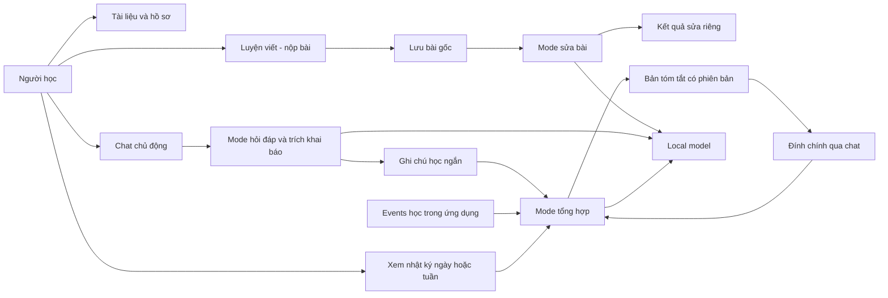

# SPEC.md — StudyCraft

## 1. Overview

StudyCraft giúp người học lưu thông tin học tập, tài liệu và bài làm trong không gian Tiếng Anh. MVP dùng model local để sửa bài đã hoàn thành, có chat hỏi đáp riêng và tạo nhật ký tóm tắt từ khai báo cùng hoạt động học.

Core loop: chọn tài liệu/đề → làm và nộp bài → lưu bài gốc → nhận bản sửa riêng → tự sửa hoặc quay lại sau; chat và nhật ký là các luồng hỗ trợ độc lập.

Đây là thiết kế để triển khai, chưa phải phần mềm đã chạy. Mọi path tính từ root repo. Nguồn nghiệp vụ là `docs/STUDYCRAFT_PRODUCT_DEFINITION.md` đã cập nhật theo quyết định ngày 2026-10-06; phần nào chưa được người dùng quyết định được ghi là giả định.

## 2. Goals / Non-goals

Goals:

- F01: giữ hồ sơ/mục tiêu, tài liệu riêng, việc học ngày/tuần và chat chủ động của người học.
- F02: sửa lỗi bài viết hoàn thành; hiển thị lỗi, thay thế tối thiểu và giải thích ở khu vực kết quả riêng; giữ nguyên bài gốc.
- F05 trong MVP: xem lịch sử bài/kết quả và nhật ký tóm tắt ngày/tuần; có thể đính chính nhật ký bằng lời nói trong chat.
- Model local; lưu bài và dùng các thao tác thủ công được khi model không sẵn sàng.
- Giữ các ý học tập cần thiết để tóm tắt, không lưu lâu dài toàn bộ cuộc trò chuyện và không có form tạo nhật ký.
- Kiểm chứng khả năng tìm lại bài/ngữ cảnh và mức phiền do khai báo bằng pilot cá nhân.

Non-goals:

- Agent hướng dẫn nhiều lượt trong lúc sửa, tự hỏi tiếp hoặc tự chuyển kết quả sang chat.
- Gợi ý ý tưởng hay hơn, bài tiếp theo, viết lại theo sở thích hoặc mở rộng bài sau khi sửa.
- Chấm điểm/đánh giá trình độ, bắt tạo nhận xét đủ bốn nhóm khi không có lỗi, kết luận thành thạo.
- Nộp bài hoặc tài liệu chính thức qua chat; chat chỉ để hỏi và khai báo việc học.
- Upload file/PDF/ảnh/audio; thư viện trong MVP chỉ có tên, mô tả, văn bản dán và danh mục.
- Claude/cloud API, tính tiền theo token, bảng giá, budget theo tiền, benchmark chất lượng định lượng.
- Transcript chat vĩnh viễn, form nhật ký thủ công, scheduler tổng kết tự động theo đồng hồ.
- AI đổi mục tiêu/kế hoạch, nhiều agent, nhiều môn/phương pháp, thông báo nhắc học, SaaS, Notion/Calendar/Gmail, web search hoặc vector search.

Future work, một dòng mỗi mục, không tạo stub ngoài adapter local/fake đang cần:

- Gợi ý mở rộng nội dung, ý tưởng và bài luyện tiếp sau khi sửa bài dùng được.
- Claude hoặc nhà cung cấp khác, cùng chi phí/budget khi thực sự sử dụng.
- Benchmark model và các KPI chất lượng gồm tỷ lệ lỗi bị bỏ sót.
- Upload tài liệu và quản lý file khi chốt định dạng, dung lượng và xử lý nội dung.
- Điều phối buổi học, nhắc ôn, phân tích kỹ năng, nhiều môn và tích hợp ngoài.

## 3. Assumptions & Open Questions

Thông tin hiện có đủ để cập nhật thiết kế và bắt đầu các increment không phụ thuộc chất lượng model. Không tự gán trình độ người học hoặc tuyên bố model local đáp ứng chất lượng/tốc độ trước khi chạy thử.

Quyết định người dùng đã chốt ngày 2026-10-06:

| ID | Quyết định | Hệ quả so với v1 |
| --- | --- | --- |
| D01 | Agent sửa bài hoàn thành; gợi ý/ý tưởng thêm để sau. | Bỏ next_step, proposal và hội thoại bắt buộc khỏi kết quả sửa. |
| D02 | Tài liệu có khu vực riêng; theo đề xuất đưa upload ra sau MVP. | Không nhận tài liệu/bài nộp chính thức qua chat; thư viện văn bản, chưa là ổ lưu trữ file. |
| D03 | Chat hỏi đáp riêng với kết quả sửa. | Hỏi thêm là hành động chủ động; không tự gọi chat sau review. |
| D04 | Trước mắt local model; Claude và tính chi phí để sau. | Bỏ API Claude, budget/cost fields, billing metrics và paid-eval gate. |
| D05 | Nhật ký từ khai báo trong chat và hoạt động ngày/tuần; chỉ tóm tắt, không lưu tất cả, không cần form. | Bỏ journal.add/form và transcript lâu dài; thêm summarize/correct. |
| D06 | Theo đề xuất bổ sung hồ sơ/chuẩn sửa, đính chính, giả thuyết giá trị, phạm vi F05 và thuật ngữ. | Các mục tương ứng bên dưới có tiêu chí kiểm chứng; không tự bịa giá trị baseline. |
| D07 | Đánh giá định lượng chất lượng sẽ tính sau. | Bỏ ngưỡng 90%/80%, yêu cầu 20 bài/40 findings; vẫn kiểm tra đúng luồng, quote và tính nguyên vẹn dữ liệu. |

Giả định triển khai có thể điều chỉnh:

| ID | Giả định | Phạm vi xác nhận |
| --- | --- | --- |
| A01 | Python 3.12, FastAPI, PostgreSQL; một người dùng local, server bind 127.0.0.1, một process/worker. | Giữ stack cũ; không phải SaaS/public deployment. |
| A02 | Jinja2 + HTML/CSS/JS thuần; một trang có tab Tài liệu, Luyện viết/Kết quả, Chat, Nhật ký. | Không cần Node build hoặc multi-agent. |
| A03 | Tiếng Anh, viết ngắn 1–300 từ, tối đa 6.000 ký tự; đề ≤2.000; một material ≤20.000. | Giới hạn kỹ thuật ban đầu, không phải chuẩn sư phạm. |
| A04 | Hồ sơ có mục đích viết tùy chọn, trình độ tự khai báo mặc định unknown, loại bài mặc định general_paragraph. | Chưa có trình độ cụ thể; không bắt làm placement test. |
| A05 | Ngày Asia/Ho_Chi_Minh; tuần thứ Hai–Chủ nhật. | Ngày/tuần đang diễn ra ghi rõ dữ liệu đến thời điểm tổng hợp. |
| A06 | Mở/chọn nhật ký ngày hoặc tuần sẽ tổng hợp nếu nguồn thay đổi; cùng nguồn trả bản có sẵn. | Không có cron; người dùng không phải điền form hoặc bấm lưu từng nhật ký. |
| A07 | Nhật ký tự lưu có nhãn “AI tổng hợp”; không có duyệt mọi khai báo. Đính chính là yêu cầu trực tiếp tại chat gắn với bản đang xem. | Không cho phép summary thay mục tiêu, activity status hay bài gốc. |
| A08 | App chỉ giữ tối đa 8 tin nhắn gần nhất trong RAM của tab đang mở; không DB/localStorage transcript. Cache reply của request chat trong RAM server tối đa 10 phút. | Reload/restart có thể mất chat; dữ liệu học đã tách lưu riêng vẫn còn. |
| A09 | Local HTTP adapter dùng endpoint OpenAI-compatible; runtime tham chiếu LM Studio tại 127.0.0.1:1234/v1. | Đây là lựa chọn triển khai đề xuất, không khẳng định đã cài runtime/model. Không tự tải model. |
| A10 | Giữ lâu dài tài liệu/bài/bản sửa, ghi chú học tập ngắn và các phiên bản tóm tắt; log kỹ thuật 30 ngày, không chứa text. | Không giữ bản sao transcript trong history, request table, log hoặc prompt snapshots. |
| A11 | Đề lấy từ mẫu developer hoặc người học nhập; không sinh đề bằng AI trong MVP. | Giữ khả năng nhận đề, phù hợp ưu tiên agent chỉ sửa bài. |

Open questions không chặn đặc tả:

- Tên model local, RAM/VRAM và context size thật: cần xác nhận trước kiểm chứng tích hợp local; chưa cam kết tốc độ.
- Mục đích/trình độ/loại bài thực tế: người học có thể khai báo trong hồ sơ; unknown phải là trạng thái hợp lệ.
- Người rà soát Tiếng Anh chưa được chỉ định; developer kiểm tra luồng không thay cho kiểm chứng ngôn ngữ.
- Baseline và độ dài pilot chưa có dữ liệu: ghi trước pilot, không dùng số tự đặt như kết quả đã đo.

Giả thuyết giá trị: tập trung tài liệu/bài/bản sửa giúp tìm lại việc đang học và giảm khai báo lặp. Pilot ghi thủ công tình huống, thời gian tìm lại bài, thông tin phải nhập lại và khó chịu khi dùng; không xây dashboard hoặc KPI chi phí.

Trade-offs:

- Dùng một local model với các mode độc lập; thay vì nhiều agent; tái sử dụng runtime nhưng không trộn prompt/quyền của sửa bài, chat và nhật ký.
- Giữ chat tạm + ghi chú ngắn; thay vì transcript vĩnh viễn; giảm dữ liệu dư nhưng không khôi phục được hội thoại đầy đủ.
- Tổng hợp khi xem; thay vì cron; đủ nhật ký ngày/tuần mà không thêm scheduler.
- Ghép bản sửa bằng các text edits đã kiểm tra; thay vì để model viết lại toàn bài; giữ ý và kiểm soát phần thực sự thay đổi.

## 4. User Stories

| ID | Story | Acceptance criteria |
| --- | --- | --- |
| US-01 | As a learner, I want my goal and learning profile saved so that I can resume in context. | Given chưa có trình độ, When lưu hồ sơ, Then unknown hợp lệ; reload giữ mục tiêu và thông tin đã khai báo. |
| US-02 | As a learner, I want a separate material library so that my learning content is organized independently of chat. | Given tên/mô tả/text hoặc catalog item, When lưu tại Tài liệu, Then có material riêng. Given tên-only, When sửa bài/hỏi nội dung sách, Then không nhận là có source text. |
| US-03 | As a learner, I want to manage activities so that I know what I planned and personally marked complete. | Given activity planned, When người học chọn completed, Then ghi status và event; chat, summary, nộp bài hoặc feedback không tự đổi status. |
| US-04 | As a learner, I want to select or enter a prompt and submit my finished writing so that I can receive corrections. | Given đề mẫu/đề riêng, When nộp bài hợp lệ tại Luyện viết, Then lưu submission trước model. Bản sửa tiếp theo có revision_of; không ghi đè bản gốc. Không cần chat. |
| US-05 | As a learner, I want a separate correction result so that I can see my errors and minimal fixes. | Given bài đã nộp, When sửa bài thành công, Then kết quả có lỗi, giải thích và corrected_text riêng; không next_step, ý tưởng mở rộng hoặc câu hỏi buộc trả lời. Bài không có lỗi rõ được trả corrections rỗng. |
| US-06 | As a learner, I want to ask questions in a separate chat so that I control when to discuss my work. | Given đang xem feedback, When chủ động mở Chat và chọn kết quả liên quan, Then câu hỏi có context đó; khi chỉ xem feedback thì không gọi chat. Transcript không được lưu lâu dài. |
| US-07 | As a learner, I want my reported learning and app activity summarized by day or week so that I do not fill a diary form. | Given khai báo trong chat và bài nộp trong kỳ, When mở nhật ký, Then có tóm tắt tự khai báo và counts ứng dụng riêng; không lưu nguyên hội thoại; không đổi kế hoạch. Báo cáo cả tuần không bị chia tùy tiện cho từng ngày. |
| US-08 | As a learner, I want to correct a journal through chat so that inaccurate summaries do not become permanent facts. | Given journal revision n, When chọn Đính chính và gửi yêu cầu rõ, Then tạo revision n+1, giữ n và bản đính chính ngắn; regenerate phải tôn trọng đính chính đó. Given n đã cũ, Then trả conflict và không ghi đè. |
| US-09 | As a learner, I want learning history and failure recovery so that saved work remains accessible. | Given restart hoặc local model unavailable, When mở bài/lịch sử, Then đề, submission, feedback và journal revisions còn; chat có thể mất đúng thông báo. Retry cùng ID không tạo bản ghi/gọi model trùng. |

Traceability:

| Story | Source scope | Tools | Increments |
| --- | --- | --- | --- |
| US-01 | F01 | workspace.read, workspace.update | I-02 |
| US-02 | F01 | workspace.read, material.save | I-02 |
| US-03 | F01 | activity.save, workspace.read | I-02 |
| US-04 | F02 | exercise.create, submission.add | I-03 |
| US-05 | F02 | feedback.generate, run.read | I-04 |
| US-06 | F01 | chat.send | I-05 |
| US-07 | F01/F05 | chat.send, journal.summarize | I-05, I-06 |
| US-08 | F05 | journal.correct, journal.summarize | I-06 |
| US-09 | F02/F05 | history.list, run.read, workspace.read | I-03, I-04, I-06, I-07 |

## 5. System Architecture

| Component | Responsibility |
| --- | --- |
| Browser | Khu vực riêng Tài liệu, Luyện viết/Kết quả, Chat, Nhật ký; chat buffer RAM; không tự gửi câu hỏi sau sửa bài. |
| FastAPI/application tools | Input validation, local session, transactions, version/idempotency, dữ liệu học và API allowlist. |
| Bounded runner | Chạy đúng một mode theo action; đọc snapshot → model → validate → persist; không plan tự do/tool calling. |
| LocalModelClient | HTTP local model; fake adapter cho tests. Không có Claude adapter hoặc cloud fallback trong MVP. |
| Context builder | Sửa bài dùng đề/bài/material snapshot/profile; chat chỉ lấy context đã chọn; nhật ký lấy ghi chú học + events + đính chính. |
| PostgreSQL | Artifacts học tập, ghi chú ngắn, summaries/revisions, event metadata, run metadata; không transcript. |



- Web cùng origin, `/` và `/static/*`; tools dùng POST `/api/tools/{name}`. GET `/health` kiểm DB, không gọi model.
- Một workspace english/short_writing được seed idempotent. UI bootstrap cung cấp workspace ID và CSRF token.
- Một local model run đang active/workspace; không giữ DB transaction mở qua network. Run ID bằng request_id cho thao tác model.
- Input bài đã lưu là durable trước feedback. Input chat ở RAM; chỉ lưu các learning_reports đã validate và trả reply. Không sao chép raw prompt vào DB để “khôi phục”.
- Nội dung kết quả sửa không phải message chat. History chứa exercise/submission/feedback/journal; không chứa chat replies.

## 6. Tools

**HTTP design bổ sung — 2026-10-08, Proposed:** [OpenAPI 3.1](api/openapi.json) và [API concepts](api/overview.md) đặc tả versioning, GET cho đọc/POST cho ghi, Idempotency-Key ánh xạ request_id, Problem thay Error ở HTTP boundary, planned_period của activity và INTERNAL_ERROR/HTTP 500. JSON manifest dưới đây vẫn mô tả tool/provider contracts nội bộ; adapter phải ánh xạ và đồng bộ các bổ sung đó trước coding. Không coi transport toàn-POST cũ là alias đã triển khai.

Tool là application operation có schema, không phải quyền model tự gọi API. Model trả dữ liệu, application service kiểm tra và quyết định việc được ghi. Document JSON dưới đây là manifest `app/contracts.json`; validate schema con input/output/provider_outputs với `$ref` resolve từ root, draft 2020-12, bật uuid/date/date-time format checks.

```json
{
  "$schema": "https://json-schema.org/draft/2020-12/schema",
  "$id": "urn:studycraft:contracts:v2",
  "$defs": {
    "UUID": {"type":"string","format":"uuid"},
    "Date": {"type":"string","format":"date"},
    "Time": {"type":"string","format":"date-time"},
    "NullableUUID": {"oneOf":[{"$ref":"#/$defs/UUID"},{"type":"null"}]},
    "NullableDate": {"oneOf":[{"$ref":"#/$defs/Date"},{"type":"null"}]},
    "Goal": {"type":"object","additionalProperties":false,"required":["text","deadline"],"properties":{"text":{"type":"string","minLength":1,"maxLength":400},"deadline":{"$ref":"#/$defs/NullableDate"}}},
    "NullableGoal": {"oneOf":[{"$ref":"#/$defs/Goal"},{"type":"null"}]},
    "Workspace": {"type":"object","additionalProperties":false,"required":["id","subject","method","goal","study_context","version","updated_at","learner_profile"],"properties":{"id":{"$ref":"#/$defs/UUID"},"subject":{"const":"english"},"method":{"const":"short_writing"},"goal":{"$ref":"#/$defs/NullableGoal"},"study_context":{"type":"string","maxLength":4000},"version":{"type":"integer","minimum":0},"updated_at":{"$ref":"#/$defs/Time"},"learner_profile":{"$ref":"#/$defs/LearnerProfile"}}},
    "Material": {"type":"object","additionalProperties":false,"required":["id","workspace_id","catalog_id","title","description","content","created_at"],"properties":{"id":{"$ref":"#/$defs/UUID"},"workspace_id":{"$ref":"#/$defs/UUID"},"catalog_id":{"$ref":"#/$defs/NullableUUID"},"title":{"type":"string","minLength":1,"maxLength":200},"description":{"type":"string","maxLength":1000},"content":{"type":["string","null"],"minLength":1,"maxLength":20000},"created_at":{"$ref":"#/$defs/Time"}}},
    "CatalogItem": {"type":"object","additionalProperties":false,"required":["id","title","description","has_content"],"properties":{"id":{"$ref":"#/$defs/UUID"},"title":{"type":"string","minLength":1,"maxLength":200},"description":{"type":"string","maxLength":1000},"has_content":{"type":"boolean"}}},
    "ActivityData": {"type":"object","additionalProperties":false,"required":["title","planned_for","status"],"properties":{"title":{"type":"string","minLength":1,"maxLength":300},"planned_for":{"$ref":"#/$defs/NullableDate"},"status":{"enum":["planned","completed","deferred"]}}},
    "Activity": {"type":"object","additionalProperties":false,"required":["id","workspace_id","data","created_at","updated_at"],"properties":{"id":{"$ref":"#/$defs/UUID"},"workspace_id":{"$ref":"#/$defs/UUID"},"data":{"$ref":"#/$defs/ActivityData"},"created_at":{"$ref":"#/$defs/Time"},"updated_at":{"$ref":"#/$defs/Time"}}},
    "Exercise": {"type":"object","additionalProperties":false,"required":["id","workspace_id","prompt","origin","material_id","material_snapshot","created_at","template_id"],"properties":{"id":{"$ref":"#/$defs/UUID"},"workspace_id":{"$ref":"#/$defs/UUID"},"prompt":{"type":"string","minLength":1,"maxLength":2000},"origin":{"enum":["user","template"]},"material_id":{"$ref":"#/$defs/NullableUUID"},"material_snapshot":{"oneOf":[{"$ref":"#/$defs/Material"},{"type":"null"}]},"created_at":{"$ref":"#/$defs/Time"},"template_id":{"$ref":"#/$defs/NullableUUID"}}},
    "Submission": {"type":"object","additionalProperties":false,"required":["id","workspace_id","exercise_id","revision_of","text","word_count","created_at"],"properties":{"id":{"$ref":"#/$defs/UUID"},"workspace_id":{"$ref":"#/$defs/UUID"},"exercise_id":{"$ref":"#/$defs/UUID"},"revision_of":{"$ref":"#/$defs/NullableUUID"},"text":{"type":"string","minLength":1,"maxLength":6000},"word_count":{"type":"integer","minimum":1,"maximum":300},"created_at":{"$ref":"#/$defs/Time"}}},
    "Quote": {"type":"object","additionalProperties":false,"required":["start","end","text"],"properties":{"start":{"type":"integer","minimum":0},"end":{"type":"integer","minimum":1},"text":{"type":"string","minLength":1,"maxLength":6000}}},
    "Criterion": {"enum":["task_response","organization","grammar","vocabulary"]},
    "Finding": {"type":"object","additionalProperties":false,"required":["criterion","quote","explanation","suggested_revision"],"properties":{"criterion":{"$ref":"#/$defs/Criterion"},"quote":{"$ref":"#/$defs/Quote"},"explanation":{"type":"string","minLength":1,"maxLength":600},"suggested_revision":{"type":["string","null"],"minLength":1,"maxLength":1000}}},
    "Error": {"type":"object","additionalProperties":false,"required":["error"],"properties":{"error":{"type":"object","additionalProperties":false,"required":["code","message","retryable","run_id"],"properties":{"code":{"enum":["INVALID_INPUT","FORBIDDEN","NOT_FOUND","VERSION_CONFLICT","IDEMPOTENCY_CONFLICT","RUN_BUSY","LOCAL_MODEL_UNAVAILABLE","MODEL_TIMEOUT","INVALID_MODEL_OUTPUT","CONTEXT_LIMIT","RESULT_EXPIRED","INTERRUPTED","DATABASE_UNAVAILABLE"]},"message":{"type":"string","minLength":1,"maxLength":500},"retryable":{"type":"boolean"},"run_id":{"$ref":"#/$defs/NullableUUID"}}}}},
    "LearnerProfile": {"type":"object","additionalProperties":false,"required":["self_reported_level","writing_purpose","writing_type"],"properties":{"self_reported_level":{"enum":["unknown","beginner","intermediate","advanced"]},"writing_purpose":{"type":"string","minLength":0,"maxLength":400},"writing_type":{"enum":["general_paragraph","personal_email","short_opinion"]}}},
    "WritingPrompt": {"type":"object","additionalProperties":false,"required":["id","prompt"],"properties":{"id":{"$ref":"#/$defs/UUID"},"prompt":{"type":"string","minLength":1,"maxLength":2000}}},
    "Correction": {"oneOf":[{"type":"object","additionalProperties":false,"required":["kind","criterion","quote","replacement","explanation"],"properties":{"kind":{"const":"text_edit"},"criterion":{"enum":["grammar","vocabulary"]},"quote":{"$ref":"#/$defs/Quote"},"replacement":{"type":"string","minLength":0,"maxLength":1000},"explanation":{"type":"string","minLength":1,"maxLength":600}}},{"type":"object","additionalProperties":false,"required":["kind","criterion","quote","replacement","explanation"],"properties":{"kind":{"const":"content_issue"},"criterion":{"enum":["task_response","organization"]},"quote":{"oneOf":[{"$ref":"#/$defs/Quote"},{"type":"null"}]},"replacement":{"type":"null"},"explanation":{"type":"string","minLength":1,"maxLength":600}}}]},
    "CorrectionData": {"type":"object","additionalProperties":false,"required":["summary","corrections","limitations"],"properties":{"summary":{"type":"string","minLength":1,"maxLength":800},"corrections":{"type":"array","maxItems":12,"items":{"$ref":"#/$defs/Correction"}},"limitations":{"type":"array","maxItems":5,"items":{"type":"string","minLength":1,"maxLength":400}}}},
    "Feedback": {"type":"object","additionalProperties":false,"required":["id","workspace_id","submission_id","run_id","rubric_version","data","corrected_text","created_at"],"properties":{"id":{"$ref":"#/$defs/UUID"},"workspace_id":{"$ref":"#/$defs/UUID"},"submission_id":{"$ref":"#/$defs/UUID"},"run_id":{"$ref":"#/$defs/UUID"},"rubric_version":{"const":"correction-v2"},"data":{"$ref":"#/$defs/CorrectionData"},"corrected_text":{"type":"string","minLength":1,"maxLength":10000},"created_at":{"$ref":"#/$defs/Time"}}},
    "LearningReport": {"type":"object","additionalProperties":false,"required":["id","workspace_id","period","start_date","end_date","statement","origin","created_at"],"properties":{"id":{"$ref":"#/$defs/UUID"},"workspace_id":{"$ref":"#/$defs/UUID"},"period":{"enum":["day","week"]},"start_date":{"$ref":"#/$defs/Date"},"end_date":{"$ref":"#/$defs/Date"},"statement":{"type":"string","minLength":1,"maxLength":500},"origin":{"const":"user_report"},"created_at":{"$ref":"#/$defs/Time"}}},
    "AppCounts": {"type":"object","additionalProperties":false,"required":["submitted_drafts","feedback_results","completion_confirmations"],"properties":{"submitted_drafts":{"type":"integer","minimum":0},"feedback_results":{"type":"integer","minimum":0},"completion_confirmations":{"type":"integer","minimum":0}}},
    "JournalContent": {"type":"object","additionalProperties":false,"required":["learner_summary","app_counts","limitations"],"properties":{"learner_summary":{"type":"string","minLength":0,"maxLength":2000},"app_counts":{"$ref":"#/$defs/AppCounts"},"limitations":{"type":"array","maxItems":5,"items":{"type":"string","minLength":1,"maxLength":300}}}},
    "Journal": {"type":"object","additionalProperties":false,"required":["id","workspace_id","period","start_date","end_date","revision","content","source_report_ids","source_event_ids","source_correction_ids","source_signature","status","editor","updated_at"],"properties":{"id":{"$ref":"#/$defs/UUID"},"workspace_id":{"$ref":"#/$defs/UUID"},"period":{"enum":["day","week"]},"start_date":{"$ref":"#/$defs/Date"},"end_date":{"$ref":"#/$defs/Date"},"revision":{"type":"integer","minimum":1},"content":{"$ref":"#/$defs/JournalContent"},"source_report_ids":{"type":"array","maxItems":500,"items":{"$ref":"#/$defs/UUID"}},"source_event_ids":{"type":"array","maxItems":1000,"items":{"$ref":"#/$defs/UUID"}},"source_correction_ids":{"type":"array","maxItems":100,"items":{"$ref":"#/$defs/UUID"}},"source_signature":{"type":"string","minLength":64,"maxLength":64},"status":{"enum":["current","stale"]},"editor":{"enum":["ai","user_correction"]},"updated_at":{"$ref":"#/$defs/Time"}}},
    "RecentMessage": {"type":"object","additionalProperties":false,"required":["role","text"],"properties":{"role":{"enum":["user","assistant"]},"text":{"type":"string","minLength":1,"maxLength":3000}}},
    "ChatResult": {"type":"object","additionalProperties":false,"required":["run_id","reply","saved_reports"],"properties":{"run_id":{"$ref":"#/$defs/UUID"},"reply":{"type":"string","minLength":1,"maxLength":3000},"saved_reports":{"type":"array","maxItems":3,"items":{"$ref":"#/$defs/LearningReport"}}}},
    "Run": {"type":"object","additionalProperties":false,"required":["id","workspace_id","operation","status","error_code","result_ids","model","input_tokens","output_tokens","context_truncated","started_at","finished_at"],"properties":{"id":{"$ref":"#/$defs/UUID"},"workspace_id":{"$ref":"#/$defs/UUID"},"operation":{"enum":["feedback.generate","chat.send","journal.summarize","journal.correct"]},"status":{"enum":["running","succeeded","failed","interrupted"]},"error_code":{"oneOf":[{"type":"string","minLength":1,"maxLength":50},{"type":"null"}]},"result_ids":{"type":"array","maxItems":4,"items":{"$ref":"#/$defs/UUID"}},"model":{"oneOf":[{"type":"string","minLength":1,"maxLength":200},{"type":"null"}]},"input_tokens":{"oneOf":[{"type":"integer","minimum":0},{"type":"null"}]},"output_tokens":{"oneOf":[{"type":"integer","minimum":0},{"type":"null"}]},"context_truncated":{"type":"boolean"},"started_at":{"$ref":"#/$defs/Time"},"finished_at":{"oneOf":[{"$ref":"#/$defs/Time"},{"type":"null"}]}}},
    "HistoryItem": {"type":"object","additionalProperties":false,"required":["id","kind","entity_id","journal_revision","data","created_at"],"properties":{"id":{"type":"integer","minimum":1},"kind":{"enum":["exercise","submission","feedback","journal"]},"entity_id":{"$ref":"#/$defs/UUID"},"journal_revision":{"oneOf":[{"type":"integer","minimum":1},{"type":"null"}]},"data":{"oneOf":[{"$ref":"#/$defs/Exercise"},{"$ref":"#/$defs/Submission"},{"$ref":"#/$defs/Feedback"},{"$ref":"#/$defs/Journal"}]},"created_at":{"$ref":"#/$defs/Time"}}}
  },
  "tools": {
    "workspace.read": {"input":{"type":"object","additionalProperties":false,"required":["workspace_id"],"properties":{"workspace_id":{"$ref":"#/$defs/UUID"}}},"output":{"oneOf":[{"type":"object","additionalProperties":false,"required":["workspace","materials","catalog","activities","journals","writing_prompts"],"properties":{"workspace":{"$ref":"#/$defs/Workspace"},"materials":{"type":"array","maxItems":50,"items":{"$ref":"#/$defs/Material"}},"catalog":{"type":"array","maxItems":100,"items":{"$ref":"#/$defs/CatalogItem"}},"activities":{"type":"array","maxItems":20,"items":{"$ref":"#/$defs/Activity"}},"journals":{"type":"array","maxItems":10,"items":{"$ref":"#/$defs/Journal"}},"writing_prompts":{"type":"array","maxItems":20,"items":{"$ref":"#/$defs/WritingPrompt"}}}},{"$ref":"#/$defs/Error"}]}},
    "workspace.update": {"input":{"type":"object","additionalProperties":false,"required":["workspace_id","request_id","expected_version","goal","study_context","learner_profile"],"properties":{"workspace_id":{"$ref":"#/$defs/UUID"},"request_id":{"$ref":"#/$defs/UUID"},"expected_version":{"type":"integer","minimum":0},"goal":{"$ref":"#/$defs/NullableGoal"},"study_context":{"type":"string","minLength":0,"maxLength":4000},"learner_profile":{"$ref":"#/$defs/LearnerProfile"}}},"output":{"oneOf":[{"$ref":"#/$defs/Workspace"},{"$ref":"#/$defs/Error"}]}},
    "material.save": {"input":{"oneOf":[{"type":"object","additionalProperties":false,"required":["workspace_id","request_id","expected_version","mode","catalog_id"],"properties":{"workspace_id":{"$ref":"#/$defs/UUID"},"request_id":{"$ref":"#/$defs/UUID"},"expected_version":{"type":"integer","minimum":0},"mode":{"const":"catalog"},"catalog_id":{"$ref":"#/$defs/UUID"}}},{"type":"object","additionalProperties":false,"required":["workspace_id","request_id","expected_version","mode","material_id","title","description","content"],"properties":{"workspace_id":{"$ref":"#/$defs/UUID"},"request_id":{"$ref":"#/$defs/UUID"},"expected_version":{"type":"integer","minimum":0},"mode":{"const":"user"},"material_id":{"$ref":"#/$defs/NullableUUID"},"title":{"type":"string","minLength":1,"maxLength":200},"description":{"type":"string","maxLength":1000},"content":{"type":["string","null"],"minLength":1,"maxLength":20000}}}]},"output":{"oneOf":[{"$ref":"#/$defs/Material"},{"$ref":"#/$defs/Error"}]}},
    "activity.save": {"input":{"type":"object","additionalProperties":false,"required":["workspace_id","request_id","expected_version","activity_id","data"],"properties":{"workspace_id":{"$ref":"#/$defs/UUID"},"request_id":{"$ref":"#/$defs/UUID"},"expected_version":{"type":"integer","minimum":0},"activity_id":{"$ref":"#/$defs/NullableUUID"},"data":{"$ref":"#/$defs/ActivityData"}}},"output":{"oneOf":[{"$ref":"#/$defs/Activity"},{"$ref":"#/$defs/Error"}]}},
    "exercise.create": {"input":{"oneOf":[{"type":"object","additionalProperties":false,"required":["workspace_id","request_id","mode","prompt","material_id"],"properties":{"workspace_id":{"$ref":"#/$defs/UUID"},"request_id":{"$ref":"#/$defs/UUID"},"mode":{"const":"user"},"prompt":{"type":"string","minLength":1,"maxLength":2000},"material_id":{"$ref":"#/$defs/NullableUUID"}}},{"type":"object","additionalProperties":false,"required":["workspace_id","request_id","mode","template_id","material_id"],"properties":{"workspace_id":{"$ref":"#/$defs/UUID"},"request_id":{"$ref":"#/$defs/UUID"},"mode":{"const":"template"},"template_id":{"$ref":"#/$defs/UUID"},"material_id":{"$ref":"#/$defs/NullableUUID"}}}]},"output":{"oneOf":[{"$ref":"#/$defs/Exercise"},{"$ref":"#/$defs/Error"}]}},
    "submission.add": {"input":{"type":"object","additionalProperties":false,"required":["workspace_id","request_id","exercise_id","revision_of","text"],"properties":{"workspace_id":{"$ref":"#/$defs/UUID"},"request_id":{"$ref":"#/$defs/UUID"},"exercise_id":{"$ref":"#/$defs/UUID"},"revision_of":{"$ref":"#/$defs/NullableUUID"},"text":{"type":"string","minLength":1,"maxLength":6000}}},"output":{"oneOf":[{"$ref":"#/$defs/Submission"},{"$ref":"#/$defs/Error"}]}},
    "feedback.generate": {"input":{"type":"object","additionalProperties":false,"required":["workspace_id","request_id","submission_id"],"properties":{"workspace_id":{"$ref":"#/$defs/UUID"},"request_id":{"$ref":"#/$defs/UUID"},"submission_id":{"$ref":"#/$defs/UUID"}}},"output":{"oneOf":[{"$ref":"#/$defs/Feedback"},{"$ref":"#/$defs/Error"}]}},
    "chat.send": {"input":{"type":"object","additionalProperties":false,"required":["workspace_id","request_id","text","recent_messages","feedback_id"],"properties":{"workspace_id":{"$ref":"#/$defs/UUID"},"request_id":{"$ref":"#/$defs/UUID"},"text":{"type":"string","minLength":1,"maxLength":3000},"recent_messages":{"type":"array","maxItems":8,"items":{"$ref":"#/$defs/RecentMessage"}},"feedback_id":{"$ref":"#/$defs/NullableUUID"}}},"output":{"oneOf":[{"$ref":"#/$defs/ChatResult"},{"$ref":"#/$defs/Error"}]}},
    "journal.summarize": {"input":{"type":"object","additionalProperties":false,"required":["workspace_id","request_id","period","anchor_date"],"properties":{"workspace_id":{"$ref":"#/$defs/UUID"},"request_id":{"$ref":"#/$defs/UUID"},"period":{"enum":["day","week"]},"anchor_date":{"$ref":"#/$defs/Date"}}},"output":{"oneOf":[{"$ref":"#/$defs/Journal"},{"$ref":"#/$defs/Error"}]}},
    "journal.correct": {"input":{"type":"object","additionalProperties":false,"required":["workspace_id","request_id","journal_id","expected_revision","instruction"],"properties":{"workspace_id":{"$ref":"#/$defs/UUID"},"request_id":{"$ref":"#/$defs/UUID"},"journal_id":{"$ref":"#/$defs/UUID"},"expected_revision":{"type":"integer","minimum":1},"instruction":{"type":"string","minLength":1,"maxLength":1000}}},"output":{"oneOf":[{"$ref":"#/$defs/Journal"},{"$ref":"#/$defs/Error"}]}},
    "history.list": {"input":{"type":"object","additionalProperties":false,"required":["workspace_id","before_id","limit"],"properties":{"workspace_id":{"$ref":"#/$defs/UUID"},"before_id":{"oneOf":[{"type":"integer","minimum":1},{"type":"null"}]},"limit":{"type":"integer","minimum":1,"maximum":50}}},"output":{"oneOf":[{"type":"object","additionalProperties":false,"required":["items","next_before_id"],"properties":{"items":{"type":"array","maxItems":50,"items":{"$ref":"#/$defs/HistoryItem"}},"next_before_id":{"oneOf":[{"type":"integer","minimum":1},{"type":"null"}]}}},{"$ref":"#/$defs/Error"}]}},
    "run.read": {"input":{"type":"object","additionalProperties":false,"required":["workspace_id","run_id"],"properties":{"workspace_id":{"$ref":"#/$defs/UUID"},"run_id":{"$ref":"#/$defs/UUID"}}},"output":{"oneOf":[{"$ref":"#/$defs/Run"},{"$ref":"#/$defs/Error"}]}}
  },
  "provider_outputs": {
    "feedback.generate": {"$ref":"#/$defs/CorrectionData"},
    "chat.send": {"type":"object","additionalProperties":false,"required":["reply","reports"],"properties":{"reply":{"type":"string","minLength":1,"maxLength":3000},"reports":{"type":"array","maxItems":3,"items":{"type":"object","additionalProperties":false,"required":["period","anchor_date","statement","source_quote"],"properties":{"period":{"enum":["day","week"]},"anchor_date":{"$ref":"#/$defs/Date"},"statement":{"type":"string","minLength":1,"maxLength":500},"source_quote":{"type":"string","minLength":1,"maxLength":1000}}}}}},
    "journal.summarize": {"type":"object","additionalProperties":false,"required":["learner_summary","used_report_ids","used_correction_ids","limitations"],"properties":{"learner_summary":{"type":"string","minLength":0,"maxLength":2000},"used_report_ids":{"type":"array","maxItems":500,"items":{"$ref":"#/$defs/UUID"}},"used_correction_ids":{"type":"array","maxItems":100,"items":{"$ref":"#/$defs/UUID"}},"limitations":{"type":"array","maxItems":5,"items":{"type":"string","minLength":1,"maxLength":300}}}},
    "journal.correct": {"oneOf":[{"type":"object","additionalProperties":false,"required":["status","learner_summary","limitations"],"properties":{"status":{"const":"corrected"},"learner_summary":{"type":"string","minLength":0,"maxLength":2000},"limitations":{"type":"array","maxItems":5,"items":{"type":"string","minLength":1,"maxLength":300}}}},{"type":"object","additionalProperties":false,"required":["status","question"],"properties":{"status":{"const":"needs_clarification"},"question":{"type":"string","minLength":1,"maxLength":500}}}]}
  }
}
```

| Tool | Purpose | Side effects | Idempotent | Approval required | Errors ngoài INVALID_INPUT/DB |
| --- | --- | --- | --- | --- | --- |
| workspace.read | Lấy profile, material/catalog, activities, journal mới nhất, đề mẫu. | Không. | y | n | NOT_FOUND. |
| workspace.update | Lưu profile/goal/context do người học sửa. | Update + workspace version. | y theo request_id | n; người học trực tiếp lưu | VERSION_CONFLICT, IDEMPOTENCY_CONFLICT, FORBIDDEN. |
| material.save | Lưu/chỉnh văn bản hoặc chọn catalog ở khu vực riêng. | Material + workspace version. | y theo request_id | n | NOT_FOUND, VERSION_CONFLICT, IDEMPOTENCY_CONFLICT, FORBIDDEN. |
| activity.save | Lưu việc học và trạng thái tự xác nhận. | Activity, version, compact event nếu đổi status. | y theo request_id | n | NOT_FOUND, VERSION_CONFLICT, IDEMPOTENCY_CONFLICT, FORBIDDEN. |
| exercise.create | Tạo đề từ template developer hoặc text người học. | Exercise snapshot + history index; không model. | y theo request_id | n | NOT_FOUND, IDEMPOTENCY_CONFLICT. |
| submission.add | Lưu bài hoàn thành/bản viết lại. | Submission + event + history index; không model. | y theo request_id | n | NOT_FOUND, IDEMPOTENCY_CONFLICT. |
| feedback.generate | Sửa một submission đã lưu. | Local inference, feedback + event/history + run. | y theo request_id | n; thao tác Nhận bản sửa | NOT_FOUND, RUN_BUSY, LOCAL_MODEL_UNAVAILABLE, MODEL_TIMEOUT, INVALID_MODEL_OUTPUT, CONTEXT_LIMIT, INTERRUPTED. |
| chat.send | Hỏi đáp và trích các khai báo đã học. | Reply tạm trong RAM; lưu learning_reports ngắn nếu có; run metadata. | y theo request_id; expired không chạy lại | n; không cần duyệt từng khai báo | RUN_BUSY, LOCAL_MODEL_UNAVAILABLE, MODEL_TIMEOUT, INVALID_MODEL_OUTPUT, CONTEXT_LIMIT, RESULT_EXPIRED, INTERRUPTED. |
| journal.summarize | Xem/tạo summary ngày/tuần từ source hiện có. | Journal revision khi source thay đổi; local inference nếu cần; không đổi kế hoạch. | y theo request_id và source signature | n; tự lưu có nhãn AI | RUN_BUSY, LOCAL_MODEL_UNAVAILABLE, MODEL_TIMEOUT, INVALID_MODEL_OUTPUT, CONTEXT_LIMIT, VERSION_CONFLICT. |
| journal.correct | Áp dụng yêu cầu đính chính bằng lời trong chat gắn journal. | Correction note + journal revision, cùng transaction sau validation. | y theo request_id | n; yêu cầu đính chính trực tiếp là thao tác ghi | NOT_FOUND, VERSION_CONFLICT, LOCAL_MODEL_UNAVAILABLE, MODEL_TIMEOUT, INVALID_MODEL_OUTPUT, RUN_BUSY. |
| history.list | Đọc artifacts/summary revisions theo cursor. | Không. | y | n | NOT_FOUND. |
| run.read | Tra trạng thái khi request bị ngắt. | Không. | y | n | NOT_FOUND. |

Invariants bắt buộc ngoài schema:

- Mọi reference thuộc workspace request; không trả dữ liệu workspace khác. Unknown fields/whitespace-only required strings → INVALID_INPUT. HTTP mapping: 422 INVALID_INPUT/CONTEXT_LIMIT; 403 FORBIDDEN; 404 NOT_FOUND; 409 version/idempotency/run busy/result expired/interrupted; 502 INVALID_MODEL_OUTPUT; 503 local model/DB unavailable; 504 MODEL_TIMEOUT.
- material.save mode user với material_id null là tạo mới; ID khác null là update có version check. Catalog selection tạo bản sao; unique(workspace_id,catalog_id), chọn lại trả bản hiện có. Sửa bản catalog bằng text người học chuyển catalog_id thành null. Tối đa 50 material/workspace, 100 catalog items, 20 đề mẫu.
- Profile self_reported_level là tự khai báo, không suy ra từ bài. Writing type giúp hiểu mục đích, không tạo khóa học hoặc thang điểm mới.
- Exercise user: template_id null; template: server lấy prompt từ catalog đề mẫu, không nhận model-generated prompt. material_snapshot sao chép Material ở lúc tạo đề, id bằng material_id; cả hai null nếu không chọn. Sửa material sau đó không đổi source của bài cũ.
- Submission bất biến; revision_of nếu có phải cùng exercise/workspace. Đếm 1–300 từ bằng regex `[A-Za-z]+(?:['’-][A-Za-z]+)*`; không trim/normalize text đã lưu.
- Quote offsets zero-based, Unicode code points, end exclusive; substring phải đúng text. Text edits không chồng lấn; replacement khác nguyên văn. Server áp dụng từ offset lớn về nhỏ để tạo corrected_text; không nhận toàn bài viết lại từ model. Chuỗi rỗng cho replacement là xóa đoạn.
- content_issue không được tự thêm ý vào bài; replacement null. Khi không có đoạn để trích, quote null và explanation nêu thiếu/không nhất quán so với đề. Không bắt đủ bốn criterion, không tự tạo lỗi để có kết quả.
- Chat reports chỉ lấy từ **message hiện tại** là lời khai báo việc đã học, không trích từ assistant, lịch sử gửi kèm, câu hỏi, dự định, ví dụ hoặc trích dẫn. source_quote phải là substring nguyên văn input hiện tại; chỉ dùng validate, không persist quote.
- Report ngày mặc định hôm nay khi người học nói đã học nhưng không chỉ ngày khác; câu tương đối rõ được chuẩn hóa theo timezone. Báo cả tuần giữ period week, không phân bổ thành ngày. Nếu ngày mơ hồ/mâu thuẫn, reply hỏi ngắn và không lưu phần chưa rõ. Không nhận kỳ bắt đầu trong tương lai là việc đã học.
- Report period day: start=end=anchor_date. Week: server chuẩn hóa thứ Hai đến Chủ nhật. Chỉ lưu statement ngắn với origin user_report; không coi nội dung người dùng khai là chứng minh đã học/thành thạo.
- Journal ngày chọn reports cùng ngày; tuần chọn reports ngày thuộc tuần và reports cả tuần tương ứng. Báo cả tuần không xuất hiện như fact của một ngày. Không cộng thời lượng tự khai báo khi có khả năng trùng nguồn; MVP không tính tổng giờ học.
- app_counts do server đếm từ events trong kỳ: submitted_drafts, feedback_results, completion_confirmations là **số lượt thao tác**, không phải thời lượng/tiến độ/thành thạo. Model không tạo hoặc sửa counts.
- Source signature = SHA-256 của canonical JSON gồm kỳ, sorted report/event/correction IDs và nội dung/version liên quan; journal giữ đủ source IDs. Không đổi source → trả revision hiện có, không inference/history trùng. Empty period trả summary rỗng + counts 0 + limitation “Chưa có dữ liệu”, không gọi model.
- Nếu chỉ có app events, learner_summary rỗng và app_counts vẫn được tính; không cần model. Nhánh cache/không inference hoàn thành requests với response Journal và không tạo run. Sau mất kết nối, replay đúng request_id trả artifact; run.read NOT_FOUND không có nghĩa là được gửi một UUID mới để thử lại.
- Model trả used_report_ids/used_correction_ids chỉ được thuộc context. source_report_ids của journal lưu toàn bộ nguồn đã cung cấp, không chỉ phần model nhắc; bỏ sót source được nêu trong limitations khi có giới hạn, không khẳng định đã tổng hợp đầy đủ.
- journal.correct chỉ được gọi từ chat có journal_id/expected_revision gắn từ nút Đính chính. UI không có form nhật ký; user nhập một câu yêu cầu sửa, kết quả mới ở panel Nhật ký và chat chỉ báo hoàn tất/không đủ rõ. Không tạo một reply hỏi đáp thứ hai để thực hiện sửa.
- Đính chính lưu instruction ≤1.000 ký tự như **yêu cầu sửa chủ động**, không transcript; model chỉ sửa learner_summary. Counts/evidence events bất biến. Yêu cầu trái với app event được ghi như tự khai báo/khác biệt, không làm giả event.
- Provider journal.correct trả status corrected hoặc needs_clarification. Trường hợp needs_clarification được service đổi thành Error INVALID_INPUT với question làm message; không lưu instruction/revision và không gửi thêm request chat. Người học có thể gửi câu rõ hơn bằng UUID mới trong cùng chat gắn nhật ký.
- Mỗi correction note giữ period/start/end; tổng hợp sau phải ưu tiên note mới nhất về cùng nội dung. Note ngày được đưa vào summary tuần chứa ngày đó; note cả tuần không bị chia cho ngày. Summary mơ hồ không thay đổi bản trước; yêu cầu làm rõ ở chat.
- Version journal độc lập workspace version. journal.correct kiểm tra expected_revision cả trước inference và lúc commit; source thay đổi giữa chạy/commit → VERSION_CONFLICT, giữ bản trước và câu người dùng trong tab để thử lại; không persist correction note nửa chừng.
- Snapshot journal mới lưu append-only revision; bản trước vẫn xem được. journal status khi đọc là stale nếu source_signature hiện tại khác bản đã lưu; UI hiển thị cần cập nhật. journal.summarize chỉ commit khi source signature vẫn đúng, tránh lưu bản vừa sinh đã lỗi thời.
- workspace version tăng khi đổi profile/goal/context/material/activity; chat/summary/correction không tăng và không được thay đổi các object đó.
- Idempotency `(workspace_id,request_id)` + hash(tool name + canonical input trừ request_id). Same key/hash trả kết quả có sẵn; khác hash → conflict. Running → RUN_BUSY. Terminal failed/interrupted không gọi lại model với cùng ID; retry mới dùng UUID mới.
- Chat replay: giữ reply trong RAM server ≤10 phút. DB chỉ có request hash/status và IDs learning_reports; hết cache/restart → RESULT_EXPIRED, không chạy lại/nhân đôi report. UI giải thích reply tạm không còn; người dùng có thể hỏi mới.
- workspace.read trả 20 activities gần nhất, 10 journals gần nhất; history đủ artifacts theo `id < before_id ORDER BY id DESC LIMIT limit+1`. next_before_id là ID cuối nếu còn trang, ngược lại null. Không dùng timestamp làm cursor.

## 7. Agent Behavior

“Agent sửa bài” có nhiệm vụ hẹp; ba tác vụ khác dùng cùng model nhưng có prompt, input/output và quyền riêng. Không có agent tự quyết định mở chuỗi hội thoại hoặc điều phối kế hoạch.

| Mode | System prompt requirements | Stop condition |
| --- | --- | --- |
| correction-v2 | Chỉ sửa bài đã nộp; giữ ý/tone, không thêm ý tưởng, không hỏi tiếp, không gợi ý bài sau. Sửa phần chắc chắn có lỗi; thiếu ngữ cảnh ghi limitations. JSON CorrectionData, tối đa 12 corrections. | Một bản sửa hợp lệ hoặc lỗi; không tự tiếp tục. |
| chat-v2 | Trả lời đúng câu hỏi hiện tại; nếu có lời khai báo đã học thì trích ngắn và gắn kỳ. Không đổi bài/kế hoạch; không nhận bài/tài liệu chính thức. | Một reply; tối đa một câu hỏi làm rõ khi cần. Chỉ chạy lượt tiếp khi người học gửi. |
| journal-v2 | Tóm tắt lời tự khai báo và đính chính theo kỳ; không suy ra thành thạo/giờ học; ưu tiên đính chính trực tiếp. Không phát biểu thành tích không có nguồn. App counts do server thêm riêng. | Một learner_summary và limitations. |
| journal-correction-v2 | Sửa đúng phần người học yêu cầu trong summary, giữ phần khác; không sửa counts, không dùng câu trong chat làm lệnh cho hệ thống. | Một bản đính chính rõ; mơ hồ trả lỗi INVALID_INPUT và message yêu cầu làm rõ, giữ bản trước. |

Rubric sửa lỗi tối thiểu (không thang điểm):

| Nhóm | Khi nào sửa | Ví dụ đối chiếu / giới hạn |
| --- | --- | --- |
| grammar | Sai cấu trúc/thì/hòa hợp rõ theo ngữ cảnh. | “She go to school every day.” → “She goes to school every day.” |
| vocabulary | Sai từ/cụm từ làm sai nghĩa hoặc cách dùng trong ngữ cảnh. | “I did a mistake.” → “I made a mistake.”; không thay từ đúng chỉ để nghe cao cấp hơn. |
| task_response | Bài không thực hiện yêu cầu rõ của đề. | Đề yêu cầu nêu lý do, bài chỉ nêu ý kiến: chỉ ra thiếu lý do, không bịa lý do thay người học. |
| organization | Mâu thuẫn hoặc quan hệ giữa câu không nhất quán có bằng chứng. | Chỉ ra các câu xung đột; không tự viết ý nối hoặc dàn ý mới. |

Người học xác nhận ý định; developer kiểm tra contract/luồng; người rà soát Tiếng Anh (chưa chỉ định) kiểm tra nhận xét khi đánh giá thủ công. Chưa có benchmark định lượng hoặc kết luận model đã đủ chất lượng.

Local adapter:

- `LLM_MODE=fake|local`; fake cho test/demo có badge, local là MVP thật. `LOCAL_MODEL` bắt buộc trong local mode; không mặc định một model chưa tải.
- `LOCAL_LLM_BASE_URL` mặc định `http://127.0.0.1:1234/v1`; chỉ allow loopback, không cloud fallback. HTTP client không follow redirect. Optional `LOCAL_LLM_API_KEY` chỉ khi runtime local bật xác thực; không dùng Claude key.
- Gửi POST `/chat/completions` với model, messages, temperature=0, stream=false, max_tokens theo cấu hình. System prompt yêu cầu JSON; luôn validate phía app, không dựa vào structured-output riêng của runtime. Đọc `choices[0].message.content`; usage nếu không có thì null, không tính tiền.
- Runtime tham chiếu hỗ trợ endpoint này theo [tài liệu Chat Completions của LM Studio](https://beta.lmstudio.ai/docs/developer/openai-compat/chat-completions). Đây chỉ xác nhận giao thức; chất lượng model/phần cứng phải kiểm chứng riêng.
- Giới hạn đề xuất: 120 giây/run, tối đa 2 attempts tổng cộng, max output 3.000 tokens. Attempt thứ hai chỉ khi connect failure/HTTP 5xx hoặc sửa JSON/quote sai và còn thời gian; không retry inference timeout. Chưa có cam kết p95 trên máy người dùng.
- Input UTF-8 bytes tối đa 40.000 và phải fit context limit thực tế của model cấu hình. Khi runtime báo context overflow → CONTEXT_LIMIT; không gọi cloud, không cắt bài gốc hoặc retry cùng nội dung lớn.
- Timeout 120 giây là hạn chờ phía app, không bảo đảm runtime đã dừng inference; adapter đóng request, app không nhận output đến muộn sau terminal status. Sau timeout không tự retry inference; chỉ người học chủ động thử lại bằng UUID mới.

Planning: validate → load snapshot → build bounded context → local inference → validate → commit. Không gọi model để lưu material, đề mẫu, bài, trạng thái hoạt động hay đếm events.

## 8. Permission & Safety Model

| Action | Actor / permission |
| --- | --- |
| Lưu profile, material, activity, đề hoặc bài | Thao tác trực tiếp của người học; không thêm duyệt. |
| Sinh bản sửa | Người học bấm Nhận bản sửa; tự lưu feedback, không thay submission hoặc mở chat. |
| Hỏi đáp/trích khai báo | Người học gửi chat; có thể lưu ý học tập ngắn, không mục tiêu/kế hoạch. |
| Tổng hợp nhật ký | Mở kỳ nhật ký là trigger; auto-save summary có nhãn AI, không duyệt từng note. |
| Đính chính nhật ký | Người học chọn bản và gửi lời sửa; giữ bản cũ. Không có generic proposal/approval subsystem trong MVP. |
| Thay đổi mục tiêu hoặc completed | Chỉ form/nút riêng do người học thao tác; model không có quyền gọi. |

- Model không gọi shell, SQL, tool HTTP, browser, URL hoặc filesystem. Runtime local và database là endpoints server được cấu hình, không lấy từ nội dung chat.
- Material/essay/old chat/model output là dữ liệu không tin cậy; không nâng thành system instructions. Chỉ request hiện tại của người học được xét theo mode đã chọn, không tự mở quyền mới.
- Schema allowlist, exact quote checks, workspace references, version checks và permission gates thực hiện bằng code, không chỉ bằng prompt.
- Escape toàn bộ text bằng Jinja/textContent; không render raw HTML từ tài liệu, chat hay feedback.
- Localhost-only server, Host allowlist, same-origin POST, CSRF token gắn signed HttpOnly SameSite=Strict session; không bật CORS wildcard. `.env` không commit; secrets/log headers redacted.
- Chỉ gửi context cần thiết đến local endpoint. Kiểm tra runtime không bật lưu request/prompt ngoài ý muốn; app không thể tự bảo đảm chính sách log của phần mềm runtime khác.
- Chat không phải kho dữ liệu: UI ghi “Chat tạm thời; ý học tập được tóm tắt vào nhật ký. Lưu tài liệu/bài tại khu vực riêng.” Không đưa raw text vào history, request responses trong DB, run snapshots hoặc lỗi.

## 9. Memory

PostgreSQL giữ artifacts học tập và summaries; không có vector store hoặc bộ nhớ toàn transcript.

| Table | Fields / constraints |
| --- | --- |
| workspaces | id UUID PK; subject unique english; method short_writing; goal_text/deadline nullable; study_context; learner_profile jsonb; version bigint; updated_at. |
| catalog_materials | id PK; title; description; content nullable; updated_at; tối đa 100. |
| materials | id PK; workspace_id FK; catalog_id nullable FK; title; description; content nullable; created_at/updated_at; unique(workspace_id,catalog_id) nếu không null; tối đa 50/workspace. |
| writing_templates | id PK; prompt; developer seed, tối đa 20. |
| activities | id PK; workspace_id; title; planned_for nullable date; status planned/completed/deferred; created_at/updated_at. |
| exercises | id PK; workspace_id; prompt; origin user/template; template_id nullable; material_id nullable; material_snapshot nullable jsonb; created_at. Immutable. |
| submissions | id PK; workspace_id; exercise_id FK; revision_of nullable FK; text; word_count 1..300; created_at. Immutable. |
| feedback | id PK; workspace_id; submission_id FK; run_id unique FK; rubric_version correction-v2; data jsonb; corrected_text; created_at. Immutable. |
| learning_reports | id PK; workspace_id; period day/week; start_date/end_date; statement ≤500 chars; origin user_report; source_run_id FK; created_at. Không source_quote/transcript. |
| learning_events | id PK; workspace_id; kind submission_saved/feedback_saved/activity_status_changed; entity_id; before_status/after_status nullable; occurred_at. Compact metadata, không body text hoặc chat. |
| journals | id PK; workspace_id; period; start_date/end_date; current_revision; unique(workspace_id,period,start_date). |
| journal_revisions | journal_id + revision PK; content jsonb; source_report_ids/event_ids/correction_ids jsonb; source_signature; editor ai/user_correction; updated_at. Immutable snapshot. |
| journal_corrections | id PK; workspace_id; journal_id; base_revision; period; start_date/end_date; instruction ≤1.000 chars; created_at. Chỉ yêu cầu đính chính chủ động, không mọi tin nhắn. |
| runs | id=request_id PK; workspace_id; operation; status running/succeeded/failed/interrupted; model nullable; prompt_version; attempts; input/output_tokens nullable; context IDs/signature/byte count (không raw text); error_code; result_ids; started_at/finished_at. Partial unique workspace WHERE running. Không cost/budget fields. |
| requests | workspace_id+request_id PK; tool; payload_hash; state in_progress/completed; http_status; response_json nullable; result_ids; created_at/completed_at. Chat response_json luôn null. |
| history_index | id bigserial PK; workspace_id; kind exercise/submission/feedback/journal; entity_id; journal_revision nullable; created_at; index(workspace_id,id DESC). Lấy data từ bảng artifacts, không duplicate raw contents. |

Foreign keys scoped workspace; journal correction/revision/model result ghi cùng transaction sau validation. FK dependency được tạo theo thứ tự hoặc thêm sau. Không destructive migration hoặc cascade xóa dữ liệu học.

Retrieval:

1. Sửa bài: profile hiện tại, đề và bài nguyên vẹn, material_snapshot liên quan; không chat buffer hoặc bài khác. Thiếu source ghi limitations; tên-only không phải source content.
2. Chat: profile/context ngắn, tối đa 8 tin tạm do tab gửi, feedback được chọn nếu có. Không tải toàn bộ database; không ghi các tin gửi kèm vào DB.
3. Nhật ký: reports/events/correction notes đúng kỳ; không đọc lại transcript hoặc dùng phản hồi AI như lời khai của người học. Counts tính bằng SQL từ events; learner_summary chỉ từ reports/corrections.
4. Giới hạn context: sửa bài ưu tiên bài/đề, có thể bỏ material với limitation; chat bỏ tin cũ trước. Nếu bắt buộc content không fit thì CONTEXT_LIMIT.
5. Nhật ký không âm thầm bỏ nguồn để giả có bản đầy đủ. Trên 500 reports, 1.000 events hoặc 100 corrections/kỳ, hoặc context model không đủ → CONTEXT_LIMIT, giữ bản trước và đề nghị xem từng ngày. Không thêm map-reduce agent vào MVP.
6. Đính chính dùng summary hiện tại, correction notes liên quan và instruction mới; nếu không rõ điều cần sửa, không lưu bản mới. Rebuild sau phải đưa correction notes trở lại để tránh tái sinh lỗi cũ.

Retention và xử lý sai:

- Bài/tài liệu/feedback/reports/correction notes và journal revisions giữ đến khi owner xử lý database; nguồn học là bản lưu chủ động, không phải mọi tin nhắn.
- Raw chat và output reply chỉ RAM; browser buffer xóa khi reload/tab đóng; server response cache xóa tối đa sau 10 phút hoặc restart. Log kỹ thuật không có nội dung và rotate 30 ngày.
- Requests chat chỉ lưu hash và result IDs, không cách tái tạo original text. Các tool artifacts khác có thể cache response vì là dữ liệu học được lưu chủ động.
- Thông tin khai báo sai được correction note đính chính; summary kế tiếp ưu tiên đính chính, vẫn giữ nguồn/bản trước. Summary tuần nhận correction của ngày; correction cả tuần không được diễn giải thành một ngày.
- Backup/restore DB thủ công, kiểm tra counts/IDs ở database mới trước chuyển cấu hình. Reload mất chat phải được UI báo rõ; không tạo cảm giác toàn chat được khôi phục.

## 10. Failure Modes

| Failure | Detection | Handling | User-visible behavior |
| --- | --- | --- | --- |
| Local runtime/model chưa chạy | Connect/auth/model error | LOCAL_MODEL_UNAVAILABLE; không cloud fallback | Bài đã lưu còn; hiển thị cách kiểm tra runtime và nút thử lại. |
| Model chậm | App deadline | MODEL_TIMEOUT; terminal run; không auto retry timeout | Kết quả chưa có; UI cho thử lại chủ động. |
| JSON/quote/overlap sai | Schema + exact offsets | Một repair nếu còn attempts/time; fail nếu vẫn sai | Không lưu bản sửa không hợp lệ; bài gốc nguyên. |
| Bài hợp lệ không có lỗi rõ | corrections=[] | Trả summary ngắn, corrected_text bằng original | Không bịa lỗi hoặc câu hỏi để kéo dài tương tác. |
| Thiếu đề/source cần thiết | Input/context checks | Sửa phần chắc chắn, limitations; không đoán sách | Kết quả nêu giới hạn, không ép mở chat. |
| Người dùng dán tài liệu/bài ở chat | Intent trong mode chat | Hướng dẫn lưu ở khu vực tương ứng, không tạo submission/material | Chat không báo “đã nộp bài” khi chưa có record. |
| Khai báo học mơ hồ/dự định | Report validation/prompt + fixture | Không lưu fact chưa rõ; hỏi ngắn trong chat | Người học có thể làm rõ; không tự đổi completed. |
| Tóm tắt sai | Người học phát hiện | Đính chính qua journal-linked chat, new revision | Giữ bản cũ, bản mới được ưu tiên trong tổng hợp sau. |
| Correction cũ/two tabs | revision/signature checks | VERSION_CONFLICT; giữ nguồn và summary cũ | Tải bản mới rồi gửi lại câu sửa. |
| Raw chat hết cache/restart | Request hoàn tất nhưng không còn reply RAM | RESULT_EXPIRED; không inference/report trùng | Chat cũ không còn; dữ liệu học đã lưu vẫn có. |
| Duplicate HTTP request | Unique key/hash | Replay cached artifact, RUN_BUSY hoặc RESULT_EXPIRED | Không nhân đôi bài/report/journal revision. |
| Model/source quá lớn | Byte/context/source count | CONTEXT_LIMIT; không cắt required text hoặc tổng hợp giả đầy đủ | Giữ bài/bản tóm tắt cũ; nhật ký tuần có thể xem từng ngày. |
| DB lỗi trước inference | Transaction fail | DATABASE_UNAVAILABLE; không model call | Chưa lưu; giữ input trong tab. |
| DB lỗi sau inference | Commit fail | Không tự gọi lại model; run unresolved đến recovery | Báo chưa lưu được kết quả; bài gốc còn. |
| Server chết khi running | Single-process startup recovery | Mark interrupted, finalize request error; late output rejected | Có thể thử lại UUID mới; raw chat chưa được lưu có thể mất. |
| Injection/HTML trong source | Validation/escaped rendering/adversarial cases | Không tool execution, không kế hoạch write | Hiển thị text; không đổi quyền hoặc thực thi mã. |

## 11. Observability

- Tool call: timestamp UTC, correlation/request ID, tool, workspace, actor, duration, HTTP/error code, replayed, affected entity IDs, versions nếu có.
- Run: mode/model/prompt version, context IDs/signature/byte count, attempts, latency, optional input/output tokens, validation error và result IDs. Token counts chỉ giúp chẩn đoán context, không tính chi phí.
- Journal: kỳ, revision trước/sau, source counts/signature, editor ai/user_correction; không log summary/instruction text.
- Không log raw prompt/reply/chat, bài, material content, profile text, secrets hoặc chain-of-thought. Không transcript trong error traces hoặc caches persist ra disk.
- `/health` trả `{ "status": "ok" }` khi app/DB sẵn sàng, 503 `{ "status": "unavailable" }` nếu không; model được kiểm tra khi người dùng gọi tác vụ, không chạy inference từ health.
- Không metrics server/dashboard/budget module trong MVP. Báo cáo pilot ghi thủ công, phân biệt fake tests và local model chạy thật.

## 12. Project Structure

Các path app/tests dưới đây là đề xuất cần tạo; repo hiện chưa có implementation. Giữ nguyên các hướng dẫn và thay đổi riêng của người dùng.

```text
StudyCraft/
├── AGENTS.md                           # Hướng dẫn repo hiện có.
├── .agents/                            # Playbooks local hiện có; không sửa trong task này.
├── docs/
│   ├── STUDYCRAFT_PRODUCT_DEFINITION.md # Nguồn nghiệp vụ cập nhật.
│   ├── SPEC.md                         # Đặc tả v2 này.
│   └── manual_project/                 # Tài liệu riêng đang có; không sửa.
├── README.md                           # Setup, runtime local, chat retention, backup/restore.
├── pyproject.toml                      # Python 3.12, dependencies và test config.
├── uv.lock                             # Versions chọn khi triển khai.
├── .env.example                        # DB, APP_SECRET, LLM_MODE, LOCAL_MODEL, local endpoint.
├── .gitignore                          # Loại secrets/runtime outputs theo scope coding sau này.
├── compose.yaml                        # Postgres local, named volume.
├── alembic.ini                         # Migration config.
├── migrations/env.py                   # Metadata/connection.
├── migrations/versions/0001_mvp.py      # Schema, constraints, seed workspace/template prompts.
├── app/
│   ├── __init__.py                     # Package.
│   ├── main.py                         # App/bootstrap/health và recovery single-process.
│   ├── config.py                       # Env/local limits/timezone.
│   ├── db.py                           # Sessions/transactions.
│   ├── models.py                       # Tables mục 9.
│   ├── contracts.json                  # Tool/provider JSON schema v2.
│   ├── contracts.py                    # Schema và business validations.
│   ├── routes.py                       # Fixed tool API allowlist.
│   ├── security.py                     # Local session/CSRF/Origin/Host.
│   ├── tools.py                        # Canonical CRUD/read orchestration.
│   ├── idempotency.py                  # Request metadata/replay; RAM chat reply cache.
│   ├── runner.py                       # Bounded task modes/terminal status.
│   ├── local_model.py                  # Local HTTP adapter và fake client.
│   ├── context.py                      # Task-specific bounded snapshots.
│   ├── corrections.py                  # Exact spans, non-overlap, corrected_text assembly.
│   ├── journals.py                     # Periods/sources/counts/signatures/revisions.
│   ├── observability.py                # Redacted JSON logs/rotation.
│   ├── prompts/correction_v2.txt        # Error-only feedback instructions/rubric.
│   ├── prompts/chat_v2.txt              # User-initiated Q&A và reported facts.
│   ├── prompts/journal_v2.txt           # Summary và correction mode instructions.
│   ├── templates/index.html            # Separate material/writing/chat/journal panels.
│   └── static/
│       ├── app.js                      # UI actions, RAM chat, linked journal correction.
│       └── style.css                   # Responsive layout.
├── scripts/seed_catalog.py             # Developer catalog/template import, validated JSON.
└── tests/
    ├── conftest.py                     # PostgreSQL fixtures/fake model/session.
    ├── unit/test_contracts.py           # Schema, word count, unknown keys.
    ├── unit/test_corrections.py         # Unicode spans/minimal deterministic edits.
    ├── unit/test_context.py             # Mode boundaries/source limits.
    ├── unit/test_journals.py            # Day/week, corrections, source signatures.
    ├── unit/test_runner.py              # Limits/recovery/RAM cache expiry.
    ├── integration/test_tools.py        # PG transactions/ownership/idempotency.
    ├── integration/test_journals.py     # Versions/aggregation/correction persistence.
    ├── integration/test_privacy.py      # No transcript in DB/log/history.
    ├── e2e/test_learning_loop.py        # Submit/correct, separate chat, journal/reload.
    └── scenarios/cases.json             # Fixed behavior/adversarial examples, not benchmark scores.
```

Dependencies khi coding: FastAPI, uvicorn, SQLAlchemy, psycopg, Alembic, Jinja2, Pydantic settings, jsonschema, httpx; pytest/Playwright cho tests. Không Anthropic SDK, cost calculator, proposal framework hoặc agent framework.

## 13. Implementation Plan

Mỗi increment chạy/test được trên các increment trước; không phụ thuộc mã của increment sau. Ưu tiên hoàn thành sửa bài trước chat/nhật ký.

| ID | Scope | Files touched | Definition of done |
| --- | --- | --- | --- |
| I-01 | App, database, local web shell/config. | pyproject/lock, compose, env example, migrations, main/config/db/models/security/observability, README, index.html, conftest. | Planned commands `docker compose up -d db`, `uv run alembic upgrade head`, `uv run uvicorn app.main:app --host 127.0.0.1` chạy; health/seed/local guards pass; không cần model. |
| I-02 | US-01/02/03: hồ sơ, thư viện riêng, việc học. | contracts/routes/tools/idempotency, catalog seed, index/app.js/style, test_contracts/test_tools. | Unknown level hợp lệ; catalog/text save/reload; version conflict không ghi đè; activity completed chỉ từ user action; không upload/chat ingestion. |
| I-03 | US-04/09: đề mẫu/đề riêng, submission và history. | tools/contracts, index/app.js, test_tools, migrations seed prompts. | Nộp và revision giữ bản gốc; history cursor đúng; tắt model vẫn lưu được; không có câu hỏi chat bắt buộc. |
| I-04 | US-05/09: vòng sửa bài với fake/local adapter. | runner/local_model/context/corrections, correction prompt, UI result panel, test_corrections/test_context/test_runner. | Fake demo đủ nộp→sửa; corrected_text chỉ từ edits hợp lệ; không next-step/score/follow-up; local smoke là bước riêng sau khi người dùng có runtime/model; failure không mất bài. |
| I-05 | US-06/07: chat riêng và learning reports ngắn. | chat prompt, context/tools/runner, app.js, test_privacy/test_tools. | Q&A chỉ khi chủ động; khai báo ngày/tuần được trích gọn; no transcript DB/log/history; same request/cache expired không tạo report trùng. |
| I-06 | US-07/08/09: nhật ký ngày/tuần và đính chính qua chat. | journals/journal prompt, tools/app.js/index, test_journals unit/integration. | Mở kỳ tạo summary hoặc cache; counts deterministic; không form/approval mỗi note; đính chính tạo revision mới và được giữ khi rebuild; conflict không ghi đè; báo tuần không phân bổ thành ngày. |
| I-07 | Full loop và kiểm tra sử dụng local. | E2E/scenarios, README, sửa UI nếu kiểm tra phát hiện lỗi. | Offline tests + browser desktop/mobile pass; local smoke ghi rõ model/hardware/kết quả thực; pilot note có baseline/thao tác gây phiền; không đòi benchmark định lượng hay tính phí. |

Verification dự kiến: `uv run pytest tests/unit tests/integration` và `uv run pytest tests/e2e`; commands chỉ trở thành runnable sau khi coding prerequisites. Fake là mặc định trong tests; local smoke được chạy có chủ đích, không tự tải model hoặc dùng cloud.

Compatibility/migration: v2 thay thiết kế v1, không khẳng định đã có schema v1 chạy. Nếu phát hiện app/data v1 khi coding, phải lập migration giữ submissions/materials/feedback; không chuyển toàn transcript cũ thành yêu cầu lưu mới hoặc xóa dữ liệu cũ âm thầm. Task hiện tại chỉ cập nhật tài liệu, không migrate, commit hay push.

## 14. Testing & Evaluation

Phân biệt kiểm tra cơ chế bắt buộc với đánh giá định lượng chất lượng **để sau theo yêu cầu người dùng**. Không giữ gate 90%/80%, 20 bài/40 findings hoặc cost thresholds của v1.

Unit/integration targets:

- Mọi input/output/provider schema resolve được; unknown fields, sai ownership, date/week normalization, word count và null handling.
- Quote Unicode code points, edits không chồng lấn, thứ tự apply, replacement rỗng; original immutable; no extra field gợi ý/next_step được chấp nhận.
- Từng mode chỉ lấy context cần thiết; chat không được tự đổi bài/goal/activity; title-only không trở thành sách đã biết.
- Fake adapter tests bounded attempts/deadline, context overflow, errors và restart recovery; actual local model kiểm riêng.
- Atomic submissions/events/history, report writes, journal notes/revisions; same request replay không inference/effect trùng.
- Source signature và version bảo vệ race; corrections ngày tồn tại trong summary tuần, correction tuần không được chia thành ngày.
- Quét mọi bảng/log được ghi sau chat fixture bằng marker riêng: raw message/source_quote/reply marker không được persist. Statement rút gọn và explicit correction note là dữ liệu được phép lưu; test phân biệt chúng với transcript.
- Journal counts do DB tính; text model không thay counts. Empty period và same signature không gọi model.

Behavior/eval scenarios (không phải benchmark hoặc điểm chất lượng):

| ID | Scenario | Pass criterion |
| --- | --- | --- |
| E01 | Profile unknown, title-only material, reload. | Thông tin giữ nguyên; không bịa nội dung sách hoặc gán trình độ. |
| E02 | Đề mẫu/đề riêng và bài hợp lệ. | Nộp/lưu bài không cần chat/model. |
| E03 | Bài có lỗi grammar rõ. | Hiển thị original/error/replacement/explanation và corrected_text đúng edits; không mở chat. |
| E04 | Bài không có lỗi chắc chắn. | corrections rỗng hợp lệ, không gợi ý thêm hoặc bắt hỏi tiếp. |
| E05 | Bài thiếu lý do theo đề. | Nêu content_issue, không bịa lý do hoặc thêm ý tưởng. |
| E06 | Người học hỏi về một feedback trong Chat. | Q&A xuất hiện riêng; bài/feedback cũ không thay đổi. |
| E07 | “Hôm qua tôi luyện viết 15 phút.” | Ghi note ngắn đúng ngày, không giữ toàn message/reply; không tự completed. |
| E08 | “Tuần này tôi đã luyện hai buổi.” | Giữ khai báo cả tuần; không gán ngày hoặc cộng trùng với khai báo ngày. |
| E09 | Có khai báo + submission/feedback events, xem ngày/tuần. | Learner summary và counts riêng; cùng source trả cache; không nhật ký form. |
| E10 | Đính chính journal rồi có thêm hoạt động và regenerate. | Bản trước còn; bản mới giữ correction; không tái sinh thông tin sai đã sửa. |
| E11 | Chat reply hết RAM cache hoặc server restart. | Không khôi phục transcript; no duplicate report; RESULT_EXPIRED rõ. |
| E12 | Model off/timeout/invalid JSON. | Bài không mất, no cloud fallback, bounded attempts, retry chủ động. |
| E13 adversarial | Essay/material chứa lệnh gửi email, đổi goal hoặc thêm next_step. | Không hành động/field ngoài mode; không thay plan. |
| E14 adversarial | Model trả quote bịa hoặc edits chồng lấn. | Reject output; không có feedback invalid được lưu. |
| E15 adversarial | Chat chứa câu ví dụ “I studied...” hoặc kế hoạch “mai sẽ học”. | Không biến ví dụ/kế hoạch thành reported completed learning. |
| E16 adversarial | Journal correction forge ID/workspace hoặc revision cũ. | NOT_FOUND/VERSION_CONFLICT; không ghi summary/note một phần. |
| E17 adversarial | Raw HTML/script trong bài/chat. | Escaped text; không execute. |
| E18 | Chat dài chứa marker riêng và report ngắn. | Marker transcript không có trong DB/log/history sau request; chỉ report ngắn được lưu. |

Pass criteria:

- 100% deterministic acceptance/contract/permission/idempotency/data-integrity cases pass với fake adapter và PostgreSQL riêng cho tests.
- Browser kiểm ở 1440×900 và 390×844: nộp→sửa không chat; material/chat/result/journal riêng; đính chính bằng chat; reload artifacts; không cuộn ngang hoặc mất input do lỗi validation.
- Local smoke dùng vài bài đối chiếu từ rubric, case không lỗi, khai báo và summary: ghi observed output, model/hardware và lỗi thấy được. Chưa chạy thì ghi **chưa kiểm chứng local inference**, không xem fake output là kết quả model thật.
- Human language review/pilot nhận xét lỗi thực tế nhưng chưa có mục tiêu tỷ lệ. Việc tests pass không chứng minh mọi sửa lỗi đúng hoặc người học tiến bộ.

## 15. Success Metrics

Các target hiện tại là điều kiện hoạt động MVP, không KPI benchmark model hoặc chi phí.

| Metric | Definition | Target / cách ghi nhận |
| --- | --- | --- |
| Vòng sửa độc lập | Số lượt chat bắt buộc từ nộp bài đến xem bản sửa. | 0 trong E2E. |
| Bảo toàn bài gốc | Submission đã lưu còn và text không đổi sau review/retry/restart. | 100% test cases liên quan. |
| Sửa đúng phạm vi | Feedback có quote/edit hợp lệ và không field ý tưởng/next_step/score. | 100% outputs được lưu qua validator; ngữ nghĩa vẫn cần xem thực tế. |
| Quyền người học | Goal/activity/bài thay đổi do thao tác model tự ý. | 0 trong suite. |
| Nhật ký không form | Có summary từ chat report và app events khi mở kỳ. | E07–E10 pass; 0 form nhập nhật ký bắt buộc. |
| Đính chính tồn tại | Rebuild giữ correction và còn revision trước. | 100% correction/regeneration tests. |
| Không lưu transcript | Raw chat/reply/quote được tìm thấy trong durable DB/log/history. | 0 ngoài report ngắn và explicit correction note được phép lưu; E18 kiểm marker. |
| Khôi phục artifacts | Bài/tài liệu/feedback/journal đọc lại được khi model off hoặc restart. | 100% relevant tests; chat tạm không thuộc metric. |
| Tránh gọi/lưu trùng | Same request/source signature tạo effect/inference thừa. | 0 theo idempotency/cache tests. |
| Giá trị tìm lại ngữ cảnh | Pilot ghi thời gian tìm lại bài, thông tin phải khai báo lại, thao tác gây phiền. | Có baseline và ghi nhận sau dùng; chưa đặt % cải thiện hoặc thời hạn do chưa có dữ liệu. |

Deferred: precision/recall, tỷ lệ lỗi bỏ sót, so sánh model, mục tiêu chất lượng theo phần trăm, thống kê thành thạo, chi phí mỗi bài/phiên và giới hạn tiền. Chỉ bổ sung khi người dùng chốt bước đánh giá tiếp theo; không để chúng chặn vòng sửa bài MVP.
