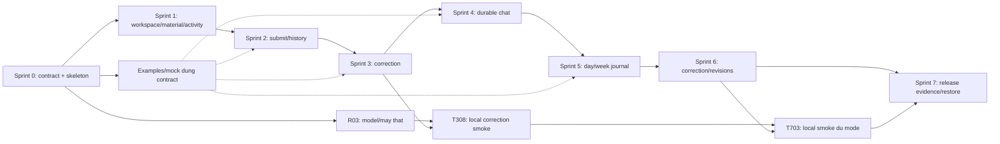

# StudyCraft — Lộ trình task và research theo sprint

**Cập nhật: 2026-10-08 · Trạng thái: kế hoạch đề xuất cho nhóm hai người.** Chưa có task triển khai hoặc research nào trong bảng dưới được xác nhận hoàn thành. Tài liệu này là kế hoạch phân công, không phải yêu cầu thực thi mã, tải model, commit hoặc push ngay.

Nguồn: [PRD](../requirements/prd.md), [18 user stories](../requirements/user-stories.md), [SPEC v3](../SPEC.md), [system design](../architecture/system-design.md), [schema](../architecture/database-schema.md), [OpenAPI](../api/openapi.json), [ADRs](../architecture/adr/001-modular-monolith.md), [Git workflow](../guides/git-workflow.md). Khi có mâu thuẫn, quyết định mới của chủ dự án và SPEC v3 ưu tiên; roadmap không tự mở rộng MVP.

## 1. Kết quả cần bàn giao

Trước khi nhận task, theo [hướng dẫn đọc docs/](../README.md): thứ tự đọc lần đầu, phần A/B cần đọc theo sprint, cách xử lý contract pending và checklist nhận task.

Một ứng dụng local cho một người học, gồm hồ sơ/mục tiêu, tài liệu văn bản, hoạt động ngày/tuần, nộp bài hoàn thành và kết quả sửa riêng, lịch sử bài, chat có lịch sử và nhật ký có phiên bản/đính chính. Chat lưu PostgreSQL ngay MVP; nhật ký và revisions lưu vĩnh viễn. Model chỉ nhận context hữu hạn, không tự đổi bài/mục tiêu/trạng thái.

Luồng bàn giao theo từng phần: **lưu tài liệu → nộp/lưu bài → sửa và mở lại → chat và mở lại → nhật ký → đính chính → kiểm chứng/restore**. Mốc sửa bài dùng được ở cuối Sprint 3 là bản dùng nội bộ sớm, chưa phải hoàn thành toàn MVP.

Stack giữ Python 3.12/FastAPI/PostgreSQL, local model. Jinja/HTML/CSS/JS và LM Studio là lựa chọn đề xuất hiện có. Không thêm cloud, SaaS, upload, audio, nghe/nói/đọc, điểm thi, coaching, fine-tuning, vector search hoặc dashboard vào backlog này.

## 2. Readiness — điều kiện sẵn sàng và việc còn mở

| Nội dung | Hiện trạng đã kiểm tra | Người xử lý / thời điểm |
| --- | --- | --- |
| Nhóm | Hai người cùng nền tảng Data & AI; A là chủ dự án/AI Engineer. Kỹ năng web/SQL và quỹ giờ chưa được đo. | TODO(A/B): giờ/tuần trước cam kết Sprint 0; R01/R04/R06 kiểm tra bằng bài tập. |
| Code | Repo hiện là tài liệu; chưa có ứng dụng/test suite để chứng minh chạy được. | T001–T006 tạo walking skeleton — khung tối thiểu chạy xuyên app/DB/web/test. |
| Contracts | OpenAPI/DDL còn banner pending SPEC v3, chưa có đầy đủ chat bền vững/policy theo loại bài. | A: R02/T000 trước các task phụ thuộc contract. |
| Giới hạn bài | Đã chốt theo loại bài, chưa có ngưỡng thật. | TODO(A): R05 trước thử nộp bài thật; fixture giúp code/test không bị chặn. |
| Model/máy | Qwen khoảng 4B/7B là ứng viên; chưa chốt model card, phiên bản, quantization — mức nén trọng số — hoặc tài nguyên. | A: R03; phải có runtime/model sẵn trước T308/T703. Không tự chuyển API. |
| Trigger nhật ký | Mở kỳ có nguồn đổi mới tổng hợp; timezone Asia/Ho_Chi_Minh, tuần thứ Hai–Chủ nhật vẫn là giả định triển khai của SPEC. | A rà R02; giữ giả định có nhãn, thay đổi phải cập nhật contract/tests. |
| Chất lượng tiếng Anh | Người rà soát chưa chỉ định; tests cơ chế không chứng minh sửa đúng ngữ nghĩa. | TODO(A): trước tuyên bố chất lượng/dùng kết quả để quyết định học tập; không bịa tỷ lệ đúng. |
| Lịch và deadline | Chưa có ngày bắt đầu, giờ làm việc thực hoặc hạn bàn giao. | TODO(A/B): chốt capacity; chưa gán ngày lịch hoặc xem dự báo là cam kết. |

Không có câu hỏi nào chặn việc lập roadmap. Task cần số nghiệp vụ hoặc môi trường thật được đánh dấu ở nơi phụ thuộc; kết quả research âm tính không được coi là tích hợp model thành công.

## 3. Ownership — trách nhiệm và cách hỗ trợ

| Người | Quyền quyết định / trách nhiệm chính | Trách nhiệm tăng dần |
| --- | --- | --- |
| **A — bạn** | Product owner và technical lead; scope/ưu tiên, contract, migration chung, model, transaction, permissions, review và tích hợp. | Làm một service mẫu, giải thích nguyên nhân thiết kế, review task B; không giữ toàn bộ coding ở A. |
| **B — bạn của bạn** | Developer cùng nền tảng Data & AI; module có đầu vào/đầu ra rõ, UI, fixtures, tests và hướng dẫn chạy. Chưa mặc định chức danh Data Analyst hoặc mức junior. | Material CRUD → submission → chat read APIs → journal helpers/offline read; tăng độ khó sau demo/review thực tế. |

- Mỗi task có **một owner**. A review backend/contract/migration của B; B review luồng sử dụng và chạy lại tests của A. AI hỗ trợ không thay trách nhiệm giải thích/kiểm chứng của author.
- Task đầu B làm cùng A theo mẫu; task sau B tự làm rồi review. Frontend không được coi là tự nhiên dễ hơn; R06 dành riêng cho kỹ năng này.
- A điều phối file chung như `db/models.py`, migration sequence, contracts, router/config. B đề xuất patch trong task riêng; thống nhất file trước khi hai người cùng sửa. Không gom mọi module vào một PR.
- Nếu kẹt khoảng 30 phút: gửi steps, lỗi, đã thử gì, giả thuyết; A hỗ trợ một phiên ngắn, rồi B tiếp tục. Nếu task vượt 8 giờ còn lại, tách trước khi nhận thêm task.
- WIP — số việc đang làm — tối đa một task chính/người. Thời gian review/mentoring nằm trong capacity dự phòng; không giả định miễn phí.
- CI, hooks, Ruff/pre-commit hoặc public staging không được tự tạo lại. Kiểm local thủ công khi coding; bổ sung automation chỉ khi chủ dự án yêu cầu. Staging hiện là app local + DB kiểm tra riêng, không public deploy.

## 4. Nhịp sprint, capacity và dự báo

**Đề xuất:** Sprint 0 + Sprint 1–7, mỗi sprint là một chu kỳ hai tuần; chưa gán ngày. Hai tuần là nhịp lập kế hoạch/review, không cam kết rằng mọi backlog sẽ xong trong đúng một chu kỳ.

Ước lượng là giờ làm việc tập trung của owner, gồm code/research và self-test. Một ngày tập trung quy ước 4 giờ; task lớn nhất 8 giờ, tương đương hai ngày tập trung. Đây chưa phải năng suất đã đo. Review/mentoring, tích hợp và lỗi bất ngờ dự phòng **25% quỹ giờ thực**.

Ví dụ nếu mỗi người dành 20 giờ/tuần: mỗi sprint có 40 giờ/người; chỉ nhận tối đa 30 giờ/người. Nếu thấp hơn, chia sprint thành nhiều chu kỳ và giữ nguyên tiêu chí nghiệm thu; không bỏ chat/nhật ký để gọi bản sửa bài là toàn MVP. Nếu cao hơn, kéo task đã sẵn sàng lên và vẫn demo/review theo chu kỳ.

| Sprint | Mốc demo | SPEC increment | A (giờ) | B (giờ) | Tổng |
| --- | --- | --- | --- | --- | --- |
| 0 | Khung chạy được và hợp đồng thống nhất | I-01 | 28 | 18 | 46 |
| 1 | Hồ sơ, tài liệu và hoạt động học | I-02 | 18 | 24 | 42 |
| 2 | Nộp bài, policy và tìm lại lịch sử | I-03 | 18 | 24 | 42 |
| 3 | Sửa lỗi bằng fake rồi model local | I-04 | 28 | 20 | 48 |
| 4 | Chat chủ động có lịch sử | I-05 | 24 | 20 | 44 |
| 5 | Nhật ký ngày/tuần từ nguồn có thật | I-06 phần tổng hợp | 18 | 24 | 42 |
| 6 | Đính chính nhật ký và bảo vệ quyền người học | I-06 phần đính chính | 20 | 22 | 42 |
| 7 | Kiểm chứng toàn MVP và bàn giao local | I-07 | 20 | 22 | 42 |

**Baseline:** 70 task, 12 task research/thử nghiệm, 348 giờ owner (A 174, B 174), chưa tính 25% capacity dự phòng. Nếu quy đổi effort thuần: 348/0,75 ≈ 464 giờ quỹ làm việc; con số này không tự suy ra ngày hoàn thành vì dependencies/mentoring có thể kéo dài. Tám chu kỳ hai tuần là khung tham khảo 16 tuần khi capacity/đầu vào phù hợp, không deadline đã chốt.

Sau Sprint 0 và Sprint 1, so estimated/actual cùng nguyên nhân; sửa estimate các task còn lại và lịch, không đổi số liệu cũ để trông như đúng dự báo.

## 5. Backlog theo sprint

**Quy ước:** BE = backend; FE = giao diện; infra = môi trường/vận hành; docs = tài liệu; test = kiểm thử; research = nghiên cứu hoặc spike — thử nghiệm ngắn giải quyết bất định. US dùng IDs `US-001–US-018` của user-stories, không nhầm với `US-01–US-09` rút gọn trong SPEC. Dấu — là task hỗ trợ được truy vết tới nền tảng/điều kiện bàn giao; không phải feature mới.

Dependencies là điều kiện đầu vào phải có bằng chứng; một demo có thể chuẩn bị qua mock trước, nhưng chỉ hoàn thành sau tích hợp thật. Research kết luận “chưa đủ điều kiện” đóng timebox cùng evidence, còn task cần môi trường đó vẫn blocked.

### Sprint 0 — Khung chạy được và hợp đồng thống nhất

**Mục tiêu:** Chạy app/DB trên cả hai máy, có health và test đầu tiên; contract policy/chat không còn lệch SPEC.

**Files dự kiến:** Root pyproject/uv.lock/compose/.env.example/.gitignore/alembic/README; migrations; src/studycraft/{main,core,db,api/health,web}; docs/api, architecture, diagrams; tests/conftest và contract.. Path app tính từ `src/studycraft/`; các thư mục code/test chỉ tạo khi task cần.

| ID | Task | US | Owner | Loại / giờ | Phụ thuộc | Acceptance / DoD |
| --- | --- | --- | --- | --- | --- | --- |
| R01 | Bài tập nhập môn Python web | — | B | research / 4h | — | Tự chạy ví dụ GET/POST và test request thiếu trường; giải thích request → validation → response. Chỉ là bài tập, không thêm feature vào app. |
| R02 | Rà chênh lệch contracts và quyết định còn mở | — | A | research / 2h | — | Danh sách delta policy/thread/messages/replay + min/max từng loại còn TODO(A); xác nhận trigger nhật ký và tiêu chí stale/offline. Không gán số nghiệp vụ thay owner. |
| R03 | Khả năng chạy model trên máy A | — | A | research / 4h | — | Ghi OS/CPU/RAM/GPU/VRAM, runtime/model/version/quantization nếu có; probe local endpoint và JSON nhỏ nếu runtime sẵn; chưa có thì ghi blocker và tiếp tục fake. |
| T000 | Đồng bộ OpenAPI, DDL/ER và ADR với SPEC v3 | US-005, US-006, US-012, US-017 | A | docs / 8h | R02 | Có policy snapshot, 3 tool chat mới, chat.send theo thread, result IDs/replay bền vững; ví dụ/$ref/DDL constraints khớp; gỡ banner pending khi từng phần thực sự đã đồng bộ. Chưa chạy migration thì không ghi đã chạy. |
| T001 | Package src, app factory và config | — | A | infra / 6h | — | Cài package Python 3.12; app factory/lifespan chạy, đọc đủ prompts/static/templates từ package; thiếu config báo rõ; .env/runtime/.ai không vào Git. |
| T002 | Postgres, migration nền và health | — | A | infra / 4h | T001, T000 | DB local, volume bền vững; migration nền/seed workspace idempotent; health OK/503; test DB riêng. Chỉ tạo bảng cần cho increment, không destructive reset. |
| T003 | Web shell và panel riêng | US-001, US-002, US-006, US-012, US-014 | B | FE / 6h | R01, T001 | Render các panel Tài liệu/Luyện viết/Kết quả/Chat/Nhật ký; escaped text; trạng thái trống/lỗi rõ; chưa giả lập thành feature đã hoạt động. |
| T004 | Session, CSRF, errors và log metadata | US-018 | A | BE / 4h | T001, T002 | Signed session, Host/Origin/CSRF checks; Problem đúng contract; không log raw content/secret; có test valid và forbidden. |
| T005 | Ví dụ API và dữ liệu giả phục vụ giao diện | US-001, US-002, US-005, US-006, US-007, US-012, US-014 | B | test / 4h | R01, T000 | Fixtures tổng hợp có nhãn giả lập; examples phù hợp schema hiện hành; mock API chỉ trong dev/test, không được báo đã lưu DB. |
| T006 | Chạy lại setup trên máy B | — | B | docs / 4h | T002, T003, T004 | Theo README từ môi trường sạch, health/test đầu tiên pass; ghi lệnh thật và lỗi đã xử lý; không cần model. |

**Song song:** B học/chạy bài tập và dựng HTML theo ví dụ trong lúc A đồng bộ contract, tạo app/DB. T003 chờ T001; không chờ model thật.

**Điều kiện kết thúc sprint:** Khởi động trên cả hai máy; migration/seed/health/test pass; DB down trả 503, Origin/Host sai bị chặn; không publish ra LAN. Research model chưa thành công được ghi blocked, không báo local inference đã chạy.

### Sprint 1 — Hồ sơ, tài liệu và hoạt động học

**Mục tiêu:** Lưu và đọc lại tài liệu/hồ sơ/hoạt động; B hoàn thành một module backend có review.

**Files dự kiến:** src/studycraft/modules/{workspace,materials,activities}, api/v1 tương ứng, execution/idempotency, db/models; migrations; web/static/js/{api,workspace}; tests/unit/integration.. Path app tính từ `src/studycraft/`; các thư mục code/test chỉ tạo khi task cần.

| ID | Task | US | Owner | Loại / giờ | Phụ thuộc | Acceptance / DoD |
| --- | --- | --- | --- | --- | --- | --- |
| R04 | Session/transaction SQLAlchemy qua module mẫu | US-002 | B | research / 4h | T002 | Bài tập insert/read/rollback; giải thích commit, FK và session scope. A review trong phần thời gian review dự phòng. |
| T101 | Receipt chống ghi trùng và version checks | US-001, US-002, US-003, US-004 | A | BE / 6h | T004, T000 | UUID/default canonical trước hash; cùng key replay trước dynamic checks; khác payload conflict; chỉ 1 effect; receipt lỗi transport không được claim. |
| T102 | Workspace/profile service làm mẫu | US-001 | A | BE / 4h | T101 | Unknown và goals hợp lệ, version tăng đúng; reload giữ thông tin; route mỏng/service transaction rõ để B làm theo. |
| T103 | Material service và API | US-002 | B | BE / 6h | R04, T101, T102 | Lưu user text hoặc catalog, sửa/version, chọn catalog lại không trùng; title-only giữ content null; workspace reference sai bị từ chối. |
| T104 | Giao diện tài liệu | US-002 | B | FE / 6h | T005, T103 | Chọn catalog/nhập text, lưu và mở lại; thiếu tên báo rõ, content escaped; không upload/chat ingestion. |
| T105 | Giao diện hồ sơ | US-001 | B | FE / 4h | T102, T005 | Lưu unknown/goal, xử lý conflict; không hiển thị điểm/trình độ do model suy ra. |
| T106 | Activity ngày/tuần và trạng thái thủ công | US-003, US-004, US-018 | A | BE / 4h | T101 | planned_period day/week chuẩn hóa, tuần thứ Hai hoặc null; chỉ user đổi status; event ghi cùng transaction. |
| T107 | Giao diện hoạt động | US-003, US-004 | B | FE / 4h | T106, T005 | Chọn kỳ/trạng thái, reload đúng; chưa học không hiện completed; conflict không mất input. |
| T108 | Kiểm tra ownership, duplicate và hai tab | US-001, US-002, US-003, US-004, US-018 | A | test / 4h | T103, T104, T105, T107 | Integration PG thật kiểm replay, sai workspace, stale version và event atomic; demo toàn sprint. |

**Song song:** A làm mẫu workspace/idempotency; B làm material backend rồi UI. API examples T005 cho phép B dựng UI trước endpoint; bản tích hợp cuối dùng DB thật.

**Điều kiện kết thúc sprint:** Unknown hợp lệ, tài liệu title-only không bị bịa nội dung; completed chỉ do user action; duplicate/version conflict không ghi trùng/đè; reload còn dữ liệu.

### Sprint 2 — Nộp bài, policy và tìm lại lịch sử

**Mục tiêu:** Nộp/lưu bài không cần model; giữ bản gốc và bản viết lại riêng.

**Files dự kiến:** modules/writing/{service,policies}, modules/history/service, api/v1/{writing,history}, contracts, db/models; migrations; web/static/js/{writing,history}; tests/unit/contract/integration.. Path app tính từ `src/studycraft/`; các thư mục code/test chỉ tạo khi task cần.

| ID | Task | US | Owner | Loại / giờ | Phụ thuộc | Acceptance / DoD |
| --- | --- | --- | --- | --- | --- | --- |
| R05 | Chốt policy từng loại bài và dữ liệu kiểm thử | US-005, US-006 | A | research / 4h | R02 | Owner ghi min/max hoặc max=null cùng policy version cho loại sẽ dùng; nếu chưa chốt, dùng fixture và giữ blocker cho bài thật. Không fine-tune/chấm điểm thi. |
| R06 | Fetch/DOM/CSRF và UI bất đồng bộ | US-006 | B | research / 4h | T003, T004, T005 | Một form gọi mock hợp đồng, dùng textContent, giữ input khi lỗi; phân biệt retry cùng key và hành động mới. |
| T201 | Exercise/template và snapshot policy/material | US-005, US-008 | A | BE / 6h | T000, R05, T103 | Đề riêng có type; đề mẫu lấy type server; policy/material snapshot bất biến; thiếu policy báo lỗi; sửa profile/material sau đó không đổi đề cũ. |
| T202 | Submission và bản viết lại | US-006, US-010 | B | BE / 6h | T201, T101 | Lưu nguyên text, word count; validate biên theo exercise; event/history cùng transaction; revision_of cùng exercise/workspace, bản cũ bất biến. |
| T203 | History cursor và đọc artifacts | US-011 | A | BE / 4h | T202 | Cursor id/limit đúng; bài/đề/phản hồi đã có đọc khi model off; bản journal sẽ dùng cùng cơ chế khi triển khai. |
| T204 | Form chọn đề, nộp bài và viết lại | US-005, US-006, US-010 | B | FE / 6h | R06, T201, T202 | Không gửi qua chat; hiển thị rule của đề; whitespace/out-of-range không gọi model; rewrite chỉ tạo khi user nộp. |
| T205 | Giao diện lịch sử bài | US-011 | B | FE / 4h | T203 | Mở đúng bài/đề, load trang tiếp, giữ original; state chưa có feedback rõ. |
| T206 | Tests policy và bảo toàn dữ liệu | US-005, US-006, US-010, US-011 | A | test / 4h | T202, T203 | Hai loại fixture khác ngưỡng; đúng biên/ngoài biên/no-policy, Unicode, đổi policy/material sau tạo đề; rollback/duplicate không mất dữ liệu. |
| T207 | Demo nộp → restart → mở lại | US-006, US-010, US-011 | B | test / 4h | T204, T205, T206 | B tự demo với model tắt; giữ cả bản gốc/bản mới; ghi evidence và lỗi tái hiện được. |

**Song song:** B xây form theo mock trong lúc A tạo exercise/policy/history. Sau ví dụ service Sprint 1, B tự làm submission service, A review invariants.

**Điều kiện kết thúc sprint:** Nộp khi model tắt; min/max đúng policy snapshot; rewrite tạo ID mới; restart vẫn đọc bài/đề/material snapshot; history phân trang không trùng hoặc thiếu.

### Sprint 3 — Sửa lỗi bằng fake rồi model local

**Mục tiêu:** Có bản sửa riêng, validator kiểm edits; failure không mất bài.

**Files dự kiến:** execution/{runner,context}, integrations/llm, modules/writing/{service,corrections}, prompts/correction_v2, api/v1/writing; web/static/js/writing; tests/unit/integration/fixtures.. Path app tính từ `src/studycraft/`; các thư mục code/test chỉ tạo khi task cần.

| ID | Task | US | Owner | Loại / giờ | Phụ thuộc | Acceptance / DoD |
| --- | --- | --- | --- | --- | --- | --- |
| R07 | Thử prompt/schema sửa bài tối thiểu | US-007, US-008, US-009 | A | research / 4h | R03, T201 | Thử ví dụ lỗi rõ/không lỗi/thiếu source; ghi output, lỗi schema/quote và 1 vòng điều chỉnh. Chưa model thì chỉ chuẩn bị fixture, local result blocked; không benchmark định lượng. |
| T301 | LLM interface và fake adapter | US-007, US-009 | A | BE / 4h | T000, T206 | Fake kết quả xác định có nhãn; mode/error injection cho tests; không gọi mạng, không framework agent. |
| T302 | Local HTTP adapter | US-007, US-009 | A | BE / 6h | R03, T301 | Endpoint loopback/model config, không redirect/cloud; parse response; connect/context/invalid output lỗi rõ; local smoke prerequisite runtime/model thực tế. |
| T303 | Bounded runner và recovery | US-007, US-009, US-018 | A | BE / 8h | T101, T301 | 1 running/workspace, deadline/attempts hữu hạn; không auto-retry inference timeout; short transactions; startup mark interrupted, late output không ghi. |
| T304 | Quote validator, edits và feedback atomic | US-007, US-008, US-009 | A | BE / 6h | T303, T201, T202 | Exact Unicode offsets/non-overlap, server ghép corrected_text; content_issue không bịa ý; immutable feedback/event/history cùng commit, hạn chế source rõ. |
| T305 | Panel kết quả riêng | US-007, US-009, US-011 | B | FE / 6h | T005, T204 | Original/error/replacement/explanation; pending/error/retry/empty corrections; xem feedback không gọi chat. Kết nối thật trước demo sau T304. |
| T306 | Fixtures hành vi và adversarial | US-007, US-008, US-018 | B | test / 4h | T301 | Case không lỗi/title-only/quote sai/overlap/HTML/injection; input giả, kỳ vọng kiểm chứng được; không gọi chúng là đáp án chuẩn nếu chưa reviewer. |
| T307 | Failure/retry/full-loop tests | US-007, US-008, US-009, US-011, US-018 | B | test / 6h | T304, T305, T306 | Model off/timeout/invalid JSON/replay/run busy/interrupted; giữ bài, 1 effect; HTML escaped và model không đổi mục tiêu. |
| T308 | Ghi nhận local smoke và hoàn thiện hướng dẫn | US-007, US-009 | B | docs / 4h | T302, T304, T307, R07 | Ghi model/runtime/máy/input/output/latency/lỗi thực; A xử lý model issue. Nếu chưa chạy, ghi blocked và chưa nghiệm thu local; không dùng fake thay chứng cứ. |

**Song song:** B dựng result/error UI và fixtures theo schema đã đồng bộ; A triển khai model/runner/validator. B kiểm fake trước, model thật chỉ sau khi A cấu hình.

**Điều kiện kết thúc sprint:** Fake nộp→sửa→lịch sử pass; local smoke chỉ tính pass nếu thật sự chạy. Bài gốc nguyên, không next_step/score/follow-up; lỗi quote/JSON/timeout không tạo feedback thành công giả.

### Sprint 4 — Chat chủ động có lịch sử

**Mục tiêu:** Mở lại hội thoại sau restart; reports chỉ từ tin hiện tại; context nhỏ độc lập retention.

**Files dự kiến:** modules/chat/{service,context}, api/v1/chat, db/models; migrations; prompts/chat_v2; web/static/js/chat; tests/integration/fixtures.. Path app tính từ `src/studycraft/`; các thư mục code/test chỉ tạo khi task cần.

| ID | Task | US | Owner | Loại / giờ | Phụ thuộc | Acceptance / DoD |
| --- | --- | --- | --- | --- | --- | --- |
| R08 | Context chat và failure sequence | US-012, US-013, US-017 | A | research / 4h | T000, T303 | Fixture chọn lượt thành công gần nhất theo budget; sơ đồ commit user → model → assistant/reports; failure ở mỗi điểm; xác nhận giới hạn hữu hạn, chưa tối ưu scale. |
| T401 | Migration threads/messages và indexes | US-012, US-017 | A | BE / 4h | T000, T303 | Scoped FK/unique(run_id,role), sequence cursor; upgrade trên DB có submissions vẫn giữ IDs/counts; không TTL. |
| T402 | Chat create/list/read API | US-012, US-017 | B | BE / 6h | T401, T101 | Tạo thread không model; paging thread/messages đúng ownership/thứ tự, trạng thái lấy từ run; xem lịch sử không inference. |
| T403 | Chat send và durable replay | US-012, US-017 | A | BE / 8h | R08, T401, T402, T302, T303, T304 | User commit trước inference, assistant/reports/receipt atomic; receipt chỉ IDs/hash, replay DB sau restart; key mới tạo lượt mới, không reply giả khi lỗi. |
| T404 | Reports từ tin hiện tại | US-013, US-018 | A | BE / 4h | T403 | source_quote xác thực rồi bỏ; không trích assistant/history/ví dụ/kế hoạch; ngày mơ hồ hỏi ngắn, báo tuần giữ tuần; không đổi completed. |
| T405 | Chat UI chọn thread/context và đọc lại | US-012, US-017 | B | FE / 8h | T402, T005, T305 | Gửi khi chủ động, chọn feedback, tin theo thứ tự; load older pages, reload giữ thread; hiển thị error/interrupted. Tích hợp send thật sau T403. |
| T406 | Restart, replay và privacy tests | US-012, US-013, US-017 | B | test / 6h | T403, T404, T405 | Success/restart/model off, duplicate và failed user turn; marker chỉ chat_messages, không log/receipt/run/history; context nhỏ giữ tin cũ. |
| T407 | Crash/ownership review và fix xác định | US-017, US-018 | A | test / 4h | T406 | Crash trước/sau commit, FK workspace giả và late model output; 0 partial success/unauthorized write; lỗi phát hiện có ticket riêng nếu vượt timebox. |

**Song song:** B làm create/list/read và UI độc lập inference; A làm chat.send/reports/replay. B học migration chat với A, rồi tự viết query phân trang.

**Điều kiện kết thúc sprint:** Đóng/mở app đọc lịch sử khi model off; same key không trùng tin/report; failed/interrupted giữ user message; context bỏ tin cũ không xóa DB.

### Sprint 5 — Nhật ký ngày/tuần từ nguồn có thật

**Mục tiêu:** Tóm tắt có nguồn, counts từ DB và lưu vĩnh viễn, không form.

**Files dự kiến:** modules/journals/{service,sources}, api/v1/journals, db/models; migrations; prompts/journal_v2; web/static/js/journals; tests/unit/integration.. Path app tính từ `src/studycraft/`; các thư mục code/test chỉ tạo khi task cần.

| ID | Task | US | Owner | Loại / giờ | Phụ thuộc | Acceptance / DoD |
| --- | --- | --- | --- | --- | --- | --- |
| R09 | Ngày/tuần, timezone và truy vấn nguồn | US-014, US-015 | B | research / 4h | T106, T404 | Bảng fixture Asia/Ho_Chi_Minh, thứ Hai/Chủ nhật/cuối tháng; phân biệt report tuần/ngày và event count; A review trước T501. |
| T501 | Period helpers và query events/reports | US-014, US-015 | B | BE / 6h | R09 | Ngày start=end, tuần thứ Hai–Chủ nhật; query đúng phạm vi/workspace; counts thao tác không tổng giờ hoặc mastery. |
| T502 | Schema nhật ký và source signature | US-014, US-015 | A | BE / 6h | T501 | Migration journals/revisions/corrections bảo toàn dữ liệu; chữ ký canonical đầy đủ; revisions append-only, không TTL/cascade cleanup. |
| T503 | Summary mode và persist theo signature | US-014, US-015 | A | BE / 8h | T502, T303, T404 | Nhánh empty/events-only/cache không inference; AI learner_summary tách counts; validate IDs, commit recheck nguồn; overflow rõ, giữ bản trước. |
| T504 | Nhật ký UI ngày/tuần | US-014, US-015 | B | FE / 6h | T005, T501 | Mở/chọn kỳ là trigger đã chọn; không form; nhãn AI/source/stale/empty riêng; render bản đã lưu. Tích hợp T503 trước demo. |
| T505 | Đọc nhật ký cũ khi model off | US-011, US-014, US-015 | B | BE / 4h | T203, T502 | Dùng history/workspace read theo contract để đọc revisions đã commit, không tạo endpoint ngoài scope; stale bản cũ vẫn đọc được, không giả đã cập nhật. |
| T506 | Tests nguồn, cache và stale race | US-014, US-015, US-018 | A | test / 4h | T503, T505 | Week reports không chia cho ngày; app_counts deterministic; nguồn đổi giữa inference/commit bị conflict, không lưu bản stale như current. |
| T507 | Demo journal ngày/tuần và offline | US-011, US-014, US-015 | B | test / 4h | T504, T505, T506 | Khai báo + nộp bài tạo summary có nguồn; mở lại không inference thừa; restart còn revision; chưa kết luận tăng năng lực. |

**Song song:** B làm periods/query fixtures và UI theo schema; A làm signature/summary persist. B chủ động backend helper thuần, A review timezone/nguồn.

**Điều kiện kết thúc sprint:** Empty/events-only không inference; same source không tạo revision; báo tuần không gán giả thành ngày; nguồn đổi có stale và bản đã lưu đọc được khi model off.

### Sprint 6 — Đính chính nhật ký và bảo vệ quyền người học

**Mục tiêu:** Người học sửa bằng chat, giữ phiên bản cũ và correction trong lần tổng hợp sau.

**Files dự kiến:** modules/journals/{service,sources}, prompts/journal_v2, api/v1/journals; web/static/js/{journals,chat}; tests/unit/integration/fixtures; ADR005.. Path app tính từ `src/studycraft/`; các thư mục code/test chỉ tạo khi task cần.

| ID | Task | US | Owner | Loại / giờ | Phụ thuộc | Acceptance / DoD |
| --- | --- | --- | --- | --- | --- | --- |
| R10 | Quy tắc đính chính và cách hiển thị trong Chat | US-016 | A | research / 4h | T503, T405 | Cases ngày→tuần/tuần không chia ngày, hai corrections cùng nội dung; journal.correct là thao tác riêng không gọi thêm chat.send. Rà hợp đồng hiển thị status/clarification, không tự thêm mode/tool ngoài SPEC. |
| T601 | Journal correction service và conflict | US-016 | A | BE / 8h | R10, T502, T503 | Lưu instruction/revision atomic sau output hợp lệ; mơ hồ INVALID_INPUT/question, không note/revision giả; recheck expected_revision và nguồn lúc commit. |
| T602 | UI đính chính gắn đúng journal/revision | US-016 | B | FE / 6h | T504, T405, T005 | Action chọn journal gửi instruction vào journal.correct, hiển thị kết quả tại Nhật ký/status tại Chat; clarification giữ input, không tự gọi Q&A; tích hợp thật sau T601. |
| T603 | Regenerate tôn trọng correction notes | US-016 | A | BE / 4h | T601 | Đưa notes đúng phạm vi/ưu tiên vào summary sau; ngày áp vào tuần, note tuần không thành fact ngày; không đổi app_counts/events. |
| T604 | Xem phiên bản trước và nhãn editor | US-011, US-016 | B | FE / 6h | T505, T601 | History trả đúng revision/content/editor; mở revision cũ không ghi hoặc inference; bản cũ không bị replace trong UI cache. |
| T605 | Tests hai tab và correction persistence | US-016 | B | test / 6h | T602, T603, T604 | Stale/nguồn đổi conflict, mơ hồ không ghi; regenerate/restart giữ note và mọi revision; forged journal/workspace không partial writes. |
| T606 | Adversarial và redaction liên mode | US-018 | A | test / 4h | T108, T307, T407, T605 | Injection trong essay/material/chat/summary, HTML và output yêu cầu đổi goal; no tool execution/unauthorized state; log/traces không raw text/secret. |
| T607 | Regression luồng học và nhật ký | US-001, US-004, US-006, US-007, US-012, US-014, US-015, US-016, US-017, US-018 | B | test / 4h | T605, T606 | Chạy suite liên quan; một demo lỗi→đính chính→nguồn mới→rebuild; ghi evidence các acceptance còn thiếu, không chỉ happy path. |

**Song song:** B làm action Đính chính và view revisions; A xử lý correction service/precedence/transaction. B dùng response mock corrected/needs_clarification/conflict trước backend.

**Điều kiện kết thúc sprint:** Correction rõ tạo revision mới, mơ hồ không đoán; expected_revision cả trước và sau model; rebuild giữ correction; counts/events/original không thay.

### Sprint 7 — Kiểm chứng toàn MVP và bàn giao local

**Mục tiêu:** Ứng dụng có bằng chứng từng story, chạy/restore được; ghi rõ giới hạn model thật.

**Files dự kiến:** tests/e2e/fixtures/integration; README; docs/planning release checklist và research notes; config chỉ nếu đã đo cần sửa.. Path app tính từ `src/studycraft/`; các thư mục code/test chỉ tạo khi task cần.

| ID | Task | US | Owner | Loại / giờ | Phụ thuộc | Acceptance / DoD |
| --- | --- | --- | --- | --- | --- | --- |
| R11 | Playwright và dữ liệu E2E độc lập | — | B | research / 4h | T607 | Chạy browser test đầu trên DB riêng/fake; không gọi model/cloud thật mặc định; fixture IDs không dùng dữ liệu học cá nhân. |
| T701 | Browser E2E cho các luồng và hai viewport | US-001, US-002, US-003, US-004, US-005, US-006, US-007, US-008, US-009, US-010, US-011, US-012, US-013, US-014, US-015, US-016, US-017, US-018 | B | test / 8h | R11, T607 | 1440×900/390×844: nộp→sửa không chat, chat reload, journal correction/rebuild, validation giữ input; screenshots/log không lộ dữ liệu thật. |
| T702 | Backup/restore và migration rehearsal | US-011, US-017 | A | infra / 6h | T607 | Backup và restore sang DB khác, đối chiếu IDs/counts/relations/receipts; mở bài/chat/revisions khi model off; không thử phá DB học thật. |
| T703 | Local smoke cho đủ các mode | US-007, US-009, US-012, US-013, US-014, US-015, US-016 | A | research / 4h | T308, T607 | Ghi correction/chat/report/summary/correction outputs, latency/resource/error/config trên máy thật; limit hữu hạn và không tự retry timeout; failure là blocker local, không cam kết chất lượng tiếng Anh. |
| T704 | Kiểm tra setup/triage lỗi người dùng | — | B | test / 6h | T701 | Làm theo README từ môi trường sạch, demo; lỗi có steps/expected/actual/evidence và mức độ, owner. Fix chưa biết tách ticket, không ghi hoàn tất trước retest. |
| T705 | Review khả năng vận hành và lỗi chặn release | — | A | test / 4h | T702, T703, T704 | Đọc các blocker, kiểm invariants/limits/startup recovery; phân task fix ≤8h, retest trước đóng; không thêm public deploy/scale. |
| T706 | README và hướng dẫn sử dụng bàn giao | — | B | docs / 4h | T702, T704 | Lệnh setup/run/DB migrate/backup/restore đã thử, local vs fake, cách hỏi/sửa journal, context vs retention; ghi giới hạn và pending rõ. |
| T707 | Đối chiếu 18 stories và sign-off MVP | US-001, US-002, US-003, US-004, US-005, US-006, US-007, US-008, US-009, US-010, US-011, US-012, US-013, US-014, US-015, US-016, US-017, US-018 | A | docs / 4h | T705, T706 | Ma trận evidence đủ, no open data-loss/security blocker; case deterministic pass; người dùng xác nhận scope đã dùng được. Reviewer tiếng Anh chưa có thì ghi chưa kiểm chứng ngữ nghĩa. |
| T708 | Chốt trạng thái và backlog sau MVP | — | A | docs / 2h | T707 | Ghi bản bàn giao/known limitations, lịch sử task và research; giá trị/pilot/quality benchmark là deferred, không tự thêm tính năng. |

**Song song:** B kiểm browser/setup/docs; A kiểm restore/model thật/terminal recovery. Sửa lỗi gắn owner module, task mới tối đa 8h; ưu tiên lỗi mất dữ liệu/quyền trước cosmetic.

**Điều kiện kết thúc sprint:** US-001–018 có evidence; deterministic suite pass; local inference đã chạy hoặc release đánh dấu chưa đạt local; restore DB riêng giữ IDs/counts/chat/revisions; owner quyết định dùng thử, không marketing chất lượng.

## 6. Research và lộ trình học gắn với sản phẩm

Research được làm đúng lúc, không cần học hết stack trước khi code. Mỗi timebox kết thúc bằng câu trả lời/POC — bản thử nhỏ — hoặc kết quả âm tính có evidence. Không chỉ gửi một danh sách bài đọc.

| ID / sprint | Câu hỏi cần trả lời | Tài liệu đầu vào | Kết quả phải giữ / stop rule |
| --- | --- | --- | --- |
| R01 / 0 · B · 4h | B tự xử lý request/validation/test được chưa? | [FastAPI Tutorial](https://fastapi.tiangolo.com/tutorial/): First Steps, Request Body, Response Model, Testing. | Ví dụ chạy được + giải thích luồng; nếu chưa, chia T003 nhỏ và pair thêm từ reserve. |
| R02 / 0 · A · 2h | Contract nào lệch quyết định mới và quyết định nào chưa có? | SPEC §3/6/9, OpenAPI, schema, ADR005. | Delta checklist cho T000; chưa giải quyết hết vẫn ghi từng mục, không bật banner “đã đồng bộ”. |
| R03 / 0 · A · 4h | Máy A chạy được runtime/model ứng viên không? | [LM Studio Chat Completions](https://lmstudio.ai/docs/developer/openai-compat/chat-completions); model card chính thức của model thực sự chọn. | Record model/version/quantization/máy/context/output/latency quan sát; chọn một ứng viên khả thi hoặc blocker cụ thể. Không tải/chạy trong task lập kế hoạch này. |
| R04 / 1 · B · 4h | Tại sao save/read/rollback phải nằm đúng transaction? | [SQLAlchemy Session Basics](https://docs.sqlalchemy.org/en/20/orm/session_basics.html); service T102 và migration nền. | Insert/read/rollback test và sơ đồ FK/session; dùng cách async trong kiến trúc khi triển khai, không chuyển engine chỉ vì ví dụ tutorial sync. |
| R05 / 2 · A · 4h | Rule từ của loại bài đầu có đủ rõ để validate không? | SPEC WritingPolicy, loại bài dự kiến và yêu cầu do owner chọn. | Min/max/version đã quyết định hoặc TODO + fixture test; không coi số fixture là chuẩn TOEIC/IELTS. Không research toàn bộ dạng bài thi. |
| R06 / 2 · B · 4h | B xử lý form/fetch/error/retry mà không mất input được chưa? | api.js/security contract, mock examples và form T104. | Form mock có valid/invalid/conflict; giữ key khi replay, key mới cho action mới; không render HTML model. |
| R07 / 3 · A · 4h | Prompt/schema tạo minimal edits có kiểm tra được không? | Rubric/spec, vài ví dụ đối chiếu, model đã chọn nếu sẵn. | Output + lỗi + một thay đổi có lý do; hết timebox không tiếp tục prompt tuning vô hạn hoặc bắt đầu fine-tuning. |
| R08 / 4 · A · 4h | Chọn context và replay thế nào khi server chết giữa lượt? | SPEC chat schema, receipt/runs/message invariants. | Sequence/fixture crash ở các điểm, rule chọn lượt; context nhỏ độc lập retention. Không nghiên cứu RAG/vector DB. |
| R09 / 5 · B · 4h | Nguồn ngày/tuần/correction thuộc kỳ nào? | SPEC periods và dữ liệu tổng hợp giả. | Fixture qua biên ngày/tuần/tháng; query expected IDs/counts; không suy ra giờ học từ lượt thao tác. |
| R10 / 6 · A · 4h | Correction mới ảnh hưởng rebuild và UI status thế nào? | Journal revisions, journal.correct/provider output và câu đính chính giả. | Quy tắc precedence + fixtures; unclear giữ bản trước; không dùng journal.correct để tự gửi thêm chat.send. |
| R11 / 7 · B · 4h | E2E chạy độc lập và lặp lại được không? | [Playwright Python](https://playwright.dev/python/docs/intro), fake client, PG fixture. | Test browser đầu tiên, cleanup chỉ DB test; ghi config/lệnh thực đã chạy. |
| T703 / 7 · A · 4h | Đủ mode mới chạy trên model thật chưa? | Report R03/R07/T308 và app đã tích hợp chat/journal. | Bổ sung evidence các mode mới, không lặp benchmark đã để sau; timeout/lỗi rõ và ghi phần chưa chứng minh. |

**Lộ trình B:** request/validation → SQL/transactions → module material → immutable submission → UI HTTP/retry → chat reads/paging → periods/journal query → E2E và bàn giao. Hoàn thành một bài tập không chứng minh đủ năng lực cho toàn stack; dùng demo, tests và khả năng giải thích để điều chỉnh task tiếp theo.

**Lộ trình A:** contract/data invariants → app foundation → model feasibility → policy snapshot → validator/runner → chat durability → journal revisions → restore/release. Fine-tuning hoặc API chỉ trở thành project/task riêng khi owner chốt sau evidence, không đưa vào critical path hiện tại.

Khi thực hiện research, ghi một mục tối đa một trang tại `docs/planning/research-notes.md` (chưa tạo nội dung giả bây giờ), gồm: ID/câu hỏi, timebox/actual, tài liệu/model version, cách thử, kết quả quan sát, quyết định và trade-off, task chịu ảnh hưởng, unknowns. Code POC bỏ ngoài app production và chỉ giữ nếu còn cần cho test. R03 chưa có runtime thì lưu “chưa chạy”, không tạo thông số máy hoặc output.

## 7. Phụ thuộc, đường găng và chỗ làm song song

Đồ thị đầy đủ từng task: [implementation-task-dependencies.mmd](../diagrams/implementation-task-dependencies.mmd). Mũi tên nét liền là prerequisite; mock giúp chuẩn bị UI, không bỏ prerequisite để đóng task.

**Đường găng theo dependency và estimate hiện tại:** `R02` → `T000` → `T002` → `T004` → `T101` → `T102` → `T103` → `T201` → `T202` → `T203` → `T206` → `T301` → `T303` → `T401` → `T402` → `T403` → `T404` → `R09` → `T501` → `T502` → `T503` → `R10` → `T601` → `T604` → `T605` → `T606` → `T607` → `R11` → `T701` → `T704` → `T705` → `T707` → `T708`.

Tổng 172 giờ theo chuỗi dependency dài nhất; đây là **cận dưới mô hình task**, chưa tính owner bận task khác, sprint gates, review, wait phần cứng hoặc reserve. Không đổi 172 giờ thành thời hạn giao hàng. A là điểm có thể nghẽn ở contract/runner/persistence; ưu tiên review và input cho B trước research phụ. R03/T308/T703 có thể thành đường găng thực tế nếu model không khả thi.

Ba nhánh làm song song chính:

1. Contract/examples chốt → B làm UI bằng mock; A làm services/DB/model; tích hợp và validate tại task test của sprint.
2. B làm fixtures/query đọc đơn giản → A xử lý write transaction/version; B chạy lại failure cases và review luồng dùng.
3. A kiểm local model/restore → B kiểm browser/setup/docs. Dữ liệu chung và migration phải phối hợp, không chạy thử phá DB của nhau.

## 8. Truy vết stories → sprint và task

Các task nền tảng/research/docs phục vụ các mục tiêu G0–G4 hoặc điều kiện triển khai; không có feature ngoài PRD. “Should” xác định thứ tự sau vòng sửa bài, không tự bỏ khỏi full MVP.

| Story | Phần triển khai chính | Task thực hiện / kiểm chứng chính |
| --- | --- | --- |
| US-001 — Hồ sơ/mục tiêu | Sprint 1 | T101, T102, T105, T108 |
| US-002 — Tài liệu riêng | Sprint 1 | T101, T103, T104, T108 |
| US-003 — Việc học ngày/tuần | Sprint 1 | T101, T106, T107, T108 |
| US-004 — Trạng thái do user | Sprint 1 | T101, T106, T107, T108 |
| US-005 — Chọn/nhập đề | Sprint 2 | T201, T204, T206 |
| US-006 — Nộp/lưu trước model | Sprint 2 | T202, T204, T206, T207 |
| US-007 — Kết quả sửa riêng | Sprint 3 | T301, T302, T303, T304, T305, T306, T307, T308 |
| US-008 — Source thực sự có | Sprint 2, 3 | T201, T304, T306, T307 |
| US-009 — Model lỗi/thử lại | Sprint 3 | T301, T302, T303, T304, T305, T307, T308 |
| US-010 — Bản viết lại mới | Sprint 2 | T202, T204, T206, T207 |
| US-011 — Lịch sử/offline | Sprint 2, 3, 5, 6, 7 | T203, T205, T206, T207, T305, T307, T505, T507, T604, T702 |
| US-012 — Chat chủ động | Sprint 4 | T401, T402, T403, T405, T406 |
| US-013 — Khai báo việc học | Sprint 4 | T404, T406 |
| US-014 — Nhật ký ngày | Sprint 5 | T501, T502, T503, T504, T505, T506, T507 |
| US-015 — Nhật ký tuần | Sprint 5 | T501, T502, T503, T504, T505, T506, T507 |
| US-016 — Đính chính/revisions | Sprint 6 | T601, T602, T603, T604, T605 |
| US-017 — Mở lại chat | Sprint 4, 7 | T401, T402, T403, T405, T406, T407, T702 |
| US-018 — Quyền người học | Sprint 0, 1, 3, 4, 5, 6 | T004, T106, T108, T303, T306, T307, T404, T407, T506, T606 |

T701 đối chiếu toàn bộ luồng trên browser; T707 đối chiếu từng acceptance criterion với evidence đã chạy. Không dùng một hàng “all stories pass” thay kiểm tra từng story.

## 9. Cách quản lý task và nghiệm thu sprint

**Trạng thái:** Backlog → Ready → In progress → Review → Done; Blocked kèm lý do, người gỡ và input thiếu. Dependency Done chưa đủ nếu kết quả research chỉ ghi blocker: task cần runtime/model thật vẫn Blocked.

**Ready:** có owner/US hoặc lý do nền tảng, scope/files, input/output contract, acceptance, dependency và estimate ≤8h; môi trường thực thi phù hợp. Chưa Ready thì làm research trước, không để cả hai cùng đoán API.

**Done chung:**

- Author demo được kết quả; kiểm cả lỗi liên quan và evidence là lệnh/output thật. Tài liệu kiểm nội dung/JSON/$ref/link/diff; code kiểm tests có ý nghĩa.
- Tests không dùng cloud/model thật mặc định; integration dùng PostgreSQL riêng, E2E fake được gắn nhãn. Không dùng dữ liệu học cá nhân làm fixture.
- Hợp đồng/permission/ownership không lệch SPEC; thay contract cập nhật OpenAPI/DDL/examples/tests cùng task. Không giữ transaction qua model inference.
- Không commit secret/runtime outputs/.ai; author tự commit theo workflow thủ công. Tài liệu này không cấp quyền agent tự commit/push.
- Reviewer hoàn tất phần trong khả năng, A xử lý review kỹ thuật nhạy cảm; UI dùng mock chưa nối backend hoặc chưa test không tính Done.
- Acceptance của sprint đạt; bug mới vượt timebox tạo task mới có owner/estimate và chèn dependencies. Không để trong comment “sẽ fix sau” nếu chặn dữ liệu/quyền.

**Nhịp làm việc đề xuất:** đầu sprint chốt goal/capacity/Ready trong 30 phút; mỗi ngày cập nhật ba dòng Done/Next/Blocked qua kênh nhóm do hai người chọn; review trong một ngày làm việc; cuối sprint demo 30 phút và retrospective 20 phút — nhìn lại estimate, blocker, cách phối hợp. Các cuộc trao đổi là quy trình đề xuất, không thiết lập bot/tự gửi tin.

Nếu B chưa tự giải thích hoặc kiểm thử code tạo bởi AI, task chưa Done; A hỏi theo request → service → DB/output, không chỉ kiểm “chạy được”. Nếu B hoàn thành tốt, giao thêm backend của Sprint 2/4/5; không giữ B chỉ làm docs/UI.

## 10. Rủi ro, blocker và cách điều chỉnh

| Rủi ro | Phát hiện / task | Xử lý theo timebox | Ảnh hưởng release |
| --- | --- | --- | --- |
| Contract còn lệch | R02/T000 | Lập delta, sync từng input/output/DDL/example; chưa sync thì không code consumer như đã chốt. | Chặn luồng tương ứng, không chặn bài tập/setup độc lập. |
| B thiếu Python/SQL/web | R01/R04/R06/demo | Pair một mẫu, tách task 2–4h; giảm WIP; re-estimate sau Sprint 1. | Kéo lịch, tăng mentoring; không chuyển cả frontend cho B mặc định. |
| Model không fit máy/context | R03/R07/T703 | Chọn một cấu hình khả thi theo evidence, giảm context/output hữu hạn; kết quả âm tính mở quyết định riêng do A. | Fake giúp tiếp tục app/tests; chưa có local smoke thì chưa sign-off full local MVP. API/fine-tuning không tự bật. |
| Quote/JSON/model sai | R07/T304/T307 | Validate bằng code, repair hữu hạn theo runner, fail rõ; giữ bài. | Chặn output sai được lưu; schema pass chưa chứng minh ngữ nghĩa đúng. |
| Duplicate/crash tạo effect trùng | T101/T303/T403/T407 | Unique/receipt/replay/recovery, thử crash ở các ranh giới commit. | Lỗi mất/trùng dữ liệu hoặc success giả chặn release. |
| Sai kỳ/đính chính mất sau rebuild | R09/R10/T506/T605 | Fixtures biên kỳ, signature và notes/revisions scoped, recheck commit. | Chặn nhật ký hoàn chỉnh, không ghi “toàn MVP xong”. |
| A nghẽn review/file chung | Check capacity cuối ngày | Cấp example/contract trước, một người điều phối migration/router, B độc lập module; review từ reserve. | Replan sprint, không thêm WIP để che wait. |
| Scope phình do research | Hết timebox không có quyết định | Kết luận + bằng chứng + next task; các ý scale/agent/RAG đi backlog sau. | Giữ scope đã chốt; chưa tự giảm các story MVP. |
| DB/storage hỏng | T702 | Backup/restore sang DB riêng, đối chiếu IDs/counts; backup local không bảo đảm chống mất máy. | Chưa restore được thì chưa coi vận hành sẵn sàng. |
| Quỹ giờ/deadline chưa rõ | Sprint planning | TODO(A/B) chốt giờ thực, reforecast với owner load/dependency. | Lịch 16 tuần là khung đề xuất, không lời hứa. |

Không có metric tiến bộ học tập, precision/recall, tỷ lệ sửa đúng hoặc hiệu quả fine-tuning mới được đặt trong roadmap. Người rà soát tiếng Anh chưa có: ghi rõ giới hạn, không biến kiểm thử phần mềm thành chứng cứ học tốt hơn.

## 11. Tài liệu viết đúng lúc

| Trigger | Owner / tài liệu | Nội dung cần cập nhật |
| --- | --- | --- |
| Trước Sprint 0 | A/B · PRD, overview, workflow | Team hai người, quỹ giờ, ownership đề xuất; không ghi năng lực hoặc lịch chưa xác nhận thành fact. Thông tin team đã cập nhật trong task lập roadmap. |
| T000 kết thúc | A · OpenAPI, schema/ER, system design, ADR005 | Chat/policy contracts khớp SPEC; chỉ gỡ pending theo phần đã kiểm tra. ADR Proposed chỉ đổi Accepted khi A thực sự quyết định. |
| App lần đầu chạy trên máy B | B · README | Lệnh thực/config/package resources/DB/test/setup error; secrets giả, không transcript thật. |
| R03 hoặc R07 có kết quả | A · research notes, ADR004 nếu lựa chọn đổi | Model/runtime/version/máy và giới hạn quan sát; không ghi các ứng viên chưa thử đã phù hợp. |
| R05 chốt policy | A · SPEC/contract/seed/tests | Rule/type/version và snapshot; giữ phân biệt fixture với rule dùng thật. |
| API/model error thay đổi | Author · OpenAPI/examples/test docs | Code/status/Problem/retry behavior cùng release; B cập nhật UI handling. |
| R08/R10 chốt quy tắc | A · SPEC/ADR005/system design | Transaction/replay/context hoặc correction precedence được thay, tác động dữ liệu cũ. |
| T702 restore đạt | B viết, A đối chiếu · README | Cách backup/restore, DB riêng, evidence IDs/counts; limits không sao chép mật khẩu. |
| T707/T708 | A/B · mục release tại research notes/roadmap | Evidence story, known issues/blockers, version đã thử, bàn giao; business pilot/quality metrics vẫn deferred. |

Chưa tạo sẵn một báo cáo “research completed” hoặc nội dung evidence khi chưa chạy. Không viết lại toàn SPEC ở mỗi sprint; cập nhật đúng mục thay đổi và đường dẫn liên quan.

## 12. Bắt đầu từ đâu và điều kiện hoàn thành toàn lộ trình

**Phiên đầu tiên:** A/B thống nhất giờ/tuần và đọc luồng nộp–sửa; B bắt đầu R01, A làm R02 và T001. R03 chạy song song nếu máy/runtime sẵn. Khi contract T000 chốt, B có mock/examples cho các panel; khi DB/security sẵn, B tự chạy lại setup T006.

**Task backend đầu của B:** T103 material service sau R04/T102; owner B chịu trách nhiệm cả validation/reload/tests, A review transaction/ownership. Không mở chat/model/journal cùng lúc trước vòng sửa bài cơ bản.

**Toàn MVP chỉ hoàn thành khi:** tất cả acceptance US-001–018 và invariants bắt buộc có evidence phù hợp; deterministic checks pass; đọc lại/replay/restore giữ dữ liệu; actual local smoke cho các mode có kết quả ghi nhận; không còn blocker mất dữ liệu/quyền/contract. Kết quả ngôn ngữ vẫn có giới hạn đã công khai nếu chưa reviewer. Chủ dự án quyết định bàn giao/dùng thử trên máy cá nhân.

Future work — một dòng mỗi mục, không lên lịch vào các sprint trên:

- Nghe/nói/đọc và audio khi có phạm vi riêng.
- Upload/PDF/ảnh/OCR khi chốt định dạng và xử lý nội dung.
- Gợi ý ý tưởng, coaching, bài tiếp theo sau sửa lỗi.
- Fine-tuning hoặc API LLM/Claude sau quyết định dựa trên evidence.
- Benchmark chất lượng, người rà soát và đo giá trị học sau sản phẩm dùng được.
- Multi-user, scale, public hosting, CI/hooks, integrations khi có nhu cầu và yêu cầu mới.
